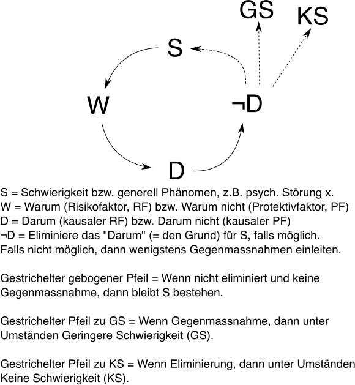
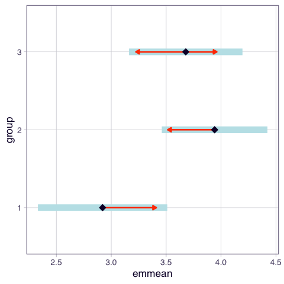
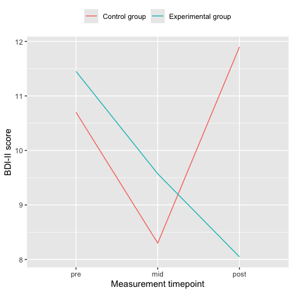
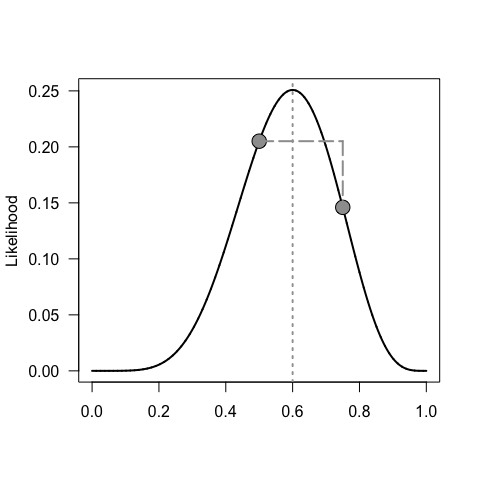

Open science FS26
================
Marcel Miché
2026-04-20

- [Misstrauen, Skepsis](#misstrauen-skepsis)
  - [Was ist das hier?](#was-ist-das-hier)
    - [Transparenz](#transparenz)
    - [Orientierung, Kompass](#orientierung-kompass)
    - [Checklisten, Regelsammlungen](#checklisten-regelsammlungen)
    - [emmeans und marginaleffects](#emmeans-und-marginaleffects)
  - [Estimated marginal means](#estimated-marginal-means)
    - [Forschungsparadigmen - Exkurs](#forschungsparadigmen---exkurs)
- [Kategorial oder nicht?](#kategorial-oder-nicht)
- [Visualisierung](#visualisierung)
  - [Kontinuierlicher Prädiktor](#kontinuierlicher-prädiktor)
  - [Ordinaler Prädiktor](#ordinaler-prädiktor)
  - [URLs etc. zu Visualisierung](#urls-etc-zu-visualisierung)
- [Vermeide Kontraproduktivität](#vermeide-kontraproduktivität)
  - [Methodische Sicherheit](#methodische-sicherheit)
  - [Methodische Details](#methodische-details)
    - [Inzidenz und Regressionsmodell](#inzidenz-und-regressionsmodell)
    - [Überfrachtetes
      Regressionsmodell](#überfrachtetes-regressionsmodell)
    - [Dichotomanie](#dichotomanie)
    - [Präzision](#präzision)
    - [Konfidenzintervall](#konfidenzintervall)
    - [Alpha Signifikanzniveau](#alpha-signifikanzniveau)
    - [Nullismus](#nullismus)
    - [Null hypothesis significance test
      (NHST)](#null-hypothesis-significance-test-nhst)
    - [Zwischenfazit 1](#zwischenfazit-1)
    - [Likelihood Ratio (LR)](#likelihood-ratio-lr)
    - [Direktes oder inverses Problem?](#direktes-oder-inverses-problem)
    - [Likelihood](#likelihood)
    - [Bayesianische Statistik (BS)](#bayesianische-statistik-bs)
    - [Frequentistische Statistik (FS)](#frequentistische-statistik-fs)
    - [Unterschied BS zu FS](#unterschied-bs-zu-fs)
    - [Forschungsfrage(n) formulieren](#forschungsfragen-formulieren)
    - [Daten … wie weiter?](#daten--wie-weiter)
    - [Zwischenfazit 2](#zwischenfazit-2)
    - [DAGs, instrumentelle Variablen](#dags-instrumentelle-variablen)
    - [Adjustierung](#adjustierung)
    - [Sensitivitätsanalyse,
      Unsicherheitsanalyse](#sensitivitätsanalyse-unsicherheitsanalyse)
    - [Systematik](#systematik)
    - [G-computation](#g-computation)
    - [Kausalität und Psychologie?](#kausalität-und-psychologie)
  - [Lesehinweise](#lesehinweise)
- [Literaturverzeichnis](#literaturverzeichnis)

# Misstrauen, Skepsis

Gebe niemals die Kontrolle ab, an von anderen Menschen oder von dir
selbst aufgestellte Regeln. Das heisst, dass Misstrauen wesentlich
besser ist als Vertrauen, im Rahmen von Regelsammlungen, z.B.
Checklisten, weil **Misstrauen** Wachsamkeit fördert (und fordert),
während Vertrauen erschreckend häufig Unachtsamkeit fördert (nicht
zwingend fordert).

Nachdem dies nun geschrieben ist, sei betont, dass Checklisten und
Regelsammlungen dann sehr gut sein können, wenn man mit ihrer Hilfe ein
bewusstes sowie gut begründetes Ziel verfolgt, das von einer gesunden
Portion Misstrauen begleitet wird.

## Was ist das hier?

Eine während des FS26 produzierte Sammlung von hoffentlich relevanten
Hinweisen als auch konkreten Anleitungen, zu Umsetzungsmöglichkeiten von
[open
science](https://poldrack.github.io/psych-open-science-guide/README.html).
Open science macht hauptsächlich dann Sinn, wenn Personen keine
(Existenz-)Angst zu haben brauchen, wenn sie öffentlich zeigen (=
dokumentieren), was sie aus welchem Grund, auf welche Weise und zu
welchem Zweck in die Tat umgesetzt haben. Zugleich will sich
selbstverständlich niemand öffentlich lächerlich machen. Genau diesem
Zweck sollen alle Inhalte dieses Dokuments dienen, denn die dumpfe,
latente Angst, sich lächerlich zu machen, scheint meist daher zu kommen,
dass man sich nicht sicher genug ist, ob man den Kern einer Sache, z.B.
eines statistischen Werkzeugs, ausreichend gut verstanden hat, um mit
dessen Hilfe etwas öffentlich in die Tat umzusetzen.

### Transparenz

Transparenz ist **das** Synonym schlechthin für open science. Beginnen
wir also mit dem Dokumenttyp dieses
[markdown](https://www.markdownguide.org/) Dokuments. Es wurde mittels
[rmarkdown](https://rmarkdown.rstudio.com/index.html) produziert
([weitere rmarkdown Quelle](https://yihui.org/rmarkdown/)). Wie bei
jedem Dokumenttyp, stellt sich auch hier die Frage nach dem Ziel, d.h.
was soll in welcher Form und auf welchem Weg an wen gelangen, und
weshalb?

**Was?** Informationen unterschiedlicher Art, z.B. Weblinks, Text,
Codebeispiele, Graphiken.

**In welcher Form?** Nach keinen rigiden Vorgaben sowie unmittelbar,
d.h. Weblinks zum Anklicken, Text zum Lesen, Codebeispiele entweder mit
Ergebnis-Output oder ohne, jedenfalls zum Kopieren und ins eigene
R-Skript Einfügen, Graphiken zum Betrachten.

**Auf welchem Weg?** Online (GitHub) und uneingeschränkt frei
zugänglich.

**An wen?** In erster Linie an Studierende dieses open science Seminars,
zudem aber auch an jede Person, der der Weblink weitergeleitet wird.

**Weshalb?** Sammlung relevanter open science Hinweise als auch konkrete
technische Anleitungen, z.B. zur öffentlichen Bereitstellung des
Analysecodes.

### Orientierung, Kompass

Wer verstehen will, braucht Orientierung. Beides geht optimal mit
Einfachheit, entweder als erstem Schritt oder sobald man anfängt, den
Wald vor lauter Bäumen nicht mehr zu sehen.

<div class="figure">


<p class="caption">

Maximal einfache Darstellung einer Schwierigkeit und deren (teilweiser)
Lösung bzw. Behebung.
</p>

</div>

Obige Graphik kann ähnlich wie ein Kompass verwendet werden. Jede/r
Wissenschaftler/in beschäftigt sich in einem gegebenen Augenblick
ausschliesslich mit <ins>einer</ins> **S**chwierigkeit, d.h. etwas das
er/sie (noch) nicht versteht. Beim **W**arum versucht man, mögliche
Erklärungsfaktoren für die **S**chwierigkeit zu finden. Beim **D**arum
prüft man empirisch, ob ein identifizierter Erklärungsfaktor die **S**
tatsächlich (teilweise) produziert (wenn es ein RF ist) oder verhindert
(wenn es ein PF ist). Zuletzt versucht man den Erklärungsfaktor so gut
es geht zu eliminieren (wenn es ein RF ist) oder zu stärken (wenn es ein
PF ist), wodurch im besten, nämlich in einem monokausalen, Fall die
**S** künftig ausbleibt (KS), wenigstens aber geringer als zuvor
ausgeprägt ist (GS).

**Kleines Beispiel**: Sollte es ein RF für geringes psychologisches
Wohlbefinden (pW) sein, dass man Diskriminierungserfahrungen macht, dann
sagt man damit lediglich, dass man vermutet, dass diskriminierte
Personen weniger pW aufweisen, verglichen mit Personen ohne jenen RF.
Man erwartet somit einen **Unterschied** in pW, **in Abhängigkeit vom**
vermuteten RF (der entweder vorhanden oder eben nicht vorhanden ist).
Somit richtet sich jede Forschungsfrage gezwungenermassen immer danach,
ob ein **bedingter Unterschied** vorliegt oder nicht. Bei einem
vermuteten PF dreht sich lediglich die Richtung des erwarteten
Unterschiedes um, im Gegensatz zu einem vermuteten RF.

**Notiz**: Ich bin zufällig auf ein aktuelles Paper gestossen (Krieger
et al. 2026), das etwas sehr ähnliches untersucht hat, nämlich
Zusammenhänge zwischen verschiedenen Diskriminierungserfahrungen, z.B.
Sexismus, und psychologischem Distress.

### Checklisten, Regelsammlungen

Im Seminar zu open science (Bereich: empirische Psychologie) geht es -
aufgrund der quasi-Gleichsetzung von empirisch und datengestützt - um
das Planen, Durchführen und Analysieren von messbaren Konstrukten bzw.
deren vermuteter Zusammenhänge.

In der empirischen Psychologie ist mit Zusammenhang fast immer ein
linearer Zusammenhang gemeint. Ein **linearer Zusammenhang** ist immer
nur dann vorhanden, wenn ein **bedingter Unterschied** in den Daten
vorhanden ist. Dies ist am einfachsten an einem sogenannten Scatterplot
demonstriert, wobei hier ein positiver Zusammenhang gezeigt wird.

``` r
library(correlatio)
library(ggplot2)
set.seed(1) # set.seed to ensure reproducibility
# Simulate two continuous variables x1 and x2
dat <- correlatio::simcor(obs=40, rhos=.7)[[1]]
# Scatterplot and slope of the linear model (lm)
ggplot(data=dat, aes(x=x1, y=x2)) +
    geom_point() +
    geom_smooth(method="lm", se=FALSE)
```

<figure>

<figcaption aria-hidden="true">Scatterplot und slope aus der einfachen
linearen Regression.</figcaption>
</figure>

Man sieht, wenn man x1 von links nach rechts abläuft, dass man dann
tendenziell auf höhere x2 Werte stösst (Englisch: slope = rise over
run). Anders gesagt, es macht einen Unterschied auf Ebene x2, ob man auf
Ebene x1 zwischen -2 und 0 liegt oder ob man x1-Werte grösser als 0 hat.
Ein linearer Zusammenhang ist somit die Verallgemeinerung des Konzepts
Unterschied, den man gewöhnlich nur mit einer Gruppenzugehörigkeit
verbindet, z.B. die Experimentalgruppe habe durchschnittlich höhere
Werte als die Kontrollgruppe. Ein **Unterschied** wird in der Statistik
häufig als **Effekt** bezeichnet (Vorsicht vor Kausalitätsillusionen!).
Der vermutete **Effekt** bezieht sich dabei immer auf die sogenannten
**Erwartungswerte**, die auf theoretischer Populationsebene existieren
(laut Theorie). Die konkrete Schätzung geschieht jedoch anhand von
**Mittelwerten** einer konkreten Stichprobe, die aus der Zielpopulation
stammen soll.

### emmeans und marginaleffects

Vor diesem Hintergrund, d.h. der bewussten und gut begründeten Analyse
des Zusammenhangs gemessener psychologischer Konstrukte, empfehle ich
das R Paket [emmeans](https://rvlenth.github.io/emmeans/). Insbesondere
empfehle ich, dass der Text unterhalb der Überschrift [‘Tidyness can be
dangerous’](https://rvlenth.github.io/emmeans/#tidiness-can-be-dangerous)
so oft gelesen wird, bis er in Mark und Bein übergegangen ist. Eine von
emmeans unabhängige, jedoch ähnliche Absicht steckt hinter der
Onlinequelle [marginaleffects](https://marginaleffects.com/).
<!-- Auch hier stösst man auf der Titelseite auf ähnliche Hinweise wie bei emmeans, nämlich dass allem Anschein nach viele Forscher/innen (nicht nur Psycholog/innen) in der Vergangenheit und Gegenwart ihr Verständnis komplexer statistischer Modelle sehr häufig überschätzt haben. Mit anderen Worten, sie haben sich auffällig häufig gegen das [Misstrauen](#Misstrauen), d.h. für das Vertrauen entschieden, z.B. in beliebte, doch leider lückenhafte Fachbücher und in 'anwenderfreundliche' Software, die bei genauem Hinsehen eher als anwenderfeindlich gelten sollte. Grund: Diese Software verletzt den Grundsatz 'Hilfe zur Selbsthilfe', d.h. diese Software suggeriert, dass sie, d.h. die Softwarefirmen, den Forscher/innen mühsame (Denk-)Arbeit abnehmen kann, worauf leider die grosse Mehrzahl aller Forscher/innen seither eingestiegen ist. Der Grad an vertrauensvoller Naivität ist hierbei maximal. Die Quittung ist, dass Softwarefirmen zwar viele zufriedene 'Kund/innen' haben, die jedoch leider Forschung betreiben, die viel zu wünschen übrig lässt [@park2023papers]. Beispiele gibt es zu viele um sie hier alle aufzuzählen, deshalb seien stellvertretend nur drei Beispiele genannt:

1. Der hybride p-Wert. Eine Mischung aus dem p-Wert von Fisher und von Neyman-Pearson, die über kein wissenschaftliches Fundament verfügt [@goodman1993p]!
2. Die völlig einseitige sowie fehlerhafte Anwendung der frequentistischen Inferenzstatistik, die Denkfaulheit fördert, weil sie suggeriert, dass der Forschungsprozess fast vollständig mechanisch (objektiv) abläuft [@nuzzo2014scientific], dass dies sogar gut so sei, weil 'subjektive' Einschätzungen den wissenschaftlichen Erfolg gefährden, was blödsinnig erscheint, es sei denn, man hat sich vollkommen dem Positivismus verschrieben [@park2020positivism].
3. Korrektur für multiples Testen [@greenland2019multiple; @hooper2025adjust]. Die Menge sowie die Titel der Publikationen zu diesem Thema zeigen an, dass eine grosse Mehrheit an Forscher/innen allem Anschein nach sich nicht mit 'subjektiven' Überlegungen hierzu aufhält. Dies zeigt eine beträchtliche Unsicherheit an. -->

## Estimated marginal means

Die ‘population marginal means’ wurden von Searle, Speed, and Milliken
(1980) als Alternative zu den oberflächlichen least squares means
vorgeschlagen. Das heisst lediglich, dass ein etwas genaueres, zugleich
also ein etwas längeres bzw. intensiveres Hinsehen auf die Ergebnisse
einer empirischen Datenanalyse vorgeschlagen wurde. Um einigermassen
nachvollziehen zu können, warum diese doch scheinbar so
selbstverständliche Angelegenheit (genau(er) hinzusehen) als
‘Alternativvorschlag’ bezeichnet wird, der ausgerechnet an
Forscher/innen gerichtet war bzw. ist, braucht es Hintergrundwissen zu
Forschungsparadigmen (Pandey et al. 2025). Die Tatsache, dass sehr
viele, leider vor allem Nachwuchsforscher/innen, so gut wie nichts zu
Forschungsparadigmen wissen, zeigt überdeutlich den Trend in der
‘modernen’ Forschung an. Es muss in erster Linie der äusserliche Schein
gewahrt werden, obwohl nichts anderes so unwissenschaftlich ist. Der
eigentliche Kern der Wissenschaft besteht doch gerade darin, den
äusserlichen Schein durch genaue(re)s Hinsehen zu durchbrechen.

### Forschungsparadigmen - Exkurs

Das in der empirischen, mit Sicherheit in der klinischen, Psychologie
weiterhin dominante Forschungsparadigma ist der Positivismus (Park,
Konge, and Artino Jr 2020), genau genommen ist es der Post-Positivismus
(Pandey et al. 2025). Das deutlichste Merkmal dieses Paradigmas liegt in
der Verachtung der subjektiven Urteilsfähigkeit (SU) des Individuums.
Das lässt sich u.a. leicht an der extremen Betonung der Objektivität
erkennen, z.B. die strikte Regel, dass der/die Experimentator/in
möglichst keinerlei Kontakt mit den Versuchspersonen, vor oder während
des Experiments, haben sollte. Daran ist tatsächlich nichts auszusetzen.
Es ist hingegen sehr viel daran auszusetzen, dass das gesamte Regelwerk
des Post-Positivismus durch jene Verachtung der SU sehr viel dazu
beigetragen hat, so zu tun, als könnten empirische Analysen, d.h.
statistische Datenauswertung, ebenfalls ohne SU auskommen. Es wurde und
wird so getan, als könne man, genau wie bei einer Maschine, ein und
dieselbe Prozedur so oft man will wiederholen, und müsse einfach nur
jedes Mal notieren, was man objektiv(!) beobachtet hat. Das ist die
Kernidee des Frequentismus bzw. der frequentistischen Inferenzstatistik.
Die Verachtung der SU geht so weit, dass man wie selbstverständlich
davon ausgeht, dass ein Individuum, z.B. du, niemals ernsthaft auf den
Gedanken kommen könnte, darüber nachzudenken inwiefern jene
frequentistische Kernidee der Realität nah oder fern steht, geschweige
denn, dass jenes Individuum zum subjektiven Urteil kommen könnte, dass
jene Kernidee viel zu extrem und deshalb zu relativieren sei.

Da die Verachtung der SU und einige offensichtliche
Widersprüchlichkeiten im (Post-)Positivismus nicht nach dem Geschmack
mancher Menschen sind, gibt es andere Forschungsparadigmen, die die SU
des Menschen wertschätzen. Das heisst nicht, dass sich diese anderen
Paradigmen unklar darüber wären, dass die SU fehleranfällig ist. Es
heisst lediglich, dass diese Paradigmen, z.B. der Pragmatismus (Casler
and Pierides 2025), die SU nicht vollumfänglich verachten, um sie
komplett von der Bildfläche zu entfernen.

Nebenbei erwähnt: Das Regelwerk des (Post-)Positivismus hat weiterhin
den überaus hässlichen Vorteil (aus meiner Sicht jedoch Nachteil), dass
Studierenden während der universitären ‘Ausbildung’ suggeriert werden
kann, dass grösstenteils der Käse gegessen ist, d.h. dass es die Aufgabe
der Studierenden lediglich sei, sich zu gut funktionierenden Zahnrädern
(innerhalb einer gut etablierten, exzellenten Forschungsmaschinerie)
formen zu lassen. Zu dieser mechanischen Weltsicht, aus der das
positivistische Regelwerk stammt, passt es sehr gut, multiple-choice
Klausuren als fast ausschliessliches Prüfungswerkzeug zu verwenden, denn
es bestätigt und verstärkt das SU-verachtende Forschungsparadigma.
Studierende werden somit als standardisierte Behälter behandelt, die mit
standardisierten Forschungsinformationen befüllt werden müssen, nicht
unähnlich eines Fliessbandes in einer Fabrik.

**Fazit**: Ein Forschungsparadigma ist nichts geringeres als eine
Weltsicht, aus der sich alle Details täglichen Denkens, Fühlens und
Handelns ableiten. Es ist somit sehr empfehlenswert, sich selbst bewusst
zu machen, in welchem Paradigma man sich gegenwärtig aufhält (Pretorius
2024) und ob man diesem Aufenthalt dann bewusst zustimmt, ihn unter
Umständen verlängert, oder ob man ihn zugunsten eines anderen Paradigmas
abzubrechen versucht.

**Exkurs Ende**

Schauen wir uns einmal ein Beispiel zu ‘population marginal means’ an
(geläufiger bekannt als ‘marginal effects’).

``` r
# Simulation von 10, 15 und 13 Werten auf 3 Gruppen verteilt.
set.seed(5)
vals1 <- rnorm(n=10, mean=3)
set.seed(4)
vals2 <- rnorm(n=15, mean=3.5)
set.seed(49)
vals3 <- rnorm(n=13, mean=4)
df <- data.frame(
    # Weise group den Typ 'factor' zu (kategoriale Variable).
    group=factor(rep(1:3, times=c(10, 15, 13))),
    vals=c(vals1, vals2, vals3)
)
# Mittelwerte der drei Gruppen
c(mean(vals1), mean(vals2), mean(vals3))
```

    ## [1] 2.921148 3.941326 3.678518

``` r
mod <- lm(vals ~ group, data=df)
coefficients(summary(mod))
```

    ##              Estimate Std. Error   t value     Pr(>|t|)
    ## (Intercept) 2.9211485  0.2901259 10.068556 7.088035e-12
    ## group2      1.0201775  0.3745509  2.723735 1.000175e-02
    ## group3      0.7573696  0.3859035  1.962588 5.768205e-02

``` r
# Plot
ggplot(df) +
    aes(x = group, y = vals) +
    geom_point(shape = 1)
```

<!-- -->

Da der Prädiktor hier kategorial ist, erhalten wir in der
Standardausgabe die Unterschiede zwischen group2 und group1 (1.020) und
zwischen group3 und group1 (.757). Wenn nichts spezifiziert wird, nimmt
R die unterste Kategorie (hier group1) als Referenz (siehe Intercept =
Mittelwert von group1).

Mit dem ‘emmeans’ Paket lassen sich sehr viele genauere Einblicke in das
Analyseresultat gewinnen. Zu den einfachsten Einblicken gehören die
paarweisen
[Kontraste](https://cloud.r-project.org/web/packages/emmeans/vignettes/comparisons.html)
zwischen den drei Gruppen (group als kategoriale Variable).

``` r
library(emmeans)
# ctrs: contrasts
ctrs <- emmeans::emmeans(mod, specs = "group")
pairs(ctrs)
```

    ##  contrast        estimate    SE df t.ratio p.value
    ##  group1 - group2   -1.020 0.375 35  -2.724  0.0264
    ##  group1 - group3   -0.757 0.386 35  -1.963  0.1366
    ##  group2 - group3    0.263 0.348 35   0.756  0.7321
    ## 
    ## P value adjustment: tukey method for comparing a family of 3 estimates

Der Vergleich der beiden Ergebnisausgaben zeigt die zwei bereits
bekannten **Unterschiede** zwischen group1 und group2 sowie zwischen
group1 und group3, aber eben zusätzlich den **Unterschied** zwischen
group2 und group3. Zudem wird automatisch eine Korrektur für multiples
Testen gemäss Tukey durchgeführt. Wenn man keine Korrektur möchte
(Hooper 2025), dann muss man in der emmeans Funktion das Argument adjust
auf ‘none’ setzen. Es lassen sich etliche Dinge spezifizieren als auch
visualisieren.

``` r
plot(ctrs, comparisons = TRUE)
```

<figure>

<figcaption aria-hidden="true">Paarweise Kontraste.</figcaption>
</figure>

Ob ein Kontrast statistisch signifikant ist, zeigt sich durch
Nichtüberlappung der roten Pfeile, hier zwischen group1 und group2.
Überlappung (hier group2 und group3 sowie group1 und group3) also
bedeutet, dass diese Kontraste statistisch nicht signifikant sind (es
wird hierbei einbezogen, ob bzw. welche Korrektur für multiples Testen
durchgeführt worden ist).

**Vorläufiges Fazit**: Warum würde sich ein/e Forscher/in, der/die
grosses Interesse an den Analyseergebnissen hat, sich mit einer
oberflächlichen summary Ausgabe zufrieden geben? Vier mögliche Gründe:

1.  Die Person weiss nicht gut genug Bescheid, mit der Statistiksoftware
    umzugehen und *muss* sich daher mit der Standardausgabe zufrieden
    geben.
2.  Die Person hat kein Interesse an detaillierten Analyseergebnissen.
3.  Die Person möchte das Risiko um keinen Preis eingehen, ein stat.
    nicht signifikantes Ergebnis zu sehen.
4.  Die Person orientiert sich daran, was die grosse Mehrheit anderer
    Forscher/innen im eigenen Forschungsfeld macht. Wenn ‘marginal
    effects’ dort nur sehr selten berichtet werden, dann berichtet diese
    Person sie eben auch nicht.

**Zusatz**: Bei meinen Recherchen war ich jedenfalls sehr überrascht,
wie selten man beim Thema ‘marginal effects’ auf psychologische
Publikationen stösst (Thomson, Maskrey, and Vlaev 2017; Hautamäki et al.
2025, 2026). Einen sehr kurzen, aber aufschlussreichen Erklärungsansatz
liefert Norton, Dowd, and Maciejewski (2019). Darüber hinaus dürften
Mize, Doan, and Long (2019) und Howell-Moroney (2024) eine wertvolle
Informationsquelle sein.

# Kategorial oder nicht?

Die weiterhin am stärksten verbreitete Art in der empirischen
Psychologie, Analyseergebnisse zu betrachten, ist kategorial. Das
heisst, ein statistisches Signifikanzniveau, meist unreflektiert die
konventionelle 5% Grenze, wird als Entscheidungskriterium akzeptiert
(Emmert-Streib 2024). Der Blick des/der Forscher/in richtet sich also
unwillkürlich auf den empirischen p-Wert. Der Vorteil, bei genauerem
Hinsehen eher ein Nachteil, liegt im Entscheidungsautomatismus, d.h. ein
**genaueres** bzw. **intensiveres** Hinsehen auf die Ergebnisse scheint
unnötig zu sein. *Oder nicht?* Noch dazu suggeriert es so etwas wie
Sicherheit und Entschlossenheit, was man leicht mit ‘Expertise’
verwechseln kann. Kurz: Ein angenehmes Gefühl, seinen Forschungserfolg
so automatisch und schnell bestätigt zu bekommen. Es könnte jedoch auch
als etwas zu schön um wahr zu sein erscheinen (bei genauerem Hinsehen).
*Oder?* (Haeffel 2022)

Hingegen, wenn man statt einer kategorialen Signifikanzgrenze das
komplette Konfidenzintervall dimensional versteht, dann wäre man
gezwungen, etwas genauer, und zudem auf eine andere Weise, hinzusehen.
Bei genauerem Hinsehen fällt jedoch auf, dass man sogar dann immer noch
(teilweise) kategorial handelt, jedenfalls dann, wenn man ein bestimmtes
Konfidenzintervall (KI), z.B. das 95%-KI, verwendet. Versteift man sich
also auf keine bestimmte Prozentzahl, dann käme man schliesslich zur
sogenannten p-Wert Funktion (Infanger and Schmidt-Trucksäss 2019; Rafi
and Greenland 2020). Hier läge der Vorteil darin, dass ohne
**genaueres** bzw. **intensiveres** Hinsehen überhaupt nichts zustande
kommen kann. Dies habe ich ausführlich im HTML ‘pValueIssue’
beschrieben.

**Vorläufiges Fazit**: Je mehr man die kategoriale Betrachtung der
Analyseergebnisse ablehnt, desto aufwändiger wird die Arbeit rund um die
Analyseergebnisse. Genau dasselbe gilt auch für das Berichten von
‘marginal effects’. Man schafft sich, und somit auch dem/der Leser/in
der Publikation, eine beträchtlich grössere Herausforderung, verglichen
mit der blitzschnellen Kenntnisnahme, ob das summary Standardergebnis
statistisch signifikant ist. Je nach Perspektive ist das eine oder das
andere von Vor- bzw. Nachteil.

**Beispiel**: Ein sehr passendes Beispiel entstammt einer Masterarbeit,
die ich im Februar 2026 begutachtet habe. Die Rohdaten kann ich leider
nicht zur Verfügung stellen, aber das Hauptergebnis schon, weil auf
diese Weise niemand der Studienteilnehmer/innen identifiziert werden
kann.

Es handelt sich um 31 Psychologiestudierende, deren
Depressionssymptomschwere (DSS) zu drei Messzeitpunkten (MZP) mit dem
Beck’s Depression Inventory 2 (BDI-II) gemessen wurde. Zwischen dem
zweiten und dritten MZP erhielten 21 (der 31) Personen ein spezifisches
Training (Experimentalgruppe, EG), während die Kontrollgruppe (KG, 10
der 31 Personen) ein anderes Training erhielt. Die Hauptfrage war, ob
die DSS in der EG zwischen MZP 2 und 3 anders verlief als in der KG.
Diese Hauptfrage kann man mit oder ohne Richtungsvorgabe stellen. Ohne
Richtung bedeutet, dass man nur vermutet, dass sich EG und KG bzgl. DSS
unterscheiden werden. Das könnte in dieser Studie sinnvoll sein, weil
das Training der EG auf die Zwangsstörung zugeschnitten war, d.h. eine
Verringerung der DSS wäre als mögliche positive Nebenwirkung des
Trainings zu verstehen. Jedoch könnte man trotzdem, u.a. aus
theoretischen Überlegungen und auf Basis der Fachliteratur, eine
bestimmte Richtung in der Hypothese verankern, nämlich, dass die DSS in
der EG stärker abnimmt als in der KG.

Aus der Erstversion der begutachteten Masterarbeit war für mich nicht
eindeutig klar, ob die Hypothese ungerichtet oder gerichtet war. In der
Datenanalyse wurde sie jedenfalls ungerichtet ausgewertet. Womöglich
aber nur deshalb, weil die Standardausgabe der verwendeten Software (R
und R Paket lme4) eine ungerichtete Hypothese voraussetzt. Ich hätte
dieses Beispiel nicht gewählt, wenn sich nicht eine ‘besondere’
Situation ergeben hätte: Bei ungerichteter Hypothese war der
Interaktionseffekt aus Gruppe (EG vs KG) und Zeit (MZP 2 vs MZP 3) nicht
stat. sign. (zweiseitiger p-Wert = .07), bei gerichteter Hypothese aber
schon (einseitiger p-Wert = .07/2 = .035), trotz der sehr kleinen
Stichprobe. In ein solches Scheindilemma kann man nur geraten, wenn man
das Signifikanzniveau von 5% wirklich ernstnimmt. Das Ernstnehmen
wiederum hängt aufs Engste mit dem Forschungsparadigma zusammen, in dem
man sich aufhält. Es folgt das visualisierte und numerische Ergebnis,
das gerade beschrieben wurde:

``` r
(dssinteraction <-
ggplot(data=dataPlot_long, aes(x=Time, y=BDI, color=group, group=group)) +
    geom_line() +
    # expand_limits(y=c(0, 12)) +
    xlab(label="Measurement timepoint") +
    ylab(label="BDI-II score") +
    theme(legend.position = "top",
          legend.title = element_blank()))
```

<figure>

<figcaption aria-hidden="true">Deutlicher Interaktionseffekt zwischen
MZP 2 (mid) und 3 (post).</figcaption>
</figure>

Würde man im ggplot2 Code expand_limits der y-Achse zwischen 0 und 12
aktivieren, dann würde der Interaktions’effekt’ nicht so beeindruckend
gross erscheinen wie hier. Gleichzeitig wäre dann aber 2/3 der Graphik
von nichts als einer weissen Fläche eingenommen. Entscheidungen beim
Visualisieren von Ergebnissen haben eben auch immer Vor- und Nachteile,
die es abzuwägen gilt.

``` r
colMeans(data[data$group=="Control group",c("bdi_mid", "bdi_post")])
```

    ##  bdi_mid bdi_post 
    ##      8.3     11.9

``` r
colMeans(data[data$group=="Experimental group",c("bdi_mid", "bdi_post")])
```

    ##  bdi_mid bdi_post 
    ## 9.571429 8.047619

Die in der Graphik (KG rot, EG türkis) relevanten DSS Mittelwerte sind
8.3 (mid, KG), 11.9 (post, KG) und 9.57 (mid, EG), 8.05 (post, EG).

``` r
library(lme4)
library(lmerTest)
# Linear mixed effects model (LMM)
# Just show the fixed effects results:
round(coefficients(summary(lmer(BDI ~ Time * Group + (1 | Subject), data = data_long))), digits=4)
```

    ##                                  Estimate Std. Error      df t value Pr(>|t|)
    ## (Intercept)                        8.3000     2.4015 44.0161  3.4561   0.0012
    ## TimePost                           3.6000     2.2435 29.0000  1.6046   0.1194
    ## GroupExperimental group            1.2714     2.9178 44.0161  0.4357   0.6652
    ## TimePost:GroupExperimental group  -5.1238     2.7258 29.0000 -1.8797   0.0702

``` r
# p-value for the two-sided hypothesis
pt(q=-1.8797417, df=29, lower.tail = TRUE)*2
```

    ## [1] 0.0702245

``` r
# p-value for the one-sided hypothesis
pt(q=-1.8797417, df=29, lower.tail = TRUE)
```

    ## [1] 0.03511225

**Zusatz**: Obiges Beispiel bezog sich zwar hauptsächlich auf das p-Wert
‘Dilemma’, eignet sich aber zudem sehr gut, um die lme4/lmerTest
Standardausgabe zweifelsfrei zu verstehen. Erinnerung: Es geht bei jeder
Forschungsfrage und Hypothese letztlich immer nur darum, ob es
**Unterschiede** gibt. Gehen wir also die Standardausgabe von oben bis
unten ab und erinnern wir uns an die vier relevanten DSS Mittelwerte.

``` r
# Relevante DSS Mittelwerte
kgMid <- 8.3; kgPost <- 11.9
egMid <- 9.571429; egPost <- 8.047619
# Estimate Spalte der lme4/lmerTest Standardausgabe
# Intercept = KG mid (MZP 2) = 8.3
# TimePost = Unterschied zwischen KG post und KG mid
kgPost - kgMid
```

    ## [1] 3.6

``` r
# GroupExperimental group = Unterschied EG mid und KG mid
egMid - kgMid
```

    ## [1] 1.271429

``` r
# Interaktionsterm: Unterschied zwischen zwei Unterschieden
egPost - kgPost - (egMid - kgMid)
```

    ## [1] -5.12381

Wichtiger als sich auf diese Zahlen zu konzentrieren, ist es, die
dazugehörige Graphik zu verstehen und noch viel wichtiger, sie kritisch
zu hinterfragen (Stichwort Forschungsparadigma) und zu einem subjektiven
Urteil zu gelangen. Ohne dies bleibt ‘Kompetenz’ bzw. ‘Expertise’ bloss
eine leere Worthülse, ein Bluff.

<!-- -->

Was genau zeigt sich im Interaktionsterm? Es zeigt sich die Erwartung,
dass die EG und KG beide denselben Verlauf zwischen mid und post nehmen,
falls das Training der EG keinerlei Wirkung hätte. Aber ist diese
Erwartung so selbstverständlich? Woher kommt sie? Könnte es auch
Erklärungen geben, warum trotz keinerlei Wirkung einer Intervention
solche DSS Verläufe zwischen mid und post nicht exakt gleich sind?
Spielt es zum Beispiel eine Rolle, dass die DSS der
Studienteilnehmer/innen sich grösstenteils im unteren Drittel der BDI-II
Skala (= 0 bis 63) aufgehalten hatten? (DSS Wertebereich waren
hauptsächlich: mid = 3 bis 11 (min = 0, max = 27); post = 4 bis 14 (min
= 0, max = 25).) Können in diesem Wertebereich DSS vielleicht auch ohne
Interventionswirkung (stark) schwanken? Was ist mit der kleinen
Stichprobengrösse (*N*=31) und der ungleichen Gruppengrössen (21 vs 10)?
Solche und etliche weitere Fragen werden sowohl von der Graphik als auch
von der Standardausgabe des linear mixed effects model vollkommen
ignoriert. Schlimmer noch, es wird standardmässig einfach der maximale
‘Effekt’ (**Unterschied**) ausgegeben. Wenn also der/die Forscher/in
(bzw. Student/in) solche und weitere kritische Fragen nicht stellt und
zu subjektiven Urteilen kommt, wer sonst?

**Fazit**: Open science trägt also (implizit) auch die Hoffnung in sich,
dass wenn Forscher/innen alles transparent machen, inkl. Ergebnisse
adäquat zu visualisieren, dass dann vielleicht auch mehr kritisches
Hinterfragen stattfindet als das bisher in der grossenteils
intransparenten Forschungs- und Publikationspraxis der Fall war und noch
ist.

# Visualisierung

Auch ohne publizierte Forschungsempfehlungen, wie etwa Pek and Flora
(2018), ist es wohl allen klar, dass empirische Ergebnisse wesentlich
besser verstanden werden können, wenn sie gut visualisiert worden sind.
‘Gut’ bedeutet hier ‘dem Verständnis förderlich’.

Nehmen wir einmal die simulierten Daten von oben (3 ungleich grosse
Gruppen, kontinuierlicher Outcome) und visualisieren unterschiedliche
Zusammenhänge, je nachdem wie der Prädiktor ‘Gruppe’ definiert wird.

## Kontinuierlicher Prädiktor

``` r
dfKontin <- df
dfKontin$group <- as.numeric(dfKontin$group)
modKontin <- lm(vals ~ group, data=dfKontin)
coefficients(summary(modKontin))
```

    ##              Estimate Std. Error  t value     Pr(>|t|)
    ## (Intercept) 2.8650640  0.4463164 6.419357 1.919239e-07
    ## group       0.3453123  0.2011934 1.716320 9.469815e-02

``` r
# Plot
ggplot(dfKontin) +
    aes(x = group, y = vals) +
    geom_point(shape = 1) +
    geom_smooth(color = "blue", 
                method = lm, se = FALSE)
```

<figure>

<figcaption aria-hidden="true">Kontinuierlicher Prädiktor.</figcaption>
</figure>

``` r
# Prüfe, ob der Intercept für group = 0 korrekt ist:
predict(modKontin, newdata = data.frame(group=0))
```

    ##        1 
    ## 2.865064

``` r
# Gebe Vorhersage auch für Werte 1-3 aus:
predict(modKontin, newdata = data.frame(group=1:3))
```

    ##        1        2        3 
    ## 3.210376 3.555689 3.901001

Da der Prädiktor hier als kontinuierliche Variable behandelt wird,
berechnet das lineare Model (lm) den Intercept für die
Prädiktorausprägung 0, obwohl es diese Ausprägung gar nicht gibt. Wir
erhalten als summary Ergebnis eine durchschnittliche Steigung von .3453.
Sofern ein/e Forscher/in einen guten Grund für solch eine Information
hätte, stünde dieser Berechnung nichts im Wege. Jedoch, etwas zu
berechnen und im Anschluss einen Sinn darin zu suchen, ist nicht
empfehlenswert.

## Ordinaler Prädiktor

Hier ist der kategoriale Prädiktor aufsteigend geordnet. Dies veranlasst
R einen linearen und separat einen quadratischen Zusammenhang zu testen.

``` r
dfOrd <- df
dfOrd$group <- ordered(dfKontin$group)
modOrd <- lm(vals ~ group, data=dfOrd)
coefficients(summary(modOrd))
```

    ##               Estimate Std. Error   t value     Pr(>|t|)
    ## (Intercept)  3.5136641  0.1509366 23.279066 6.940244e-23
    ## group.L      0.5355412  0.2728750  1.962588 5.768205e-02
    ## group.Q     -0.5237766  0.2494604 -2.099638 4.303940e-02

``` r
# Plot
ggplot(dfOrd) +
    aes(x = group, y = vals) +
    geom_point(shape = 1) +
    geom_smooth(aes(x = unclass(group), color = "1"), 
                formula = y ~ x, 
                method = lm, se = FALSE) +
    geom_smooth(aes(x = unclass(group), color = "2"), 
                formula = y ~ poly(x, 2), 
                method = lm, se = FALSE) +
    scale_color_discrete("Trend", labels = c("linear", "quadratic"))
```

<figure>

<figcaption aria-hidden="true">Ordinaler Prädiktor.</figcaption>
</figure>

``` r
# Prüfe, ob der Intercept korrekt ist.
mean(predict(modOrd, newdata=data.frame(group=ordered(1:3))))
```

    ## [1] 3.513664

Der lineare Trend ist exakt derselbe wie oben ([siehe Kontinuierlicher
Prädiktor](#kontinuierlicher-prädiktor)). Der quadratische Trend geht
exakt durch die Mittelwerte der drei Gruppen (2.92, 3.94, 3.68). Der
Intercept ist der Mittelwert dieser drei Mittelwerte (3.51). Der
quadratische Trend zeigt einen besseren Modelfit, was daran zu erkennen
ist, dass der Betrag des t-Wertes \|2.1\| grösser ist als der t-Wert des
linearen Trends (1.96). Dies ist nicht überraschend, weil die
Datenpunkte etwas besser dem quadratischen Trend entsprechen, als dem
linearen Trend.

Der lineare Trend tested, ob die Daten mit dem linearen Model besser als
mit dem Nullmodel beschrieben werden können, welches verglichen mit dem
linearen Model einer horizontalen Geraden entspricht. Der quadratische
Trend testet, ob die Daten mit dem quadratischen Model besser
beschrieben werden können, verglichen mit linearen Model, welches somit
in diesem Vergleich als Nullmodel fungiert. Was genau die Zahlen in der
Spalte Estimate bedeuten, mit Ausnahme des Intercept, weiss ich leider
nicht.

Ähnlich wie oben, wo der Prädiktor als kontinuierlich behandelt wurde,
ist die einzig entscheidende Frage, ob bzw. welches Interesse der/die
Forscher/in hat, d.h. welche Information er/sie aus den Daten erhalten
möchte. Wenn polynomiale Trends des Grades 2 oder mehr (= nicht-lineare
Trends) exploriert werden sollen, wäre diese Analyse passend. Bei
polynomialen Trends höheren Grades muss man jedoch sehr aufpassen, dass
man sich nicht vom statistischen Modelfit blenden lässt, d.h. eine
Überanpassung (overfit) verletzt den wissenschaftlichen Grundsatz eines
möglichst sparsamen (parsimonious) Datenmodels (Azzalini 2023).

In diesem [Video (8:56
Min.)](https://www.youtube.com/watch?v=QptI-vDle8Y) wird gut erklärt und
veranschaulicht, was polynomiale Regression ist und was es mit Polynomen
zweiten usw. Grades auf sich hat.

**Vorläufiges Fazit**: Genau wie die gesamte Publikation, so sollte auch
eine Graphik so leicht verständlich wie möglich sein, was bei so etwas
Selbstverständlichem wie der Erkennbarkeit beginnt, z.B. der
Schriftgrösse der Achsen:

``` r
ggplot(data=dat, aes(x=x1, y=x2)) +
    geom_point(size=3)  +
    theme(
        panel.background = element_blank(),
        axis.text.x=element_text(size=16),
        axis.title.x=element_text(size=16),
        axis.text.y=element_text(size=16),
        axis.title.y = element_text(size=16),
        panel.border = element_rect(color="grey", fill=NA))
```

<figure>

<figcaption aria-hidden="true">Grössere Beschriftung und bessere
Erkennbarkeit.</figcaption>
</figure>

## URLs etc. zu Visualisierung

Das Internet ist voll von Beiträgen, z.B. [Visual
Statistics](https://visualstats.bryer.org/), die der Visualisierung
empirischer Ergebnisse dienen sollen (Download des R-Pakets
[VisualStats](https://github.com/jbryer/VisualStats) von GitHub).
Publikationen zum selben Zweck nicht zu vergessen, z.B. Stoudt and Nolan
(2025) oder Majumder et al. (2025). Zugleich ist das Bedienen an einem
Buffet oder das Orientieren an einem ‘Storyboard’ wie kaum etwas anderes
dazu geeignet, in die Unachtsamkeit abzudriften, was um jeden Preis zu
vermeiden ist ([siehe Misstrauen, Skepsis](#misstrauen-skepsis))! Ein
Beispiel für Unachtsamkeit wäre, dass man eine möglichst
‘eindrucksschindende’ Visualisierung produziert, anstatt eine Graphik,
die sowohl möglichst einfach aussieht (= nicht aufdringlich) als auch
möglichst optimal das Verständnis des empirischen Ergebnisses fördert
und/oder erleichtert.

# Vermeide Kontraproduktivität

**Heute: 2026-03-17**

Open science als relativ *neuartige* Bewegung kann durchaus als
Armutszeugnis verstanden werden, d.h. wenn Wissenschaft in der
akademischen Psychologie in Übereinstimmung mit der ursprünglichen Idee
von Wissenschaft funktioniert hätte, dann würde es diese Bewegung nicht
brauchen. Dass es sie braucht, zeigt, dass Wissenschaft alles andere als
ein Selbstläufer ist.
<!--Ich liste im Folgenden Themen auf, die ich als relevant für die akademische Psychologie einschätze, meist deshalb, weil jene Themen trotz ihrer Relevanz von der Mehrheit psychologischer Forscher/innen unberücksichtigt geblieben ist, was auch weiterhin der Fall ist. Es handelt sich eigentlich immer um methodische Details, in denen bekanntlich der (Fehler-)Teufel steckt. Warum es (vermutlich) nirgends so sehr relevant ist wie in open science, methodische Details zu kennen und sie angemessen zu berücksichtigen, braucht wohl nicht extra erklärt zu werden.-->

Erinnerung: Checklisten sind kontraproduktiv, solange man nicht genau
weiss, was man warum auf welche Weise machen will, d.h. um welches
psychologische Problem (oder Phänomen) es einem **inhaltlich** geht,
z.B. Essstörung bei Frauen in den Wechseljahren (Vincent et al. 2024).
Als kleines Selbstexperiment bietet es sich an, die Publikation
‘Improving statistical reporting in psychology’ von Schubert et al.
(2025) anzusehen, und dabei aufmerksam zu beobachten, wie stark sich das
Gefühl aufdrängt, sich dieser Checkliste willenlos zu unterwerfen, weil
man ‘ja eh keine Chance hat mitzureden’. Weiterhin kann die
Kontraproduktivität darin bestehen, dass der Aufwand so viele kognitive
Kapazitäten beansprucht, aufgrund der vielen methodischen Details, der
Durchführung (z.B. R Code) und der Ergebnisauswertung, dass der/die
Forscher/in völlig vergisst, dass es doch eigentlich um das inhaltliche
Problem (Phänomen) gehen sollte. Stattdessen kann es so kommen, dass man
am Ende den Eindruck hat, dass der Inhalt zur Neben- und die Methodik
zur Hauptsache geworden ist.

Aus diesen Aussagen ergibt sich ein Reihenfolgeproblem (wer hat
eigentlich die Führung, die Checkliste oder der/die Forscher/in?), das
man ernstnehmen sollte. Da es eine Tatsache ist, dass es sehr viele
methodische Details gibt, über deren (Un-)Wichtigkeit man selbst
entweder nur eingeschränkt oder gar nicht kompetent urteilen kann,
braucht es eine gute Strategie. Sich einer Checkliste zu unterwerfen,
ist mit die schlechteste Strategie. Eine bessere Strategie ist, dass man
sich methodische Sicherheit aneignet, und zwar so, dass man sie
berechtigt empfindet. Ohne Einsicht und subjektives Verständnis ist
Kontraproduktivität praktisch unausweichlich. Ich spreche von
methodischen Grundprinzipien, die man sich aneignen kann. Es sind wenige
und sie sind nicht kompliziert. Bewerte selbst …

## Methodische Sicherheit

Ohne Statistik, Mathematik o.ä. zu studieren, lässt sich dennoch
methodische Sicherheit gewinnen. Wie das? Man muss sich bewusst machen
und darf es dann nicht mehr vergessen, dass es eine allgemein
menschliche Fähigkeit ist, Unterschiede zu erkennen und sie gewöhnlich
adäquat zu interpretieren. Diese Fähigkeit stellen alle Menschen
vielfach täglich unter Beweis. Wenn in einem Regal im Supermarkt nur
noch zwei Packungen Toastbrot liegen, statt wie üblich 20 oder mehr,
sind wir erleichtert noch eine Packung bekommen zu haben. Dieses
implizite bzw. intuitive Verständnis für Unterschiede ist in der
Publikation von Masnick and Morris (2022) geschildert. Das Endergebnis
eines beliebigen statistischen Testverfahrens zeigt an, ob ein
Unterschied festgestellt werden konnte. Statistische Testverfahren sind
also bloss Hilfsmittel, um Unterschiede festzustellen, ähnlich wie eine
Brille ein Hilfsmittel ist, um besser zu sehen. Man darf somit nicht
blind sein, sonst hilft auch keine Brille.

Was wird also von einem statistischen Testverfahren genutzt, um einen
Unterschied festzustellen? Ausser dem Unterschied selbst, z.B. zwischen
zwei oder mehr Gruppen, wird zudem berücksichtigt, wie stark die Werte
in den Gruppen variieren. Insgesamt heisst das im Fachjargon:
Unterschiede zwischen den Gruppen (between group differences) werden
relativiert an Unterschieden innerhalb der Gruppen (within group
differences). Als Grundprinzip ausgedrückt: Unterschiede (zwischen
Gruppen) werden an Variabilität (in den Gruppen) relativiert. Das
Ergebnis hiervor ist das statistische Endergebnis, z.B. ein t-Wert.
Falls man null hypothesis significance testing (NHST) betreiben sollte,
wird zuletzt noch geprüft, ob das statistische Endergebnis (der
ermittelte t-Wert) unter der Wahrscheinlichkeitsverteilung der
Nullhypothese (unter der t-Verteilung mit ? vielen Freiheitsgraden)
extremer ist als der gewählte Cutoff-Wert (alpha Signifikanzniveau).
Folgende Ergebnisse stammen von oben, [siehe Kontinuierlicher
Prädiktor](#kontinuierlicher-prädiktor).

``` r
summary(modKontin)
```

    ## 
    ## Call:
    ## lm(formula = vals ~ group, data = dfKontin)
    ## 
    ## Residuals:
    ##      Min       1Q   Median       3Q      Max 
    ## -1.58792 -0.58708 -0.08655  0.50733  2.29194 
    ## 
    ## Coefficients:
    ##             Estimate Std. Error t value Pr(>|t|)    
    ## (Intercept)   2.8651     0.4463   6.419 1.92e-07 ***
    ## group         0.3453     0.2012   1.716   0.0947 .  
    ## ---
    ## Signif. codes:  0 '***' 0.001 '**' 0.01 '*' 0.05 '.' 0.1 ' ' 1
    ## 
    ## Residual standard error: 0.9599 on 36 degrees of freedom
    ## Multiple R-squared:  0.07564,    Adjusted R-squared:  0.04996 
    ## F-statistic: 2.946 on 1 and 36 DF,  p-value: 0.0947

``` r
# t-Wert = Estimate/Std. Error = .3453/.2012
estimate <- coefficients(summary(modKontin))["group","Estimate"]
stdError <- coefficients(summary(modKontin))["group","Std. Error"]
(tVal <- estimate/stdError)
```

    ## [1] 1.71632

``` r
# Zweiseitiger empirischer p-Wert
pt(q=tVal, df=36, lower.tail = FALSE)*2
```

    ## [1] 0.09469815

Ist das eben beschriebene Grundprinzip kompliziert? Ich würde sagen,
dass es eher primitiv einfach ist. Es ist ein durch und durch
mechanisches Grundprinzip, für das eigentlich gar keine menschliche
Intelligenz nötig ist, es sei denn man möchte NHST kompetent und
verantwortungsvoll durchführen. Sofern man das will, fehlen noch sehr
wichtige Komponenten: Eine zuvor bestimmte und begründete Effektgrösse,
d.h. eine Antwort auf die Frage ‘Welcher Effekt wäre sowohl praktisch
relevant als auch theoretisch zu erwarten?’ Zudem eine Antwort auf die
Frage, wie hoch die statistische Power sein soll, mit der man den
erwarteten Effekt entdecken können möchte? Sofern das alpha
Signifikanzniveau ebenfalls kompetent und verantwortungsvoll gewählt
wurde, d.h. durch Abwägen wichtiger Aspekte aus der realen Welt, lässt
sich für das gewählte statistische Testverfahren bestimmen, wie gross
die Stichprobe sein sollte.

Es sind diese wichtigen Vorabinformationen, die furchtbar häufig in
Publikationen fehlen und von denen man als Leser/in den deutlichen
Eindruck hat, dass sie nicht einfach nur in der Publikation fehlen,
sondern dass sie bei den Publikationsverantwortlichen gar keine Rolle
spielten. Die Bayesianische Statistik ist wie jede Statistikvariante
beschränkt, aber wenigstens spielen dort diese wichtigen
Vorabinformationen eine so zentrale Rolle, dass man sie unter keinen
Umständen ‘vergessen’ könnte.

Vielleicht hilft es manchen, diese relativ wenigen statistischen
Grundprinzipien in ein anderes Bild zu setzen: Die Anwendung eines
statistischen Testverfahrens ist prinzipiell ähnlich, wie wenn man ein
Mikroskop verwendet. Man muss vorher genau wissen, was man sich
anschauen will, z.B. Mikroben. Könnte man sie mit dem blossen Auge
sehen, würde man vielleicht gar kein Mikrospkop verwenden. Man muss
weiterhin vorab festlegen, wie gross das Forschungsobjekt ist (ähnlich
zu vorab festgelegter Effektgrösse) und in welcher Vergrösserung man es
sich anschauen will (ähnlich zu vorab festgelegter Power).
Stichprobengrösse und alpha Signifikanzniveau machen in diesem Bild
leider keinen erkennbaren Sinn.

Methodische Sicherheit ist übrigens nicht nur möglich, sondern sogar
sehr wichtig. Und zwar damit man nicht auf die Idee kommt, Dinge wie das
5% alpha Signifikanzniveau (die ‘Kontrolle’ des Fehlers erster Art) mit
Sicherheit zu verwechseln. Jedes qualitative oder quantitive
wissenschaftliche Ergebnis ist und bleibt unsicher. Erst wenn man eine
zweifelsfreie kausale Ursache für ein Ergebnis bestimmen kann, hätte man
Sicherheit. Dann bräuchte man in dieser Angelegenheit nicht weiter zu
forschen. Forschung macht nur Sinn bei relativer Unsicherheit.
Methodische Sicherheit bedeutet bloss, dass man weiss, wie man ein
methodisches Hilfsmittel, z.B. ein Mikroskop oder Statistik, korrekt
verwendet. Das Forschungsobjekt, das man sich damit sichtbar(er) zu
machen versucht, bleibt (relativ) unsicher. Ist das schwer zu verstehen?

Bevor man sich also statistischer Auswertung zuwendet, sollte man sich
darüber klar sein, welche Effekte man auf welche Weise und aus welchem
Grund statistisch sichtbar zu machen versucht. Wenn man das nicht weiss
oder vergessen haben sollte, z.B. aufgrund kognitiver
Kapazitätsüberlastung, sollte man sich zuerst obige Frage erneut stellen
und beantworten. Der action bias (Jeremiah and Radics 2025), d.h. das
vorschnelle Handeln, allein des Handelns willen, ist sehr
kontraproduktiv! Man geht ja auch nicht über die Strasse und kümmert
sich erst währenddessen oder danach, ob von links oder rechts etwas
kommt oder gekommen ist. Vielleicht wäre es gut, wenn einem auch in der
Statistik der action bias lebensgefährlich werden könnte?

**Open science**, wenn ernst und gewissenhaft ausgeführt, kann also
schon deshalb sehr nützlich sein, weil es dazu veranlasst, sich sehr
früh, z.B. (lange) bevor man die Daten der Studie zu sehen bekommt, mit
relevanten methodischen Details aktiv auseinanderzusetzen.

Die beiden letztlich einzig wichtigen empirischen Fragen sind:

1.  Liegt der statistisch sichtbar gemachte Unterschied in der
    erwarteten Richtung?
2.  Ist der statistisch sichtbar gemachte Unterschied von praktischer
    Bedeutung?

Eine Zusatzfrage, die natürlich alle am liebsten beantworten können
möchten, ist: Vorausgesetzt, dass der sichtbar gemachte Unterschied echt
ist (anstatt eines statistischen Artefakts), was verursacht ihn? Diese
Frage ist in der wissenschaftlichen Psychologie, inklusive
psychologischer Laborexperimente, bisher noch nie zweifelsfrei
beantwortet worden.

Notiz 1: Ich habe oben überall von Unterschied gesprochen, nicht von
linearem Zusammenhang. Grund: Ein linearer Zusammenhang ist eine
Verallgemeinerung des Konzepts Unterschied (siehe oben [Checklisten,
Regelsammlungen](#checklisten-regelsammlungen)).

Notiz 2: Ein sehr häufiges Detail, das übersehen wird, bezieht sich auf
Notiz 1, nämlich ein Zusammenhang zweier Variabeln kann jede beliebige
Form annehmen. Die lineare Form ist also nur eine von unzählig vielen
Möglichkeiten. Jedoch werden in der Psychologie fast ausschliesslich
lineare Zusammenhänge in den Publikationen berichtet, weshalb der
falsche Eindruck entstehen kann, dass ein Zusammenhang automatisch
linear sein müsse.

Notiz 3: Ein vielleicht noch häufiger übersehenes Detail (Bezug zu Notiz
2) ist, dass eine Pearson Korrelation eine Korrelation und zugleich ein
linearer Zusammenhang ist, jedoch ist ein linearer Zusammenhang (in
einem Regressionsmodell) nicht automatisch eine Korrelation! Ich habe
schon etliche Studierende auf ein Regressionsgewicht zeigen sehen und
zugleich von ihnen das Wort “Korrelation” gehört. Dies ist nur unter
einer Bedingung richtig: Wenn es eine simple lineare Regression ist und
beide Variabeln mit einer kontinuierlichen Skala gemessen wurden (=
Intervallskalenniveau) und beide Variabeln Mittelwert = 0 und Varianz =
1 besitzen, also z.B. z-transformiert worden sind.

Notiz 4: Noch ein so unerhörtes Detail (Bezug zu Notiz 3). Es wird
leider auch häufig ‘vergessen’, dass sogenannte standardisierte
Regressionsgewichte (d.h. wenn die Variabeln im Regressionsmodell alle
standardisiert wurden) den Betrag von 1 überschreiten können, sobald
mind. 2 Prädiktoren im Modell sind. Nur bei der simplen linearen
Regression, wie in Notiz 3 beschrieben, kann das Regressionsgewicht den
Betrag von 1 nicht überschreiten, weil das Ergebnis dann identisch mit
dem Ergebnis der Pearson Korrelation ist.

## Methodische Details

> - Sofern alles gelesen, verstanden und subjektiv eingesehen (=
>   kritisch reflektiert) wurde, was oben steht, und es nicht wieder
>   vergessen wird, können wir uns ab hier dem ein oder anderen
>   methodischen Detail widmen, das man entweder auf dem Schirm haben
>   sollte oder es zumindest von Vorteil wäre, wenn man darüber Bescheid
>   weiss.
> - Alle methodischen Details zeigen in Richtung Nüchternheit (Gegenteil
>   von ‘overconfidence’). Das ist erwähnenswert, weil akademische
>   Wissenschaft sich äusserlich gerne als nüchtern gebärdet, es jedoch
>   leicht zu erkennen ist, dass der akademische Karrieremotor verreckt,
>   sobald etwas anderes als ‘overconfidence’ im Tank ist. Wer etwas
>   mehr hierüber erfahren möchte, siehe z.B. Greenland (2017b) oder
>   Smith (2018).
> - Mindestens ebenso wichtig zu erwähnen: Ein neues Manuskript (van
>   Zwet, Gelman, and Więcek 2026) deutet darauf hin, dass das bisherige
>   wissenschaftliche Vorgehen insofern optimistisch stimmen sollte, als
>   zumindest die *Richtung* der untersuchten Effekte korrekt
>   festgestellt zu werden schien. Zudem wird im Manuskript betont, dass
>   ‘Replikation’ unter den weiterhin dominanten NHST Bedingungen ein
>   sehr impotentes Kriterium für wissenschaftlichen Erfolg ist.

### Inzidenz und Regressionsmodell

Folgendes Beispiel hat diesen Hintergrund. Eine Arbeitskollegin, die die
Ergebnisse eines Regressionsmodells auf einer Konferenz präsentieren
wollte, fragte mich (ein wenig besorgt), was sie antworten könne, falls
ein/e Zuschauer/in fragen sollte, warum das Regressionsgewicht der
Variable Sex nicht das zeigte, was alle wissen, nämlich dass
Suizidversuche (SV) bei Frauen häufiger als bei Männern beobachtet
werden.

Die Antwort war, dass es in diesem Fall ein statistisches Artefakt ist.
Wir können die Ergebnisse zudem nutzen, um daran zu erinnern, warum bei
einem (multiplen) Regressionsmodel per Default immer ein zweiseitiger
statistischer Test stattfindet (Erinnerung: Jedes Regressionsgewicht und
der Intercept werden statistisch getestet). Der Grund ist, dass man bei
Hinzunahme weiterer Prädiktoren ins Modell nie wissen kann, wie stark
sich die Regressionsgewichte der bis dahin enthaltenen Prädiktoren
ändern, was eben auch die Möglichkeit umfasst, dass sich das Vorzeichen
ändert. Genau das ist hier passiert:

``` r
# Outcome: Suizidversuch (SV)
# Stichprobengrösse = 4050 (Anzahl Männer = 1841, Frauen = 2209)
# Prozentual: 1.03% der Männer mit SV, 1.31% der Frauen mit SV.   
            0         1
  0 98.967952  1.032048
  1 98.687189  1.312811
# Regressionsmodell mit: 
# Prädikor Sex
(Intercept)         Sex 
 -4.5632511   0.2434668
# Prädikoren Sex, Age
(Intercept)         Sex         Age 
-2.11576636  0.29337492 -0.04826642
# Prädikoren Sex, Age, früherer SV
(Intercept)         Sex         Age        SUA2 
-2.56253404  0.04332210 -0.04776294  2.85591644
# Prädikoren Sex, Age, früherer SV, frühere psych. Störung
(Intercept)         Sex         Age        SUA2    mentalDx 
-4.02962663 -0.06306595 -0.04230424  2.54458514  1.71131043  
```

Beim letzten Modell ist das Vorzeichen von Sex negativ, weshalb es
fälschlicherweise (= Artefakt) erscheint, als ob Männer häufiger SV
begingen als Frauen. Die insgesamt sehr geringe SV Inzidenz (48/4050 =
1.19%) und der sehr geringe Unterschied der SV Inzidenz zwischen Männern
(1.03%) und Frauen (1.31%) waren ausschlaggebend, dass sich das
Vorzeichen änderte. Die Ergebnisse des letzten Modells entstammen dieser
[Publikation](https://doi.org/10.1186/s12888-024-05647-w) (siehe dort,
Table 2, leider übersehener Druckfehler bei Lifetime mental disorder,
1.1711 ist falsch, 1.711 ist richtig).

### Überfrachtetes Regressionsmodell

Ein Regressionsmodell ist wehrlos, d.h. es kann nicht zurückmelden, dass
sich viel zu viele Prädiktoren im Modell befinden. Der/die Forscher/in
muss um dieses mögliche Problem wissen. Mehrere Analysen von
Publikationen (in Medizin und Psychologie) haben ergeben, dass dieses
Wissen mehrheitlich entweder nie vorlag oder vergessen oder aus
irgendwelchen Gründen ignoriert wurde (Babyak 2004; Freedland, Reese,
and Steinmeyer 2009; Dalicandro et al. 2021). Das Problembewusstsein
scheint auch aktuell nicht so stark ausgeprägt zu sein wie es sein
sollte, obwohl das Wort ‘Overfitting’ fast allen Forscher/innen sehr gut
bekannt ist. Sie wissen meist was damit gemeint ist, nämlich dass ein
Regressionsmodell dank zu vieler Prädiktoren zu stark den Besonderheiten
der vorliegenden Stichprobe angepasst wird (was die Daten betrifft),
wodurch teilweise das verloren geht, wofür die Regressionsanalyse
‘eigentlich’ durchgeführt wurde, nämlich um die Ergebnisse
inferenzstatistisch generalisieren zu können. Man kann Overfitting zudem
auch so verstehen, dass zu viele Prädiktoren im Modell die Stabilität
der Effektschätzungen (= der Regressionsgewichte) schwächen, was von
Greenland (2021) beschrieben wird als ‘too many covariates chasing too
few data points’. Mit covariates sind die Prädiktoren im Modell gemeint.

Trotzdem es keine harten Grenzen sondern eher empirische Daumenregeln
sind, es gibt sie (Babyak 2004) und man kann sie sich leicht merken:

- Sollte der Outcome auf einer kontinuierlichen Skala liegen, dann bitte
  mindestens 10 Studienteilnehmer/innen je Prädiktor im Modell.

- Sollte der Outcome dichtom (= binär) sein, dann bitte mindestens 10
  Studienteilnehmer/innen, die den Outcome aufweisen, je Prädiktor im
  Modell.

Ob diese Daumenregel eingehalten wurde, lässt sich in allen
Publikationen prüfen, worin Ergebnisse eines Regressionsmodells
berichtet werden und sofern die beiden nötigen Informationen (Outcome
kontinuierlich oder dichotom? Anzahl Prädiktoren im Modell?) vorliegen.
Sie liegen im Normalfall immer vor.

Beispiel: In Tabelle 3 in Marić et al. (2022) sind sechs
Regressionsmodelle aufgeführt. Die Zeilen der Tabelle stellen die Anzahl
der Prädiktoren dar, genau genommen, die Anzahl durchgeführter
statistischer Tests, in diesem Fall 20. Manche Prädiktoren, z.B.
Altersgruppe, sind faktisch mehr als ein Prädiktor, in diesem Fall drei,
denn es wurden drei statistische Tests durchgeführt für die Altersgruppe
18-29 Jahre, 30-39 und 40-49, zur Referenzgruppe 50-65 Jahre. Die ersten
vier der sechs Regressionsmodelle hatten einen dichotomen Outcome, d.h.
für sie gilt die zweite der beiden Daumenregeln. Die Häufigkeit des
Outcome in den vier Modellen war 183, 55, 52 und 96. Die zweite
Daumenregel erfordert 200 Outcomefälle (20 Prädiktoren \* 10). Nur das
erste Modell hält sich sehr grob in dieser Nähe auf. Die letzten beiden
Regressionsmodelle hatten einen kontinuierlichen Outcome. Da die
Stichprobe 1203 Personen umfasste, war bei ihnen die erste Daumenregel
erfüllt.

Tabelle 3 in Marić et al. (2022) zeigt weitere Mängel, von denen eine
von Greenland (2017c) als Dichotomanie bezeichnet wurde, d.h. die
unwissenschaftliche und dennoch in vielen ‘wissenschaftlichen’ Bereichen
allgemein praktizierte (und somit akzeptierte) Nutzung des 5% alpha
Signifikanzniveaus als harte Grenze, um damit Ergebnisse in
‘signifikant’ (in Tabelle 3 fett hervorgehobene p-Werte) und ‘nicht
signifikant’ zu unterteilen, und diese Unterteilung als finalen Schritt
der Datenanalyse zu behandeln (NHST at its best; das ist sarkastisch
gemeint!!).

Laut Kraemer (2015) ist das Überfrachten von Regressionsmodellen eine
wahrscheinliche und plausible Quelle, die zur Replikationskrise
beigetragen haben dürfte. Diesen möglichen Beitrag wollte ich einmal an
den sechs Regressionsmodellen aus Tabelle 3 in Marić et al. (2022)
prüfen. Hierfür musste ich mir erst einmal ausdenken, wie man so etwas
‘prüfen’ könnte. Ob meine Idee hierfür gut genug ist, dürft ihr und
andere bewerten. So bin ich vorgegangen: Die 20 oben genannten
‘Prädiktoren’ reduzieren sich zu 15 Prädiktoren, aus demselben Grund wie
im simulierten Beispiel (oben) in diesem Dokument:

``` r
# Der kategoriale Prädiktor 'group' (3 Kategorien) wird im Regressionsmodell
# automatisch zu 2 Prädiktoren (group2, group3) umfunktioniert.
coefficients(summary(mod))
```

    ##              Estimate Std. Error   t value     Pr(>|t|)
    ## (Intercept) 2.9211485  0.2901259 10.068556 7.088035e-12
    ## group2      1.0201775  0.3745509  2.723735 1.000175e-02
    ## group3      0.7573696  0.3859035  1.962588 5.768205e-02

Meine Idee war es, alle möglichen Regressionsmodelle für jeden der sechs
Outcomes zu prüfen. Bei 15 Prädiktoren macht das 32’767 Modelle, z.B.
Modell mit allen 15 Prädiktoren, Modell mit Prädiktoren 1-14, usw. Dann
wollte ich sehen, in wie viel Prozent aller Modelle, in denen Prädiktor
x enthalten war, sein p-Wert kleiner oder gleich 5% war. Stabilität des
Regressionsgewichts hatte ich in diesem Fall festgelegt als ‘konsistent
über alle Modelle hinweg’, d.h. wenn er im gesamten Modell (nicht) stat.
sign. war, dann sollte er über fast alle Modelle hinweg ebenfalls
(nicht) stat. sign. sein. ‘Fast alle’ hatte ich übersetzt als ‘in mind.
90% aller Modelle’. Ergebnisse:

**Modell 1** (183 Fälle mit Outcome). Stat. sign.: 1 von 8 instabil, er
war in 64% aller Fälle nicht signifikant. Stat. nicht sign.: 3 von 12
instabil, sie waren stat. sign. in 32%, 50% und in 95% aller Fälle.

**Modell 2** (55 Fälle mit Outcome). Stat. sign.: 0 von 2 instabil.
Stat. nicht sign.: 6 von 18 instabil, sie waren stat. sign. in 15%, 22%,
zweimal 31%, 39% und in 81% aller Fälle.

**Modell 3** (52 Fälle mit Outcome). Stat. sign.: 1 von 7 instabil, er
war in 30% aller Fälle nicht signifikant. Stat. nicht sign.: 4 von 13
instabil, sie waren stat. sign. in 15%, 33% und zweimal in 70% aller
Fälle.

**Modell 4** (96 Fälle mit Outcome). Stat. sign.: 0 von 3 instabil.
Stat. nicht sign.: 6 von 17 instabil, sie waren stat. sign. in 15%, 18%,
20%, 50%, 67% und in 92% aller Fälle.

**Modell 5** (kontin. Outcome Depression). Stat. sign.: 0 von 6
instabil. Stat. nicht sign.: 4 von 14 instabil, sie waren stat. sign. in
12%, 72%, 76% und in 90% aller Fälle.

**Modell 6** (kontin. Outcome Angst). Stat. sign.: 1 von 7 instabil, er
war in 73% aller Fälle nicht signifikant. Stat. nicht sign.: 4 von 13
instabil, sie waren stat. sign. in 12%, 17%, 44%, 61%, 83% und in 89%
aller Fälle.

**Gesamtergebnis**: Kein klares Gesamtbild. In Einzelfällen zeigt sich,
dass je nach Anzahl der Prädiktoren im Modell, manche
Regressionsgewichte einen völlig anderen Eindruck machen, im Vergleich
zum Modell mit allen Prädiktoren. Heisst: In jedem der 6 Modelle kam
mind. ein Prädiktor vor, der in mind. 70% der Fälle instabil war; in
Modell 2 und 6 war dies bei zwei, in Modell 5 sogar bei 3 Prädiktoren
der Fall; immer war es so, dass diese Prädiktoren im Gesamtmodell nicht
stat. sign. waren, es aber in mind. 70% aller Modelle gewesen wären, in
denen diese Prädiktoren enthalten waren.

### Dichotomanie

Bei Einzelstudien ist es bereits höchst fragwürdig, ob das 5%
Signifikanzniveau zur Unterteilung in ‘signifikant’ und ‘nicht
signifikant’ sinnvoll ist. Eine bessere Alternative wäre die
beschreibende Herangehensweise an statistische Ergebnisse, siehe hierzu
pValueIssue2.html und compatibilitySurprisal.html.

Ausser bei Einzelstudien zeigt sich das Problem der Dichotomanie
(Greenland 2017c) (= Signifikanzwahn) besonders bei
[Meta-Analysen](https://doing-meta.guide/) oder auch beim narrativen
Abgleich einer Studie mit anderen Einzelstudien, wie es im
Diskussionsteil jeder Einzelstudie üblich ist.
<!--Autor/innen von Meta-Analysen (in Medizin und Psychologie) wollen bzw. müssen ebenfalls viel und in prestigeträchtigen Fachjournalen publizieren, wenn sie ihre Forschungskarriere aufrechterhalten oder sogar vorantreiben wollen. Vielleicht 'vergessen' sie unter anderem deshalb ihr Versprechen so regelmässig, das sie mind. einmal gemacht haben, z.B. am Ende ihrer PhD-Disputation. Das Versprechen lautet, dass man alle Fähig- und Fertigkeiten dafür einsetzen werde, mit wissenschaftlichen Mitteln zur Wahrheit beizutragen. Dichotomanie und dieses Versprechen können nicht koexistieren.-->
Eines von (sehr) vielen traurigen Beispielen ist von Greenland (2017a)
kritisiert worden. Thema: Einnahme eines Medikaments (bzw. eine
bestimmte Dosis) zur Verringerung des Risikos eines bösartigen
Krebstumors im Gehirn oder Rückenmark (Gliom). Autoren einer
Einzelstudie hatten in ihrem Diskussionsteil zwei weitere Studien mit
ihrer eigenen Studie verglichen. Dieser Vergleich verleitete sie zur
Schlussfolgerung, dass jenes Medikament das Gliom-Risiko nicht
verringern könne, was in diesem Fall sehr nach Dichotomanie aussieht:

``` r
library(meta)
# Drei Fall-Kontroll Einzelstudien:
# https://doi.org/10.1007/s10654-016-0145-7, page 950
# https://doi.org/10.1002/ijc.27536, pages E1032 and E1034
# https://doi.org/10.1038/bjc.2012.536, page 717
# Beachte: Diese Tabelle enthält adjustierte OR Ergebnisse.
#                Author   OR 95lo 95up
# Seliger et al. (2016) 0.75 0.48 1.17
#  Ferris et al. (2012) 0.72 0.52 1.00
#   Gaist et al. (2013) 0.76 0.59 0.98
# Aus diesen Einzelstudien stammende Anzahl an Beobachtungen.
dfMeta <- data.frame(Author=c("Seliger et al. 2016",
                              "Ferris et al. 2012",
                              "Gaist et al. 2013"),
                 Ee=c(24, 122, 96), Ne=c(2469, 517, 2656),
                 Ec=c(332, 126, 831), Nc=c(24690, 400, 18480))
# Die metabin Funktion berechnet nicht-adjustierte OR.
(m.bin <- metabin(Ee, Ne, Ec, Nc,
                 data = dfMeta,
                 studlab = paste(Author),
                 common = FALSE,
                 random = TRUE,
                 overall.hetstat = FALSE,
                 method = "Inverse",
                 sm = "OR"))
```

    ## Number of studies: k = 3
    ## Number of observations: o = 49212 (o.e = 5642, o.c = 43570)
    ## Number of events: e = 1531
    ## 
    ##                          OR           95%-CI     z p-value
    ## Random effects model 0.7457 [0.6354; 0.8752] -3.59  0.0003
    ## 
    ## Details of meta-analysis methods:
    ## - Inverse variance method

Bereits ohne das metaanalytische Ergebnis lässt sich an den 95%
Konfidenzintervallen (95% KI) erkennen, dass der Grossteil der
Effektschätzungen in Richtung Chancenverringerung geht, z.B. Odds Ratio
von .48 bedeutet 52% Verringerung, .52 bedeutet 48% Verringerung und .59
bedeutet 41% Verringerung, wohingegen 1.17 eine Gliom-Chancenerhöhung
von 17% bedeutet. Was bedeutet in diesem Fall Dichotomanie? Laut 5%
Signifikanzniveau sind 2 der 3 Studien stat. nicht signifikant, weil der
Wert 1 entweder im 95% KI liegt oder dessen Grenze darstellt (die Grenze
gehört zum Intervall dazu). Eine Studie ist stat. signifikant. Somit
lautete das Gesamturteil 2:1 für ‘stat. nicht signifikant’. Was die
Autoren ausser Acht gelassen hatten, war, dass ihre eigene Studie die
geringste Präzision aufwies (= das breiteste 95% KI zeigte).

Zwei weitere wichtige, methodische Details, die hierhin gehören:

1.  Warum sprechen die Autoren der Studien von Risikoverringerung, ich
    aber von Chancenverringerung? Das Odds Ratio bezieht sich rein
    methodisch auf ein Chancenverhältnis (Odds = Chance, Ratio =
    Verhältnis). Es gibt ein anderes Mass in der Epidemiologie, dass
    zwei Risiken ins Verhältnis setzt, das relative Risiko (Risk Ratio).
    Konzeptuell gibt es keine Berechtigung Chance und Risiko synonym zu
    setzen. Was die numerischen Ergebnisse betrifft, kann es jedoch so
    sein, dass diese sich so gut wie nicht voneinander unterscheiden,
    und zwar je geringer die Outcomehäufigkeit ist (siehe Table 2 in
    Schmidt and Kohlmann (2008), point estimate bei Inzidenz von 4%
    wesentlich ähnlicher als bei Inzidenz 62%). Die Bedeutung des Wortes
    muss man zudem beachten: Ein Faktor kann nur dann inhaltlich als
    ‘Risikofaktor’ gelten, wenn garantiert ist, dass er zeitlich vor der
    Erstmanifestation des Outcome vorgelegen hat. Dasselbe gilt auch für
    ‘Protektivfaktor’. Während ein Risikofaktor das Risiko für den
    Outcome erhöht, verringert ein Protektivfaktor das Risiko, den
    Outcome zu entwickeln.
2.  Bei Meta-Analysen wird empfohlen, dass man das ‘prediction interval’
    berechnet, um die Heterogenität der Effektgrössen der Einzelstudien
    empirisch adäquat zu berücksichtigen (Higgins 2008), jedoch sollten
    hierfür mindestens 5 Einzelstudien vorliegen. Im Beispiel oben sind
    es nur 3 Studien.

### Präzision

Präzision wird empirisch als Breite des Konfidenzintervalls verstanden.
Bei steigender Stichprobengrösse wird es enger (weil dadurch die
Standardabweichung (standard deviation; SD) verringert wird und somit
auch der Standardfehler), d.h. die Präzision der Effektschätzung wird
besser (Sedgwick 2014; Button et al. 2013). Leider ist es in den sog.
weichen Wissenschaften wie Psychologie, Soziologie usw. weitaus
schwerer, Effekte präzise zu schätzen als z.B. in der Physik.
Beziehungsweise wären Stichprobengrössen nötig, die jeden finanziellen
Rahmen sprengen würden. Meta-Analysen werden u.a. auch gerade deshalb
durchgeführt, um die Stichproben der Einzelstudien zu einer wesentlich
grösseren ‘Meta’-Stichprobe zusammenzuführen (Liu 2015), d.h. eine
präzisere Schätzung des Effekts zu erreichen.

Hierzu habe ich ein Beispiel. Siehe Luo et al. (2020), Figure 3 im
Corrigendum! Änderungen der Zahlen betreffen zwei der 14 Studien (Choi
2014 und Wright 2005). Zudem habe sie bei Mohr 2012 den Mittelwert der
Kontrollgruppe zu 10.32 korrigiert, ohne es explizit zu erwähnen.

Warum führe ich dieses Beispiel hier beim Thema Präzision auf? Es war
(wem auch immer) erst nach der Publikation aufgefallen, dass die zweite
der 14 Studien durch extrem kleine SD auffiel, zudem identisch in beiden
Gruppen (nämlich .2). Nach der Korrektur konnte ich ihr Ergebnis leider
trotzdem nicht exakt reproduzieren. Zwei mögliche Erklärungen sind, dass
mind. eine Einstellung bei der Berechnung des random 95% CI abweicht,
und/oder das deren verwendete Software (RevMan) leicht andere
Einstellungen nutzt als das meta Paket in R.

Besonders erwähnenswert ist dieses Beispiel jedoch aus zwei Gründen:

1.  Die Autor/innen der Studie haben sich auf die Dichotomanie
    verlassen, weil ihr korrigiertes Ergebnis noch immer die 0 nicht im
    95% KI enthalten hatte: -1.76 bis -.09. Sie schrieben deshalb: ‘This
    error did not change the results, direction, or the conclusions.’
    Laut meinem 95% KI hat sich etwas geändert: -2.35 bis .44.
2.  Die Autor/innen der Studie haben das ‘prediction interval’ nicht
    berichtet. Das prediction interval zeigt den Bereich an, in dem man
    das Ergebnis einer neuen Studie erwarten würde, basierend auf den
    bisherigen Ergebnissen und deren Heterogenität. Das Ergebnis (-6.2
    bis 4.3) legt eine noch grössere Ernüchterung nahe als das 95% KI,
    ob man einen ‘Unterschied’ zwischen der Experimental- und der
    Kontrollgruppe annehmen möchte.

<!-- -->

    ##    author n.e mean.e sd.e n.c mean.c sd.c
    ## 1   A2013  33  10.00  1.9  36   7.00 1.60
    ## 2   C2014  56   9.86  1.3  63  13.67 1.25
    ## 3   G2012   7   9.40  3.5   7   2.80 3.50
    ## 4   H2013  16   6.30  2.5  18   8.70 2.10
    ## 5   K2014  50   9.40  1.5  53  10.00 1.10
    ## 6  KL2009  32  11.50  2.8  35  18.30 2.40
    ## 7   L2016  62  13.00  2.2  59  18.00 2.20
    ## 8   M2012 163   9.25  0.7 162  10.35 0.80
    ## 9   N2003  14   7.70  2.9  14   1.90 3.90
    ## 10  P2016  51   4.70  2.4  50   4.00 2.40
    ## 11  S2010   9   0.70  3.4  10  11.80 1.90
    ## 12  S2013  23   5.50  1.2  21  13.60 1.30
    ## 13  W2014  32  10.60  2.1  30  11.10 2.10
    ## 14  W2005  15  20.40  2.9  15  14.70 2.80

    ## Review:     eCBT vs. Face to Face
    ## 
    ##            SMD             95%-CI %W(random)
    ## A2013   1.6953 [ 1.1406;  2.2500]        7.3
    ## C2014  -2.9719 [-3.4980; -2.4459]        7.3
    ## G2012   1.7649 [ 0.4687;  3.0611]        6.8
    ## H2013  -1.0205 [-1.7413; -0.2996]        7.2
    ## K2014  -0.4548 [-0.8464; -0.0633]        7.3
    ## KL2009 -2.5866 [-3.2446; -1.9286]        7.2
    ## L2016  -2.2584 [-2.7173; -1.7994]        7.3
    ## M2012  -1.4603 [-1.7053; -1.2153]        7.4
    ## N2003   1.6385 [ 0.7659;  2.5110]        7.1
    ## P2016   0.2895 [-0.1027;  0.6816]        7.3
    ## S2010  -3.9102 [-5.5640; -2.2564]        6.5
    ## S2013  -6.3705 [-7.8826; -4.8584]        6.7
    ## W2014  -0.2351 [-0.7350;  0.2648]        7.3
    ## W2005   1.9456 [ 1.0573;  2.8339]        7.1
    ## 
    ## Number of studies: k = 14
    ## Number of observations: o = 1136 (o.e = 563, o.c = 573)
    ## 
    ##                          SMD            95%-CI     t p-value
    ## Random effects model -0.9605 [-2.3561; 0.4352] -1.49  0.1609
    ## Prediction interval          [-6.1941; 4.2732]              
    ## 
    ## Quantifying heterogeneity (with 95%-CIs):
    ##  tau^2 = 5.4649 [2.7982; 15.3013]; tau = 2.3377 [1.6728; 3.9117]
    ##  I^2 = 96.9% [95.9%; 97.7%]; H = 5.69 [4.94; 6.56]
    ## 
    ## Test of heterogeneity:
    ##       Q d.f.  p-value
    ##  421.01   13 < 0.0001
    ## 
    ## Details of meta-analysis methods:
    ## - Inverse variance method
    ## - Restricted maximum-likelihood estimator for tau^2
    ## - Q-Profile method for confidence interval of tau^2 and tau
    ## - Calculation of I^2 based on Q
    ## - Hartung-Knapp adjustment for random effects model (df = 13)
    ## - Prediction interval based on t-distribution (df = 13)
    ## - Hedges' g (bias corrected standardised mean difference; using exact formulae)

### Konfidenzintervall

Das Konfidenzintervall (KI) und der p-Wert der frequentistischen
Inferenzstatistik (fIs) sind beide komplizierter als man glaubt! Leider
scheint der Glaube, KI und p-Wert seien ganz einfach, bei sehr vielen
Wissenschaftler/innen stärker zu sein als die Fakten. Folgendes ist
sowohl wahr als auch den meisten Psycholog/innen entweder entfallen oder
nie wirklich klar geworden. Es gibt eine extrem wichtige Unterscheidung
zwischen **vorher** und **nachher**. Die Hauptbedeutung des KI bzw. des
p-Werts in der fIs bezieht sich auf das **Vorher**. Dann nämlich sollten
alle Abwägungen gemacht werden (Lakens et al. 2018), auf Basis der
Expertise des/der Forscher/in und der Bedeutung der noch zu ermittelnden
Analyseergebnisse. Das Fazit bestünde in der Wahl eines adäquaten alpha
Signifikanzniveaus, z.B. alpha = .003, wodurch automatisch auch das KI
festgelegt wäre, nämlich 99.7%. Kommt man jedoch beim **Nachher** an,
wenn also die Ergebnisse vorliegen, dann **muss** man aufpassen, nicht
unbemerkt zum/zur Bayesianer/in zu werden. **Nachher**, d.h. wenn die
Ergebnisse vorliegen, haben die (in unserem Beispiel) 99.7% keine
spezielle Bedeutung mehr, denn egal welches KI gewählt wurde, es ist
**IMMER** so, dass die Wahrscheinlichkeit 50% ist, dass der wahre Wert
im Intervall oder ausserhalb des Intervalls liegt (man weiss es eben
nie). Warum? Weil es EIN EINZIGES Ergebnis ist. Der Frequentismus heisst
so, weil er sich auf theoretisch unendlich viele Ergebnisse bezieht.
Unter sehr eng gefassten und sehr gut kontrollierbaren Umständen
funktioniert die fIs tadellos, z.B. bei Würfelexperimenten (viele Male
einen Würfel werfen und jedes Mal das Ergebnis festhalten). Die
Geschichte der fIs etwas zu kennen (Zyphur and Pierides 2020) kann sehr
wichtige Fragen provozieren, z.B. ob und wie gut man es auch bei
psychologischen Experimenten oder Beobachtungsstudien anwenden kann. Ich
erinnere daran: Beim Versuch solche Fragen zu beantworten, drängt sich
unmittelbar Ernüchterung auf, was der akademischen Karriere durchaus
gefährlich werden kann. (Ich weiss natürlich, dass man denkt, dass es
umgekehrt sein muss, d.h. dass kritisches Hinterfragen der akademischen
Karriere förderlich ist, unabhängig davon, ob es Ernüchterung nach sich
zieht; aber das ist leider falsch bzw. träumerisch gedacht.)

Die Publikation von Naimi and Whitcomb (2020) (Titel: Can Confidence
Intervals Be Interpreted?) ist sehr empfehlenswert, u.a. weil sie nur 2
Seiten umfasst und das Thema gut erläutert ist. Ich empfehle sehr,
während des Lesens aktiv zu identifizieren, wo die beiden Autoren das
**Vorher** und das **Nachher** betonen. Zweitens möchte ich dies zur
Debatte stellen: Ich habe oben geschrieben, dass die Wahrscheinlichkeit
50% sei, dass der wahre Wert im KI liegt oder ausserhalb, unabhängig von
der Prozentzahl des KI. Hingegen schreiben Naimi and Whitcomb (2020):
‘\[…\] confidence interval estimate will either include or exclude the
truth with 100% probability.’ Ist einer von beiden oder sind beide Sätze
korrekt (ich spreche von 50%, die beiden Autoren sprechen von 100%)?

Zuletzt muss noch folgende Denkfalle (fallacy) entblösst werden: Worin
unterscheiden sich zwei verschiedene KI, z.B. das 98% und das 93% KI?
Wir wissen ja bereits, dass es **NICHTS** mit x prozentigem Vertrauen zu
tun hat! Der Unterschied von 5% (98-93) hat also überhaupt keine
Bedeutung. Das erste Problem ist sicherlich die Frage, ob und unter
welchen Bedingungen es eigentlich ‘erlaubt’ ist, ein anderes als das 95%
KI zu wählen. Ein daraus abgeleitetes Problem ist, dass man einsehen
muss, dass das 95% KI keine wissenschaftlich gerechtfertigte
Sonderstellung hat (und nie gehabt hat). Es sei denn, dass man es als
zulässig erachtet, dass Forscher/innen das alpha Signifikanniveau (siehe
nächster Beitrag) erstmals wählen, **nachdem** sie ihre Ergebnisse
gesehen haben. Obige Denkfalle besteht jedenfalls darin, dass das 98% KI
in keiner Weise ‘besser’ ist als das 93% KI, und umgekehrt natürlich
ebensowenig. Der Grund dafür ist, dass die gewählte Breite des KI das
Ergebnis aller **vorherigen** Abwägungen des/der Forscher/in sein
sollte, wie es bereits oben im ersten Absatz steht.

Es folgt eine Demonstration, die auf den ersten Blick (Stichwort:
Denkfalle) der intuitiven Erwartung widerspricht: Beim Wechsel vom
beidseitigen 95% zum 98% KI wird das Intervall breiter, nicht etwa
enger. Ich verwende das bereits bekannte Beispiel von oben:

``` r
# Zeige nur x% KI für Prädiktor group (nicht für Intercept)
confint(modKontin, level = .95)["group",]
```

    ##       2.5 %      97.5 % 
    ## -0.06272686  0.75335153

``` r
confint(modKontin, level = .98)["group",]
```

    ##        1 %       99 % 
    ## -0.1444919  0.8351166

Warum ist das so? Und warum widerspricht es der intuitiven Erwartung?

Um die erste Frage zu beantworten, müssen wir verstehen, was eigentlich
das beidseitige 100% KI bedeutet. Darin sind alle theoretisch möglichen
Unterschiede enthalten, genauer gesagt: das 100% KI hat keine Grenzen,
andernfalls könnte es nicht alle theoretisch möglichen Unterschiede
umfassen, von negativ bis positiv unendlich. Erinnere, dass die
Wahrscheinlichkeitsdichte sowohl der t- als auch der
Standardnormalverteilung sich insgesamt zu 1 summiert
(Wahrscheinlichkeit = 100%) und nach links und rechts ins Unendliche
verläuft. Das 98% KI hat Grenzen und beinhaltet weniger theoretisch
mögliche Unterschiede als das 100% KI, aber mehr als das 95% KI.

Um die zweite Frage zu beantworten, darf sich jede/r selbst befragen
bzw. über die Frage reflektieren.

Ich schliesse das Thema KI hier ab, indem ich noch darauf hinweise, dass
das publizierte R-Skript, das zum Paper von Naimi and Whitcomb (2020)
gehört, einen nennenswerten Fehler beinhaltet. Im Paper selbst wird
behauptet, dass die logistische Regression durchgeführt wurde und dass
damit das Odds Ratio ermittelt wurde. Beides stimmt nicht, da die
Autoren hierfür eine Spezifikation im R-Befehl ‘glm’ hätten machen
müssen, die sie aber unterlassen haben. Damit haben sie (unwissentlich)
die lineare Regression ausgeführt. Für die logistische Regression hätten
sie das Argument ‘family’ des ‘glm’ Befehls auf ‘binomial’ setzen
müssen, da ‘glm’ per Default ‘gaussian’ verwendet (somit also die
lineare Regression ausführt).

### Alpha Signifikanzniveau

Es ist extrem wichtig zu betonen, dass eine subjektiv abwägende Art das
alpha Signifikanzniveau zu bestimmen, ohne Ausnahme **vorher** (bevor
man von den Daten Wind bekommt) stattfinden müsste. Es danach, also post
hoc, zu wählen, wäre kontraproduktiv (Hemerik and Koning 2026). Bei all
den alpha Problemen, scheint es durchaus plausibel, dass manche
Methodolog/innen gefordert haben, das alpha Signifikanzniveau komplett
aus dem Programm zu nehmen (McShane et al. 2019; Amrhein, Greenland, and
McShane 2019; Ciapponi et al. 2021), wennschon nicht ohne Protest
(Ioannidis 2019).

Das Problem dabei ist immer dasselbe, und zwar: Was soll anstelle von
alpha treten, welche Alternative(n) gibt es? Ich erinnere hier an
compatibility intervals und surprisals, die beide auf der
Informationstheorie von Claude Shannon basieren, das Unsicherheit als
zentrales Konzept nutzt (C. Cole 1993). Bisher hat es jedoch kaum jemand
geschafft, es (klinischen) Psycholog/innen schmackhaft zu machen
(Rohlfsen, Shannon, and Parsons 2025).

### Nullismus

Nullismus (Greenland 2017c, 2011) ist die Gewohnheit, die
Default-Nullhypothese von exakt Null Effekt zu verwenden, ohne jemals
darüber konsequent zu reflektieren, ob und warum dies gerechtfertigt
sein soll. Damit wird die Passivität wissenschaftlichen Arbeitens
gefördert, was eigentlich ein Widerspruch in sich ist. Aber im Rahmen
des (Post-)Positivismus erscheint es als eine wissenschaftliche Tugend,
anstatt als kognitives, oder eher moralisches(?), Defizit.

Der Nullismus und die Dichotomanie sind eng verwandt. Warum? Wenn man
wissenschaftliche Ergebnisse hauptsächlich oder sogar ausschliesslich
dichotom versteht (Erfolg = stat. sign. auf dem 5% Niveau; Misserfolg,
wenn empirischer p-Wert \> 5%) und zudem niemals konsequent hinterfragt
hat, warum eigentlich der Effekt von exakt Null immer die Nullhypothese
darstellen soll, der/die wird meist die Gewohnheit entwickeln, sich
mental daran zu orientieren, ob das 95% KI den Wert 0 enthält (=
Misserfolg) oder nicht enthält (= Erfolg). Auf dieses Defizit verweisen
die letzten zwei Sätze in Ramos (2025): ‘You can always test for an
effect that you deem practically significant if you want to,
acknowledging that doing so does remove your chances of discovering
smaller statistically significant effects. After all, you were not
interested in them anyway, right?’

### Null hypothesis significance test (NHST)

Die NHST Übersichtsarbeit von Dongen and Grootel (2025) ist extrem
hilfreich: Sie präsentieren 20 Verteidigungs- und 70 Angriffsversuche,
sowie 33 Verbesserungsvorschläge. Jedoch erwähnen sie leider manche
Alternativen nicht, z.B. die beschreibende Herangehensweise an
Datenanalysen (Shmueli 2025), die zu unterscheiden ist von der
erklärenden und von der vorhersagenden Herangehensweise. Ein Paper wie
das von Morgan (2025) zeigt, dass es nicht nur in der Psychologie
gehörige Verständnisschwierigkeiten mit der NHST-‘Logik’ gibt.

> Ich empfehle dringend das Manuskript von Carol Ting zu lesen (Version
> 2 - März 2026), in dem beschrieben wird, wann und weshalb NHST zur
> Dominanz gelangt ist und welche Zerstörung es versucht (hat) (Ting
> 2026).

### Zwischenfazit 1

Alle Themen bisher kreisen, wie oben angekündigt, einerseits um den
Versuch einen Unterschied mithilfe statistischer Hilfsmittel
sichtbar(er) zu machen (Unterschied zwischen Gruppen relativiert an
Variabilität der Daten in den Gruppen), und andererseits um die
Nüchternheit, mit der die sichtbar gemachten Unterschiede
(miss-)verstanden, und dementsprechend ((over-)confidently) publiziert
werden.

### Likelihood Ratio (LR)

Auf die allgemeine Idee, die hinter LR steht, spricht Nuzzo (2014)
(siehe Überschrift ‘What does it all mean’) mit dieser Beschreibung an:

> ‘That requires another piece of information: the odds that a real
> effect was there in the first place. To ignore this would be like
> waking up with a headache and concluding that you have a rare brain
> tumour — possible, but so unlikely that it requires a lot more
> evidence to supersede an everyday explanation such as an allergic
> reaction. The more implausible the hypothesis — telepathy, aliens,
> homeopathy — the greater the chance that an exciting finding is a
> false alarm, no matter what the P value is.’

Die LR ist also ein Veränderungsfaktor, der die *a priori* in die *a
posteriori* Wahrscheinlichkeit einer Hypothese übersetzt. Da in diesem
Fall Hypothesen mit Auftretenswahrscheinlichkeiten versehen sind,
befinden wir uns automatisch in der Bayesianischen Statistik. Jedoch
spielt das Konzept ‘Likelihood’ (Etz 2018) auch in der frequentistischen
Statistik eine zentrale Rolle. So nutzen z.B. generalisierte lineare
Modelle wie die logistische Regression die ‘maximum likelihood’ Methode
(Pedersen 2025), um die Regressionsgewichte zu ermitteln. Wie
Bayesianische und frequentistische Statistik verbunden sind, versucht
u.a. Sidebotham et al. (2023) zu erklären.

Der LR Veränderungsfaktor bezeichnet die Stärke der empirischen Evidenz,
also genau das, worum es in der Wissenschaft andauernd und in zentaler
Weise geht: Die Suche nach **starker** empirischer Evidenz, die erklärt,
warum ein bestimmtes Phänomen auftritt (positive LR bzw. LR+). Umgekehrt
wäre es ebenso wichtig, starke Evidenz zu haben, die erklärt, warum ein
bestimmtes Phänomen nicht auftritt (negative LR bzw. LR-). **Die
allgemeine Idee hinter LR ist also DIE Idee, die Wissenschaft zu
Wissenschaft macht!** (Starke Belege, die in wiederholt gleichbleibend
starker Weise empirisch demonstrieren und inhaltlich erklären, warum das
Phänomen (nicht) auftritt (= Faktische Replizierbarkeit); was uns in der
Psychologie noch weitestgehend nicht gelingt.)

<!--Der LR Veränderungsfaktor ist im Rahmen eines Bewerbungsverfahrens vielleicht am einfachsten zu verstehen. Je mehr die Kriterien für potenzielle Bewerber/innen auf die Spitze getrieben werden, desto weniger Personen kann es (weltweit) überhaupt geben, die (annähernd) für die ausgeschriebene Stelle infrage kämen. Es wird damit zunehmend unwahrscheinlich, dass sich solch ein seltenes Exemplar tatsächlich unter den Bewerber/innen auf die ausgeschriebene Stelle befinden, d.h. die *a priori* Wahrscheinlichkeit war extrem gering (solch eine/n Bewerber/in zu erreichen), weshalb auch die *a posteriori* Wahrscheinlichkeit nur minimal grösser sein dürfte. Wie gross sie tatsächlich ist, wird von der LR beschrieben, d.h. wenn die Stellenausschreibung wie durch ein Wunder mehr als ein solch seltenes Exemplar dazu bewogen haben sollte, sich zu bewerben, dann wäre die LR ziemlich gross.-->

In der (klinischen) Diagnostik (Deeks and Altman 2004) sowie in der
(klinischen) Forschung (randomized trials) spielt LR eine sehr wichtige,
weil praktische, Rolle (Perneger 2021). In folgendem Beispiel geht es um
die Frage, wie wahrscheinlich es ist, dass eine Person, die ein
**positives** diagnostisches Ergebnis erhalten hat, die diagnostizierte
Krankheit tatsächlich habe (Einschlussdiagnostik), und zwar bei diesen
Voraussetzungen:

- Prävalenz der Krankheit in der Bevölkerung sei 5%.
- Sensitivität des diagnostischen Tests sei 99%.
- Spezifität des diagnostischen Tests sei 90%.

Es gibt zudem Ausschlussdiagnostik. Dort geht es um die Frage, wie
wahrscheinlich es ist, dass eine Person, die ein **negatives**
diagnostisches Ergebnis erhalten hat, die Krankheit habe. (Wer denkt, es
müsse ‘die Krankheit nicht habe’ heissen, irrt.)

In diesem Zahlenbeispiel würde jemand, der keinerlei Test durchführt,
für eine beliebige Person x annehmen (= raten), dass es 5%
wahrscheinlich ist, dass diese Person die fragliche Krankheit habe, und
zwar weil dies die Prävalenz der Krankheit ist. Ein diagnostischer Test
ist umso besser, je stärker er diese Ratewahrscheinlichkeit erhöht (was
von der LR+ angezeigt wird) bzw. verringert (was von der LR- angezeigt
wird).

Die Formel für LR+ lautet Sensitivität/(1-Spezifität). Das heisst, dass
die Wahrscheinlichkeit einer erkrankten Person unter denen mit positivem
Testergebnis (Sensitivität) zur Wahrscheinlichkeit einer erkrankten
Person unter denen mit negativem Testergebnis (1-Spezifität) ins
Verhältnis gesetzt wird.

``` r
# lrp: likelihood ratio positive
(lrp <- .99/(1-.9)) # LR+
```

    ## [1] 9.9

Die Formel für LR- lautet (1-Sensitivität)/Spezifität. Das heisst, dass
die Wahrscheinlichkeit einer gesunden Person unter denen mit positivem
Testergebnis (1-Sensitivität) zur Wahrscheinlichkeit einer gesunden
Person unter denen mit negativem Testergebnis (Spezifität) ins
Verhältnis gesetzt wird.

``` r
# lrn: likelihood ratio negative
(lrn <- (1-.99)/.9) # LR-
```

    ## [1] 0.01111111

Bevor es mit dem Rechnen weitergeht, will ich die Ergebnisse
vorwegschicken und sagen, dass per Daumenregel ein LR+ von 10 (oder
mehr) und ein LR- von .1 (oder weniger) als sehr guter diagnostischer
Test gilt. In der Einschlussdiagnostik würde obiger Test die
Wahrscheinlichkeit von 5% zu 34% erhöhen, dass Person x bei positivem
Ergebnis die Krankheit habe. In der Ausschlussdiagnostik würde obiger
Test die Wahrscheinlichkeit von 5% zu .05% verringern, dass Person x bei
negativem Ergebnis die Krankheit habe.

Nachdem die Ergebnisse feststehen, wie kommen sie zustande? Hierzu
braucht es die Formeln in der blauen Textbox auf S.168 in Deeks and
Altman (2004). Darin spielt das statistische Konzept ‘Chance’ bzw.
‘Odds’ eine Rolle, welches definiert ist als Wahrscheinlichkeit (p) im
Verhältnis zur Gegenwahrscheinlichkeit (1-p). LR ist der
Veränderungsfaktor (siehe oben: LR+ = 9.9 und LR- = .0111), der die *a
priori* bzw. *pretest* Wahrscheinlichkeit in die *a posteriori* bzw.
*post-test* Wahrscheinlichkeit übersetzt. Wir brauchen also noch die *a
priori* Odds, multiplizieren das mit dem LR und müssen zuletzt das
Ergebnis (das *a posteriori* Odds) in die *a posteriori*
Wahrscheinlichkeit übersetzen (hierzu die Formel: Odds/(1 + Odds)).

``` r
# Prävalenz der Krankheit in der Bevölkerung
probability <- .05
pretestOdds <- probability/(1-probability)
# Veränderungsfaktor bei seiner 'Arbeit'
positivePostTestOdds <- pretestOdds*lrp
negativePostTestOdds <- pretestOdds*lrn
# A posteriori probability due to LR+ = 34%
positivePostTestOdds/(1+positivePostTestOdds)
```

    ## [1] 0.3425606

``` r
# A posteriori probability due to LR- = 0.5%
negativePostTestOdds/(1+negativePostTestOdds)
```

    ## [1] 0.0005844535

<!--Es gibt eine positive und eine negative LR, je nachdem worauf der Fokus liegt. Wird ein Test durchgeführt, um einen Zustand zu diagnostizieren oder um ihn auszuschliessen? Im Zahlenbeispiel von eben würde jemand, der keinen Test nutzt nur auf Basis der Prävalenz raten, d.h. man würde die Wahrscheinlichkeit von 5% annehmen, dass Person x jene Krankheit habe. Führt der diagnostische Test dazu, dass diese Wahrscheinlichkeit erhöht werden kann, dann sollte man ihn wohl durchführen. In diesem Zahlenbeispiel steigt die Wahrscheinlichkeit von 5% auf 34% (also um 29 Prozentpunkte gestiegen). Die positive LR (LR+) zeigt, wie viel wahrscheinlicher ein positives Testergebnis für eine Person ist, die die Krankheit hat, verglichen mit einem positiven Testergebnis für eine Person, die die Krankheit nicht hat. Eine LR+ von 10 (oder mehr) zeigt gewöhnlich einen starken diagnostischen Test an. Berechnung: LR+ = Sensitivität/(1-Spezifität)-->

**Fazit**: LR zu kennen, z.B. im Bereich klinischer Diagnosen in der
realen Welt, kann unter Umständen traumatische Ereignisse oder sogar
Suizide verhindern helfen! Warum? Viele Menschen erleben eine Diagnose
als etwas Feststehendes, nicht als etwas Wahrscheinliches, und schon gar
nicht als etwas gering Wahrscheinliches. Man stelle sich vor, die
Krankheitsprävalenz einer entsetzlichen Krankheit sei nicht 5% sondern
.4%, während die Sensitivität des diagnostischen Tests .99 und
Spezifität .98 sei. Wie hoch wäre dann die positive und die negative
post-Test Wahrscheinlichkeit?

``` r
# lrp: likelihood ratio positive
lrp <- .99/(1-.98) # LR+ = 49.5
# lrn: likelihood ratio negative
lrn <- (1-.99)/.98 # LR- = .01
# Prävalenz der Krankheit in der Bevölkerung
probability <- .004
pretestOdds <- probability/(1-probability)
# Veränderungsfaktor bei seiner 'Arbeit'
positivePostTestOdds <- pretestOdds*lrp
negativePostTestOdds <- pretestOdds*lrn
# A posteriori probability due to LR+ = 16.6%
positivePostTestOdds/(1+positivePostTestOdds)
```

    ## [1] 0.1658291

``` r
# A posteriori probability due to LR- = 0.004%
negativePostTestOdds/(1+negativePostTestOdds)
```

    ## [1] 4.097857e-05

Die Wahrscheinlichkeit, dass eine Person mit positivem diagnostischen
Testergebnis die Krankheit tatsächlich habe, wäre ca. 17%. Wenn diese
Zahl der diagnostizierten Person nicht deutlich gesagt werden würde,
sondern lediglich, dass die Testsensitivität und -spezifität bei nahezu
100% liegen, würde diese Person auch die Diagnose als nahezu 100% sicher
einordnen, obwohl 17% weit von 100% entfernt liegt. Sehr viele Menschen,
darunter leider auch (sehr) viele Diagnostiker/innen bzw. Ärzt/innen und
Therapeut/innen, sind nicht ausreichend sensibilisiert für die Bedeutung
des Themas LR in der Praxis (Mendes, Manesh, and Sanchez 2025).

Nachdem LR und auch dessen zentrale Bedeutsamkeit einigermassen
verstanden wurde, empfehle ich [dieses Video (21:13
Min.)](https://www.youtube.com/watch?v=lG4VkPoG3ko) anzusehen, weil
darin noch viel mehr betont wird, welche erkenntnistheoretische
Grundidee die Hauptsache ist, die es zu verstehen gilt (zu verstehen wie
Verstehen formalisiert wurde und warum sie gerade so formalisiert
wurde). Zudem wird im Video LR mit dem Bayes Factor verknüpft, was ich
bis hierhin noch nicht gemacht habe.

### Direktes oder inverses Problem?

Die knapp 2-seitige Publikation von Naimi and Whitcomb (2025) ist sehr
interessant für alle, die gerne grundlegend wissen wollen, wie und vor
allem warum man statistische Informationen korrekt einordnen können
sollte, um tatsächlich etwas gewinnbringendes aus ihnen ziehen zu
können. Hierzu ist es laut der Autoren wichtig, dass man weiss, dass es
direkte und inverse Problemstellungen in der Statistik gibt. Worin
besteht also der Unterschied?

Folgendes ist meine Abschlussnotiz, nachdem ich Naimi and Whitcomb
(2025) ein zweites Mal gelesen hatte. Sie bezieht sich auf den letzten
Satz des zweiten Absatzes unter der Überschrift ‘Inverse problems and
statistics’:

In der angewandten Statistik (also in der realen Welt) fragt man eine
Szenario 2 Frage (**Szenario 2** = Man hat keinerlei Ahnung über den
Mechanismus, durch den die Daten produziert wurden, mit denen man es zu
tun hat), und zwar ganz einfach deshalb, weil man sich in Szenario 2
(reale Welt) befindet. Jedoch ist der p-Wert der Inferenzstatistik die
Antwort auf eine Szenario 1 Frage (**Szenario 1** = Datensimulation,
d.h. man hat vollständiges Wissen über den Mechanismus und alle weiteren
Dinge, die die Daten produziert haben). Das könnte eine Hauptrolle
spielen, weshalb so auffällig viele Wissenschaftler/innen wiederholt in
ihren Publikationen ihr Fehlverständnis des p-Werts dokumentieren.
Nämlich: Sie glauben, der p-Wert sei eine Szenario 2 Antwort, d.h. dass
er angäbe, wie wahrscheinlich ihre Nullhypothese wahr sei, in
Abhängigkeit der Daten bzw. des Ergebnisses: P(H0\|Daten). Tatsächlich
ist es aber eine Szenario 1 Antwort, d.h. das genaue Gegenteil der
Szenario 2 Antwort. Der p-Wert gibt an, wie wahrscheinlich die Daten
bzw. das Ergebnis ist, unter der vorab als wahr festgelegten Annahme der
Nullhypothese: P(Daten\|H0).

Zur Sicherheit wiederhole ich es besser nochmal: In der
frequentistischen Inferenzstatistik nimmt man die Nullhypothese vorab
als wahr an. Diese Annahme gilt also ungebrochen, wenn man das Ergebnis
des statistischen Tests sieht. Einzig vor dem Hintergrund dieser 100%
Annahme ist der p-Wert definiert: So wahrscheinlich ist das Ergebnis
unter der Bedingung, die Nullhypothese sei wahr, mitsamt aller damit
weiter verbundenen Annahmen.

Das Fehlverständnis des p-Werts ist ein menschlich-kognitives Problem,
das eigentlich aus der Welt geschafft werden muss. Stattdessen erfreut
es sich allgemeiner Beliebtheit, wie es scheint, denn es wird
ungebrochen weiter in Publikationen demonstriert. Nur ist das leider
keine Kleinigkeit. Wissenschaftler/innen sind zwar auch nur Menschen,
die Fehler machen können, doch diese Sache mit dem p-Wert ist ein
Fehler, der eine mittlerweile fast 100-jährige Geschichte menschlicher
Nachlässigkeit ist. Aus meiner Sicht ist es eine Schande, dass
Wissenschaftler/innen diese Angelegenheit auch weiterhin nicht
ernstnehmen, sondern so weitermachen als gäbe es das Problem überhaupt
nicht (Emmert-Streib 2024).

### Likelihood

Als erstes empfehle ich dieses sehr kurze
[Video](https://www.youtube.com/shorts/LM316199wC8) anzusehen, um einen
(kommentarlosen) Eindruck zu erhalten, was mit ‘likelihood’ in der
Statistik gemeint ist. Likelihood ist **KEINE** Wahrscheinlichkeit.
Jedoch steht likelihood in einem bestimmten Verhältnis zu
Wahrscheinlichkeiten. Das ist der Grund, warum likelihood sowohl in
Bayesianischen als auch in der frequentistischen Statistik das Salz in
der Suppe ist. Sehr empfehlenswert ist die Publikation von Etz (2018),
die gut verständlich likelihood erklärt. Einer der ersten und
wichtigsten Aspekte ist, dass likelihood nur im Verhältnis zu einem
zweiten likelihood sinnvoll ist. Zwei likelihoods im Verhältnis
zueinander heisst: likelihood ratio (LR; siehe oben in diesem Dokument).

Ich verwende hier ein Teilbeispiel aus Etz (2018), d.h. aus dessen
zusammen mit der Publikation veröffentlichten R-Skript. Die dazugehörige
Frage lautet: Nach 10 Münzwürfen ist das Ergebnis 6 Mal Kopf und 4 Mal
Zahl. Wie viel wahrscheinlicher ist die Hypothese, dass die Münze fair
ist (Wahrscheinlichkeit p = 50%) als die Hypothese, dass es eine
Trickmünze ist (p = 75%)?

``` r
# Code copy pasted and modified; original R code by Alexander Etz,
# published as part of: https://doi.org/10.1177/251524591774431
# I removed the scaling factor from the original R code.
LR <- function(h,n,p1=.5,p2=.75,Title="",Xlab=""){
    L1 <- dbinom(h,n,p1)
    L2 <- dbinom(h,n,p2)
    Ratio <- L1/L2 ## Likelihood ratio for p1 vs p2
    curve((dbinom(h,n,x)), xlim = c(0,1), ylab = "Likelihood",
          xlab = Xlab,las=1, main = Title, lwd = 2, n=10001)
    points(p1, L1, cex = 2, pch = 21, bg = "grey62")
    points(p2, L2, cex = 2, pch = 21, bg = "grey62")
    lines(c(p1, p2), c(L1, L1), lwd = 2, lty = 5, col = "grey62")
    lines(c(p2, p2), c(L1, L2), lwd = 2, lty = 5, col = "grey62")
    abline(v = h/n, lty = 3, lwd = 2, col = "grey63")
    return(Ratio) ## Returns the likelihood ratio for p1 vs p2
}
# Likelihood L1 = .2050781
# Likelihood L2 = .145998
# Likelihood Ratio L1/L2 = 1.404664
LR(6,10)
```

<figure>

<figcaption aria-hidden="true">Verhältnis zweier likelihoods. Siehe
Abbildung 1, top panel, in Etz (2018).</figcaption>
</figure>

    ## [1] 1.404664

Die Hypothese einer fairen Münze ist 1.4 Mal wahrscheinlicher als die
Hypothese, es sei eine Trickmünze von 75% Kopf-Wahrscheinlichkeit. Dem
sogenannten likelihood Profil (ich wiederhole: Es ist **KEINE**
Wahrscheinlichkeitsdichte) kann unmittelbar entnommen werden, dass die
maximum likelihood bei einer Kopf-Wahrscheinlichkeit von 60% liegt.

Zudem finde ich besonders erwähnenswert, worauf Etz (2018) in seiner
Abbildung 2 hinweist, nämlich dass LR eine Art ist, einen Unterschied zu
messen (entlang der vertikalen log likelihood Achse von Abbildung 2),
wohingegen der Wald Test denselben Unterschied in Einheiten des
Standardfehlers misst (entlang der horizontalen
Wahrscheinlichkeits-Achse.in Abbildung 2). Dies erinnert daran, dass
mancherorts Distanzen in Metern, andernorts in Fuss gemessen werden.
Damit will ich sagen, dass in der Wissenschaft (und deshalb in der
Statistik) eine Distanz (ein Unterschied) von Hauptinteresse ist und er
deshalb gemessen wird. Auf welche Art der Unterschied ausgedrückt wird,
sollte eigentlich unerheblich sein.

Zuletzt erwähnenswert: Likelihood bezieht sich ausschliesslich auf die
vorliegenden Daten einer Studie. Es werden keine Hilfsannahmen benutzt,
wie z.B. in der frequentistischen Inferenzstatistik, die nur Sinn macht,
wenn man der Annahme zustimmt, dass Studie x zumindest theoretisch
unendlich oft identisch wiederholt werden könnte.

### Bayesianische Statistik (BS)

Hierüber brauche ich in diesem Dokument nichts zu schreiben, es reicht
zwei Publikationen zu empfehlen: Gaona et al. (2022) vergleichen
frequentistische Statistik (FS) mit Bayesianischer Statistik (BS), und
sprechen sich klar für die BS aus. Am Ende ihrer kurz gehaltenen
Publikation machen sie leider zwei Mal denselben Fehler bezogen auf die
FS. Sie schreiben, dass man in der FS die Nullhypothese entweder
zurückweisen oder akzeptieren könne. Zurückweisen ist richtig,
akzeptieren ist falsch. Das ist tatsächlich einer der häufigsten Fehler,
die Wissenschaftler/innen in Publikationen machen, sie akzeptieren die
Nullhypothese, weil das Ergebnis nicht statistisch signifikant geworden
ist. Van de Schoot et al. (2021) konzentrieren sich voll auf die BS,
zudem ist die Publikation eher lang gehalten, darunter viele
Visualisierungen.

Eine wichtige Notiz zur BS: Wie ich weiter oben in diesem Dokument schon
geschrieben habe, wenn man blind ist, dann hilft auch keine Brille.
Statistik macht als wissenschaftliches Hilfsmittel nur Sinn, wenn man
kompetenten Gebrauch davon machen kann und will. Wenn man Statistik nur
pro forma durchführt, was Gigerenzer als [‘statistical
ritual’](https://www.gerd-gigerenzer.com/scientific-creativity-and-statistical-rituals)
bezeichnet, dann wird Statistik ohnehin in Sackgassen (ver)enden, egal
ob man FS oder BS glaubt durchgeführt zu haben. Es wurde kürzlich
kritisiert, dass auch für die Anwendung des Bayes Factors ähnlicher
Unsinn feststellbar ist wie beim NHST (Tendeiro et al. 2024).

### Frequentistische Statistik (FS)

Frequentistische Statistik (FS) ist nicht automatisch mit NHST
gleichzusetzen, d.h. man kann und sollte es auseinanderhalten, wenn
möglich. FS bezeichnet das (theoretisch) extrem häufige, identische
Wiederholen ein und desselben Experiments, jedes Mal jedoch mit neuen
Teilnehmer/innen. Wüsste man das wahre Ergebnis dieses Experiments
(siehe Szenario 1 in [‘Direktes oder inverses
Problem’](#direktes-oder-inverses-problem)), könnte man sofort
auszählen, ob der wahre Wert in x% aller x% Konfidenzintervalle
enthalten ist. Zum Thema FS gibt es genügend Publikationen (z.B. Haucke
et al. 2021; Dunleavy and Lacasse 2021; Bland and Altman 1998).
Jedenfalls stellt die FS den Anspruch auf Objektivität, indem behauptet
wird, Wahrscheinlichkeit käme zustande durch die gerade beschriebene
langzeitliche, wiederholte Häufigkeit der notierten (= beobachteten)
Ergebnisse. Diese Webseite [seeing theory: Frequentist
inference](https://seeing-theory.brown.edu/frequentist-inference/index.html)
ist sehr empfehlenswert, um mit der FS etwas zu interagieren. Doch ist
es überaus auffällig, dass sobald man über die FS genauer reflektiert,
anfängliche Gefühle der ‘Objektivität’ schwierig bis unmöglich bestehen
bleiben. Ein sehr klar geschriebener Essay von ca. 3.5 Seiten ist an
dieser Stelle sehr zu empfehlen (Ambaum 2012).

NHST hat bei der FS sehr viele Anleihen gemacht, darunter der Anspruch
auf Objektivität. Nur leider fehlt grösstenteils die Übereinstimmung der
frequentistischen Theorie mit der (psychologischen) Praxis.

### Unterschied BS zu FS

Der Hauptunterschied besteht darin, dass die Bayesianer/innen vom
subjektiven Praxisstandpunkt in Richtung Theorie schauen (siehe Szenario
2 in Naimi and Whitcomb (2025)), während die Frequentist/innen vom (wie
ihnen scheint) objektiven Theoriestandpunkt in Richtung Praxis schauen
(siehe Szenario 1 in Naimi and Whitcomb (2025)). In Publikationen, die
FS und BS vergleichen (z.B. Bland and Altman 1998), werden Szenario 1
und 2 meist so oder ähnlich ausgedrückt:

Szenario 1 (**FS**): Die Hypothese ist fixiert (= der wahre,
theoretische Parameter in der Population, z.B. Risikounterschied Suizid
zu begehen, wenn man traumatische Kriegserfahrungen gemacht hat *versus*
sie nicht gemacht hat). Die Daten können variieren. Somit erklärt sich
P(Daten\|H0), siehe oben, [‘Direktes oder inverses
Problem’](#direktes-oder-inverses-problem). P steht für
Wahrscheinlichkeit, \| steht für ‘unter der Bedingung von’, H0 heisst
Nullhypothese.

Szeanario 2 (**BS**): Die Daten sind fixiert. Die Hypothese kann
variieren. Somit erklärt sich P(H0\|Daten), siehe oben, [‘Direktes oder
inverses Problem’](#direktes-oder-inverses-problem).

Das wirklich Verwirrende scheint (mir) zu sein, dass ein dritter
Standpunkt fehlt, von dem aus deutlich würde, dass sowohl die BS als
auch die FS lediglich gegensätzliche Standpunkte sind, von denen aus ein
Werturteil (wer Recht habe) im Voraus zum Scheitern verurteilt ist. In
jeder Auseinandersetzung dieser beiden “Lager” wiederholt sich derselbe
Unsinn, wie eine Art Besessenheit mit anschliessendem Zwangsverhalten:
“Wir liegen richtig, nein wir, nein wir, nein wir, …” ad infinitum.

Von einem dritten Standpunkt aus ist sofort und mühelos ersichtlich: Die
Frequentist/innen fokussieren auf das wahrgenommene Objekt (was
beobachtet wurde; objektive Empirie), die Bayesianer/innen fokussieren
auf das Subjekt (den/die wahrnehmende Beobachter/in; subjektive
Empirie). Empirie hat laut Duden zwei Bedeutungen:

- Methode, die sich auf wissenschaftliche Erfahrung stützt, um
  Erkenntnisse zu gewinnen.
- aus wissenschaftlicher Erfahrung gewonnenes Wissen (Erfahrungswissen)

Es bleibt somit unklar (unentschieden), ob ‘Erfahrung(swissen)’ eine
Sache ist (etwas, das man besitzt oder nicht besitzt; eine Art Objekt)
oder ein Prozess (ein Werkzeug, dessen Benutzung etwas hervorbringen
oder erzeugen kann). Oder vielleicht liegt der Duden (teilweise) falsch.
Vielleicht ist Empirie (auch noch) etwas anderes.

Wer aus der Geschichte nicht lernt, wiederholt sie eben, nämlich sich
ewig zu streiten, trotzdem ein dritter Standpunkt in Reichweite ist, der
zeigt, weshalb der Streit niemals zu **einer** Lösung finden kann, weder
logisch noch praktisch. Einfach ausgedrückt: Beide Seiten spielen auf
Sieg, und beide halten den Sieg für möglich oder sogar für
wahrscheinlich, erreichen aber mit Sicherheit nie etwas anderes als ein
Unentschieden. Ist diese Erkenntnis nicht auch Empirie?

Man könnte schlussfolgern, dass die Frequentist/innen das ‘Subjekt’ (die
subjektive Wahrnehmung) mit grosser Anstrengung auszuschalten versuchen
(siehe Positivismus und Behaviorismus; das Subjekt wird maschinisiert
bzw. objektiviert), während die Bayesianer/innen den Gegenpol dazu
darstellen, indem sie betonen, dass was auch immer als ‘objektiv’ gelten
soll, immer nur unter der *a priori* Bedingung der subjektiven
Wahrnehmung existieren kann, und somit immer nur in Form subjektiver
Wahrscheinlichkeit, d.h. mehr oder weniger (un)sicher.

### Forschungsfrage(n) formulieren

Zu diesem **überaus wichtigen, weil ersten, Schritt**, im Rahmen jeder
wissenschaftlich-empirischen Arbeit, empfehle ich sehr Alfuth et al.
(2025) aufmerksam zu lesen und aktiv zu nutzen. Ich habe zwei kritische
Anmerkungen zum Paper:

- Im Text unterhalb von Abbildung 2 in Alfuth et al. (2025) steht:
  ‘\[…\] advice and recommendations from authors \[…\] are the main
  triggers for initiating needed research.’ Schön wäre es, wenn diese
  Beschreibung nur positiv verstanden zu werden bräuchte. Jedoch war der
  Trigger für Alfuth et al. (2025), dass bei auffällig vielen
  Publikationen die Forschungsfrage viel zu ungenau formuliert worden
  war, worunter alles Folgende, z.B. Studiendesign, Hypothesen,
  Durchführung, Datensammlung und -analyse, leiden musste. Deshalb
  sollten viele (solcher) Studien vielleicht gerade **nicht** der
  Trigger für neue Forschung sein, aufgrund der zwingend ungenauen
  Interpretationen und Schlussfolgerungen solcher Studien. Wenn sie
  Trigger sein sollen, dann wohl am ehesten im Sinne von: An wie vielen
  und welchen Stellen müsste man jene Studie verbessern, damit man mit
  den Ergebnissen und Schlussfolgerungen etwas vernünftiges anfangen
  kann?
- Im letzten Satz oberhalb der Überschrift ‘Conclusion’ fehlt meiner
  Meinung nach das Wort ‘unduly’ am Ende des Satzes. Wenn nämlich
  jegliche(?) Form von Schaden immer Sorgen bereiten sollte (was
  genau(!) ist damit gemeint?), dann wäre wesentlich weniger
  psychologische Forschung möglich. Man denke nur an all die Forschung,
  bei denen menschliche Studienteilnehmer/innen absichtlich falsch
  informiert werden, bevor die Untersuchung beginnt, um erst am Ende
  darüber aufgeklärt zu werden, dass, worüber und warum man sie falsch
  informiert hat. Deshalb: In jeder gesundheitsbezogenen Intervention
  ist die Devise stets: Wird der zu erwartende Schaden (oder Schmerz),
  z.B. Nebenwirkungen eines Medikaments, ausreichend aufgewogen durch
  den Nutzen für den/die Patient/in? (Hippokratischer Eid)

Besonders nennenswert finde ich noch ein Satzende, das deutlich vor dem
‘action bias’ warnt: ‘Researchers should \[…\], rather than jumping
directly to finding solutions to specific problems.’

### Daten … wie weiter?

Der für meine Begriffe wichtigste Aspekt empirischer Forschungsarbeit
liegt darin, möglichst praxisrelevante, wenn möglich sowohl neuartige
als auch akkurate Informationen aus den Daten einer wissenschaftlichen
Studie zu ziehen. Dies lässt sich mit absoluter Sicherheit nicht
erreichen, wenn man darauf fokussiert ist, ein statistisch signifikantes
Ergebnis zu präsentieren. Warum nicht? Weil dies für etwas völlig
anderes konzipiert wurde, nämlich gemäss eines *a priori* festgelegten
Kriteriums (alpha Signifikanzniveau) eine binäre Entscheidung zu
treffen. Wie informativ ist das? Exakt 2 bit (bit = binary digit, 0 =
statistisch nicht signifikant, 1 = statistisch signifikant). Weniger
Information ist nicht möglich.

Masnick and Morris (2022) bezeichnet es als ‘data reasoning’ bzw. ‘data
sensemaking’, während Sand (2022) es ‘interpreting data’ nennt. Das Ziel
von NHST ist die Generalisierung (von der Stichprobe auf die
Zielpopulation) eines angeblich gefundenen, weil statistisch
signifikanten, Effekts. Beim Reflektieren über NHST wird sehr deutlich,
dass es als Werkzeug explizit nicht zur Interpretation von Daten
geeignet ist (Sand 2022). Andere Werkzeuge sind wesentlich geeigneter,
z.B. das Konzept likelihood (siehe oben, [Likelihood](#likelihood)) und
insbesondere auch die beschreibende Herangehensweise via Kompatibilität
und Surprisal (siehe compatibilitySurprisal.html).

### Zwischenfazit 2

Der subjektive Eindruck der Liste methodischer Details ist klar: That’s
a lot! Und die Liste wird weiter ergänzt werden … Deshalb hier nochmals
zur Erinnerung (siehe oben, [Methodische
Sicherheit](#methodische-sicherheit)): Es geht in jedem Punkt
grundlegend immer nur um das Konzept ‘Unterschied’, welches statistisch
bedeutet: Unterschied zwischen Gruppen, relativiert an der Variabilität
der Daten in den Gruppen. Daran direkt angeschlossen sind die beiden
einzig wichtigen empirischen Fragen:

1.  Liegt der statistisch sichtbar gemachte Unterschied in der
    erwarteten Richtung?
2.  Ist der statistisch sichtbar gemachte Unterschied von praktischer
    Bedeutung?

Ist das viel? Nein. Schwer? Nein. Alles übrige sind methodisch (mal mehr
mal weniger) wichtige Details, die um diese zentrale Frage kreisen.
Diese Frage sollte also hauptsächlich und ständig präsent sein. Damit
man weiss, worauf die Details zu beziehen sind, denn andernfalls hängen
die Details sinnleer in der Luft und werden womöglich genutzt, um
wehrlose Studierende damit in Angst und Schrecken zu versetzen. Das wäre
kontraproduktiv, nicht wahr?!

### DAGs, instrumentelle Variablen

Directed acyclic graphs (DAGs) und ‘instrumentelle Variablen’ sind zwei
(nicht mehr als modern zu bezeichnende) Ideen (Feeney, Hartwig, and
Davies 2025; Walker et al. 2024; Labrecque and Kezios 2026; Doi et al.
2026). Worum geht es hierbei? Es geht um die Frage nach dem ‘heiligen
Gral’ jeder wissenschaftlichen Forschung: Kausalität, genauer:
Kausalität in Beobachtungsstudien (Igelström et al. 2022). Ist der
vermutete kausale Faktor wirklich kausal? Ist es der (oder wenigstens
ein) Wirkungsfaktor (unter anderen), bezogen darauf, warum sich der
Outcome entwickelt?

DAGs sind visuelle Hilfsmittel, womit man Variablen in einem
statistischen Model bestimmte Rollen zuweisen und spezifische
Beziehungen zwischen den Variablen benennen kann. Anders ausgedrückt, es
kann zu vermeiden helfen, Variablen falsche Rollen zuzuschreiben, z.B.
Kontrollvariable anstatt Mediator. All dies ist selbstverständlich rein
theoretisch (G. Ellison and Rhoma 2025; Tennant et al. 2021). Die
empirische Prüfung steht auf einem anderen Blatt, z.B. ist das
Studiendesign längsschnittlich, usw.? Achtung vor Stolperfallen
(Weidlich, Gašević, and Drachsler 2022). Auch DAGs gehören zur bekannten
Forderung, Forschungsergebnisse mehr als bisher ‘beschreibend’ zu
präsentieren (Dyer 2025; Fox et al. 2022), im Gegensatz zu
‘entscheidend’ (Erinnere: Abweichungs- *versus* Entscheidungs-P-Wert).

Kausalitätsfragen konnten in der Psychologie bisher noch nie für
irgendeinen Outcome abschliessend beantwortet werden, wofür u.a. die
Existenz des Bio-Psycho-Sozialen Erklärungsmodells psychischer Phänomene
ein Indiz ist (Stichworte: Multikausalität und Multifinalität, u.a.
thematisiert in Yang et al. (2025)). Nichtsdestotrotz stellen einige
Wissenschaftler/innen häufig bereits die Folgefrage (als ob man die
Wirkungsfrage schon beantwortet hätte), nämlich: Wissen wir über den
Wirkmechanismus genau Bescheid? Ich wiederhole: Wir wissen noch nicht
einmal, ob es der vermutete Faktor ist, der wirkt, geschweige denn wie
der genaue Wirkmechanismus wissenschaftlich erforscht, und noch viel
weniger, wie er nachgewiesen werden könnte. Zumindest gilt das für die
klinische Psychologie (Eronen 2020), anscheinend nicht (mehr) für die
Arbeits-/Organisationspsychologie (AOP) (Cornelissen and Werner 2026).

**Korrektur**: Die Absätze 1 und 2 in Cornelissen and Werner (2026)
lassen bereits erkennen, dass ‘causal mechanisms’ in der AOP doch nicht
untersucht werden können, aus den Gründen, die Eronen (2020) beschreibt.
Ich werte das als ein weiteres Indiz für den ‘action bias’, d.h. dem
Drang etwas zu tun (zu forschen und zu publizieren) vorschnell
nachzugeben, anstatt dass alle Forscherinnen gemeinsam feststellen, dass
sie bezüglich des wissenschaftlich wichtigsten Konzepts, nämlich
**Kausalität**, aneinander vorbeireden. Vernünftig wäre das Innehalten
und das gemeinsame Diskutieren darüber, dass Kausalität nicht einfach
individuell ‘uminterpretiert’ werden
kann.<!-- Sobald dies geschieht, müsste man konsequent von Rollenwechsel sprechen: Was ursprünglich Forschung in AOP war, wird dann zu einer Mischform von AOP und Laienphilosophie. *Fazit*: Unterschiedliche Perspektiven sind wichtig, aber es gibt Ausnahmen. Das Konzept Kausalität ist in jedem Wissenschaftsbereich so zentral, dass es sowohl als fixiert als auch als zwingend verbindlich gelten muss. -->
Dieses Konzept ist u.a. von Eronen (2020) deutlich und leicht
verständlich beschrieben worden. Wenn dieses Konzept zu teils unlösbar
erscheinenden Schwierigkeiten führt, dann ist das eben
so.<!--Kausalität 'anders zu verstehen' als andere, erscheint mir jedenfalls völlig unvernünftig.-->

Kausalforschung in der Psychologie ist kontrovers (z.B. Haber et al.
2022; D’Amico et al. 2025; Hernán et al. 2025; Conway et al. 2025), d.h.
manche sagen, Kausalität solle in Beobachtungsstudien nirgends
suggeriert und schon gar nicht behauptet werden, andere sehen dies
völlig anders. Leider begegnen wir hier scheinbar demselben Problem wie
bei den beiden Lagern ‘Bayesianische’ und ‘frequentistische’ Statistik.
Jede Seite ist überzeugt, sie (aber nicht die andere Seite) könne es
beurteilen, wer Recht hat. Das ist offenkundig zum Scheitern verurteilt.
Das Paper von Maldonado and Cox (2020) gibt einen kurzen Einblick in
‘causal reasoning in epidemiology’ (siehe zudem Maldonado (2016) und
Morabia (2005)). Auch ein ‘causal cookbook’ (Chatton and Rohrer 2024)
gibt es, darin u.a. eine (weitere) Erläuterung eines DAG (Box 2 bzw.
Abbildung 1). Wie DAGs in der psychologischen Forschung aussehen
könnten, siehe Rohrer (2024). Gibt es Paper, die DAGs konkret anwenden?
Ja, z.B. Don et al. (2025). Insgesamt wurden sie von Psycholog/innen
jedoch eher selten in Publikationen verwendet (Poppe et al. 2025).

**Fazit**: Allein auf Grundlage statistischer Hilfsmittel wird
‘Kausalforschung’ in der Psychologie (und vermutlich auch in allen
anderen Naturbereichen) stets unvollständig bleiben, gerade weil jene
Hilfsmittel (egal wie komplex oder ‘sophisticated’) begrenzt sein müssen
(Statistische Modelle = Idealisierung). Etliche Dinge, die für
Kausalität relevant sind, müssen ausserhalb der Statistik
wissenschaftlich berücksichtigt werden. Statistik war und ist **nicht**
mit Wissenschaft deckungsgleich. Somit hängt es davon ab, ob Menschen
die Energie, das Geld, die Geduld und eben die Kompetenz aufbieten (oder
eben nicht; Erinnerung: ‘action bias’), Kausalitätsforschung angemessen
zu betreiben.

**Zusatz 1**: Das Paper von G. T. Ellison (2021) berichtet über
beträchtliche DAGs-Anlaufschwierigkeiten von medizinischen
Bachelorstudierenden. Das dürfte auch für Psychologiestudierende (und
vielleicht darüber hinaus) zu erwarten sein.

**Zusatz 2**: Theorie und Praxis sind meist deutlich verschieden, was
auch für DAGs gilt. Sie *sollen* eine Erleichterung/Verbesserung
ermöglichen, können dies jedoch nur dann, wenn die nutzende Person aktiv
mitdenkt und lenkt, d.h. zu keiner Zeit passiv wird. Drei Paper, in
denen es um das Hin und Her geht, zwischen aktiv mitdenken/lenken und
passiv einem Hilfsmittel die Kontrolle zu überlassen, sind Oberndorfer
et al. (2026), Carlin (2026) und Dyer (2026). Betont wird auch die
zentrale Bedeutung, wie spezifisch, klar und eindeutig die
Forschungsfrage ausgearbeitet wurde (Erinnere das SQUARE-IT Paper von
Alfuth et al. (2025)).

**Zusatz 3**: Wann immer Struktur- und/oder Pfadmodelle und statistisch
gestützte Kausalitätsforschung kombiniert werden, muss unbedingt auch
das Thema ‘unkorrigierte Messfehler’ erwähnt werden (D. A. Cole and
Preacher 2014), weil diese in multiplen Regressionsmodellen völlig
unberücksichtigt bleiben (Grund: Kombination aus Standardeinstellung der
Software und annähernd keine Kenntnisse der Forscher/innen, wie man
quantitative Biasanalysen durchführt), obwohl es genügend viele und
realistische Möglichkeiten gibt, dass sie die berichteten Schätzgrössen
verzerren können. Hiermit ebenfalls eng verknüpft ist das Paper von
Westfall and Yarkoni (2016), dessen Titel aussagt, dass es ‘schwerer als
gedacht sei, statistisch Konfundierung zu kontrollieren’; siehe zudem
Wysocki, Lawson, and Rhemtulla (2022).

**Zusatzfazit**: Über diese drei Zusätze hinweg, lautet das Fazit,
einerseits eine möglichst präzise Forschungsfrage zu erarbeiten, die
andererseits ein möglichst einfaches, anstatt komplexes, statistisches
Modell verlangt. Dies wäre zudem in Übereinstimmung mit dem Prinzip von
Ockham’s Rasierklinge (Lazar 2010), d.h. Modelle so simpel wie möglich
zu halten, ohne sie jedoch zu übersimplifizieren.

### Adjustierung

In statistischen Regressionsmodellen wird fast immer adjustiert. Grund:
Diese Modelle werden sehr häufig für Daten aus Beobachtungsstudien
verwendet, worin eine Randomisierung vorab bekannter
Konfundierungsvariablen, z.B. Geschlecht und Alter, fast nie möglich
ist. Jedenfalls besteht die Gefahr, dass der/die Nutzer/in des
Regressionsmodells die Gewohnheit entwickelt hat, dass Adjustierung
**ganz automatisch** von der Statistiksoftware durchgeführt wird. Es
gibt kaum etwas einfacheres, eine Variable einem statistischen
Regressionsmodell hinzuzufügen. Ich wiederhole jedoch: **Open science
bedeutet Transparenz.** Man gibt also alles zu erkennen, wozu auch
gehört, ob man die Idee, d.h. den Zweck, von Adjustierung überhaupt
verstanden hat. Das zeigt sich u.a. darin, ob die Rechtfertigung für
jede gewählte Adjustierungsvariable nachvollziehbar ist, und zwar aus
dem inhaltlichen Hintergrund, der Forschungsfrage sowie dem
Forschungsziel. Oberndorfer et al. (2026) liefern in ihrem sehr kurzen
Paper deutliche Beispiele. Würde man etwa ‘beschreibend’
(Divergenz-P-Wert) statt ‘entscheidend’ (Entscheidungs-P-Wert; NHST)
forschen, so wäre die Verwendung von Adjustierungsvariablen in einem
Regressionsmodell sehr verwirrend, da ‘beschreibende’ Forschung gerade
nicht das Ziel verfolgt, eine möglichst verzerrungsfreie Schätzung des
Effektparameters, z.B. relatives Risiko für Suizid, in der
Zielpopulation zu liefern.

Neben der Frage **ob** man adjustiert ist ebenso wichtig, **welche**
Variablen aus welchem Grund als Adjustierungsvariable sinnvoll(!) gelten
sollen (siehe oben, [DAGs](#dags-instrumentelle-variablen)). Auch
hierfür liefern Oberndorfer et al. (2026) ein gutes Beispiel, das gleich
aus zwei Gründen wertvoll ist. Der eine Grund wurde oben gerade genannt
(Forschungsziel = Entscheidung, ob Effekt existiert). Der zweite Grund
lautet, dass durch Hinzunahme einer (oder mehr) Adjustierungsvariablen
sich die Interpretation des Regressionsgewichts ändert, und zwar auch
dann, wenn sich rein numerisch das Regressionsgewicht annähernd gar
nicht ändern würde! Damit tritt man von der konkreten Stichprobe über
zur hypothetischen Zielpopulation.

**Fazit**: Effektschätzung mit dem Forschungsziel ‘Entscheidung’
bedeutet immer, dass man ein statistisches Modell für genau diesen Zweck
aufgestellt und ausgewertet haben muss. Hierfür muss man (Stichwort
Transparenz) **vorab** den Zweck des Modells **tatsächlich** verstanden
haben, d.h. insbesondere die Rollen und die Beziehungen aller Variablen
im Modell. Zudem muss man vorab tatsächlich verstanden haben, was im
Rahmen statistischer Regressionsmodelle die Begriffe ‘estimand’,
‘estimator’ und ‘estimate’ bedeuten (z.B. Little and Lewis 2021). Der
‘estimand’ ist die theoretisch definierte Zielgrösse in der
Zielpopulation, z.B. Risikounterschied in Gesamtpopulation. Der
‘estimator’ ist die gewählte empirische Form jener Zielgrösse, z.B. der
Unterschied der prozentualen Häufigkeiten des Outcome zwischen zwei
Gruppen. ‘Estimate’ ist das konkrete Ergebnis, basierend auf der
durchgeführten Studie in der gewählten Stichprobe, z.B. der numerisch
ausgedrückte Unterschied der prozentualen Outcomehäufigkeit. Diese drei
Konzepte spielen in allen quantitativen empirischen Studien eine
wichtige Rolle, nicht nur dann, wenn explizit die Entdeckung ‘kausaler
Effekte’ das Forschungsziel ist (Lundberg, Johnson, and Stewart 2021).
Es ist leider wiederholt festgestellt worden, dass auffällig viele
Forscher/innen sich entweder viel zu oberflächlich oder annähernd gar
keine Mühe geben, die Frage ‘Was ist der estimand?’ explizit zu
beantworten (Lundberg, Johnson, and Stewart 2021; Ung and Dahabreh 2025;
Kahan and Devane 2025); Stichwort ‘action bias’(?). Fragen wie diese,
inklusive zur Adjustierung, beziehen sich auf ‘wichtige methodische
Details’. Wenn sie nicht explizit thematisiert, d.h. beantwortet werden,
muss der/die Leser/in davon ausgehen, dass wichtige methodische Aspekte
als zu selbstverständlich betrachtet wurden, was der Wissenschaft
zuwiderläuft. Dadurch entsteht nämlich genau das, was Gigerenzer als
‘statistical rituals’ bezeichnet, d.h. eine **ganz automatische**
Prozedur, fast komplett ohne erkennbares menschliches know-how und
know-why. Dies ist einer der Gründe, warum Carlin and Moreno-Betancur
(2025) fordern, dass Regressionsmodelle anders als in den letzten
(mindestens) 70 Jahren (Greenland 2025) praktiziert und gelehrt werden
sollten.

### Sensitivitätsanalyse, Unsicherheitsanalyse

Sowohl eine Sensitivitäts- als auch Unsicherheitsanalyse (Saltelli et
al. 2019) ist unmittelbar mit dem Thema Adjustierung (Synonyme:
Kontrollvariablen, Kovariaten) verknüpft (Segerstrom 2019). Als
generelle Frage formuliert: Wird dem Regressionsgewicht (= ‘estimate’)
durch die gewählten Adjustierungsvariablen mehr Verzerrung
herausgenommen (wie beabsichtigt) als ihm zugeführt wird (nicht
beabsichtigt)? Dies ist ein weiteres ‘methodisch wichtiges Detail’, das
auffällig oft (fast) keine erkennbare Rolle in Publikationen zu spielen
scheint. Siehe oben, [Überfrachtetes
Regressionsmodell](#überfrachtetes-regressionsmodell).

### Systematik

Wissenschaftliches Handeln und Systematik sollte gleichbedeutend sein.
Systematik wiederum hat die Bedeutung einer durchdacht beabsichtigten
Ordnung. Diese Systematik wird möglicherweise nicht immer exakt gleich
dargestellt, trotzdem ist sie leicht zu erkennen, sofern man darüber
ernsthaft reflektiert hat. Diese Systematik hat 3 Bestandteile.

1.  Annahme, ein bestimmtes Phänomen sei wahr. Beispiel: Risiko, eine
    Major Depression (MDD) im Laufe des Lebens zu entwickeln,
    unterscheide sich weltweit zwischen Männern und Frauen.
2.  Absicht, die Annahme in Erfahrung zu bringen. Überlegung und
    Festlegung, wie man das Risiko für die Entwicklung eines Outcome
    sichtbar machen kann. Beispiel: Ergebnis der Überlegung =
    Festlegung, Geschlecht zu beobachten (zu ‘messen’) und MDD zu
    diagnostizieren. Zuletzt: Beide Messungen einander gegenüberstellen,
    um zu beobachten, ob sich die prozentuale Häufigkeit von MDD
    zwischen Männern und Frauen unterscheidet.
3.  Ausführung der Absicht. In diesem dritten Punkt wird Tür und Tor für
    alle methodischen Details geöffnet, die für die konkrete
    wissenschaftliche Untersuchung relevant sind. Beispiel: Da die Frage
    einer Risikodifferenz für MDD zwischen Männern und Frauen kein
    experimentelles Forschungsdesign erlaubt, bleiben nur
    Beobachtungsstudien übrig. Man kann also keine vermuteten
    Konfundierungsfaktoren kontrollieren, sondern höchstens die
    statistische Analyse hierfür adjustieren. Es steckt zwar die exakt
    selbe Absicht dahinter, ist jedoch eine vollkommen andere Handlung.
    Zudem besteht bei Beobachtungsstudien keine Möglichkeit der
    Randomisierung. Weitere konkrete Fragen, die sich stellen: Was genau
    soll ‘MDD Diagnose’ heissen, d.h. wie findet diese ‘Messung’ statt?
    Goldstandard ist ein systematisches, voll- oder teilstrukturiertes,
    klinisches Interview.

Annahme, Absicht, Ausführung entspricht dem oben genannten ‘estimand’,
‘estimator’ und ‘estimate’. Eine andere Form wäre: Inhalt (Was?),
Operationalisierung (Wie?), statistische Analyse (Ergebnis?). Man könnte
es in Alltagssprache vielleicht so übersetzen:

1.  Um welche Show soll es gehen? Antwort: Depression und Geschlecht.
2.  Wie soll die Show aussehen? Antwort: Diagnose von Depression bei
    Männer und Frauen vergleichen.
3.  Wie sieht die Show rückblickend aus? Antwort: Diagnose Depression
    soundso viel Prozent bei Männern und soundso viel Prozent bei
    Frauen. Aber … Einschränkungen: 1, 2, …

Am Ende dieser Systematik warten dann, wie oben zwei Mal erwähnt, die
beiden Hauptfragen:

1.  Liegt der statistisch sichtbar gemachte Unterschied in der
    erwarteten Richtung?
2.  Ist der statistisch sichtbar gemachte Unterschied von praktischer
    Bedeutung?

Eine der vielen (leider sehr häufig unter den Teppich gekehrten)
implizit vorhandenen Fragen: Ist der statistisch sichtbar gemachte
Unterschied gültig? Stichwort: Prüfung der Testannahmen.

**Fazit**: Diese Systematik kann nur dann als wirkliche Systematik
gelten, wenn es kein vernünftiges Argument gibt, demzufolge diese
Systematik fehlerhaft oder schwachsinnig ist. Gibt es solch ein Argument
nicht, dann sollte wissenschaftliches Handeln aus dieser Systematik
bestehen. Nur gilt dabei (wie immer), dass man es durch und durch
verstanden und verinnerlicht haben sollte (Stichwort: Reflektieren), um
es als verlässlichen Orientierungsrahmen zu nutzen. **Wichtig**: Wenn
man diese Systematik verstanden und verinnerlicht hat, dann beginnt die
eigentliche wissenschaftliche Arbeit erst, d.h. es ist nichts erledigt
und wer glaubt, es gäbe einen verlässlichen Automatismus, der/die hat
schlicht und einfach noch so gut wie gar nichts verstanden (Stichwort:
Auswendiglernen).

### G-computation

**Vorweg wichtig**: Wer hinsichtlich g-computation damit beginnt,
Publikationen (z.B. Loh and Ren 2023; Chatton and Rohrer 2024), open
books o.ä. zu lesen (z.B.
[dieses](https://marginaleffects.com/chapters/gcomputation.html) oder
[jenes](https://www.r-causal.org/chapters/13-g-comp)), mit dem Ziel,
g-computation zu verstehen und anzuwenden, macht meiner Meinung nach
sehr wahrscheinlich folgenden Fehler. Schritt 1 wird ausgelassen. Es
wird nämlich eine fundamental wichtige Frage nicht gestellt und somit
auch nicht beantwortet: Welche Beziehung, wenn es überhaupt eine gibt,
besteht zwischen der Realität und dem statistischen Modell? Ich spreche
hier von nichts anderem als vom ‘action bias’. Dieser mag häufig so
stark sein, dass man ihm Folge leistet, obwohl man weiss, was der action
bias ist und warum er in sehr vielen Fällen kontraproduktiv ist. Das
heisst, dass man beim Überspringen von Schritt 1 Gefahr läuft, sehr
viele theoretische Annahmen zu akzeptieren, ohne es zu bemerken und
somit ohne zu wissen, wie diese Annahmen eigentlich lauten. Würde man
wenigstens die wichtigsten Annahmen explizit auf den Tisch legen, würde
man unter Umständen leicht und unmittelbar einsehen, dass man entweder:

- g-computation rundheraus ablehnen sollte, oder wenigstens,
- g-computation nüchtern, anstatt betäubt, durchführen sollte.

Worauf will ich hinaus? Die Frage, die scheinbar nicht einmal gedanklich
gestellt wird, lautet: ‘Gibt es eine Übertragung kausaler Effekte aus
einem *causal inference* Datenmodel auf die ihnen entsprechenden
kausalen Effekte in der realen Welt?’ Denn ausschliesslich letztere sind
der Grund für das Aufstellen und Analysieren des Datenmodells, bzw. für
die Ergebnispräsentation (Greenland and Mansournia 2015). Wir wissen
aber leider annähernd nichts zu jener Übertragung. Ausser sie in der
Realität zu überprüfen, haben wir keine andere Möglichkeit, etwas zu
jener Übertragung in Erfahrung zu bringen (Cliff 1983; Jørgensen,
Gresele, and Weichwald 2025). Aber meines Wissens hat bisher niemand
versucht, diese Übertragung in der Psychologie zu überprüfen.

> Wichtig: Die ursprüngliche Idee von Dingen wie
> Strukturgleichungsmodellen und DAGs ist, dass ein *im Voraus*
> vorhandenes, wenn auch nur anfängliches, Wissen, oder wenigstens eine
> Ahnung über die kausale Struktur vorliegt. Es zeigt sich jedoch in
> etlichen Publikationen, dass Forscher/innen tatsächlich erwarten, dass
> die Verwendung jener Datenmodelle ihnen Hinweise zur kausalen Struktur
> gibt, d.h. **ohne** dass sie sie *im Voraus* besessen haben müssten.
> Es findet somit eine komplette Umkehr statt, die scheinbar völlig
> bedenkenlos ist. Leider ist sie nicht bedenkenlos, jedoch gedankenlos.
> **So kann Wissenschaft nicht funktionieren**.

Die Übertragungsthematik wird in dieser medizinischen Publikation (Ali
et al. 2025) angesprochen. Es wird darin gezeigt, dass je nachdem wie
der Outcome ‘Körpergewicht’ mit Daten gebildet wird, ‘kausale’
Effektschätzungen ganz unterschiedlich ausfallen können, was zu
entsprechend unterschiedlichen Interventionsempfehlungen (in der realen
Welt!) führen würde. Unter den unabhängigen Variablen befindet sich eine
dichotome psychologische Variable, die durch einen Fragebogen zustande
kam, nämlich ob irgendeine depressive Problematik vorgelegen haben
könnte.

**Fazit**: Sich über *causal inference* Datenanalysen den Kopf zu
zerbrechen, erscheint mir überflüssig, solange nicht wenigstens
theoretisch begründet werden könnte, warum die ‘kausalen’ Effekte im
Datenmodell auch in der realen Welt beobachtet werden sollten. Wem
nutzen ‘kausale’ Effekte, die (vielleicht ausschliesslich) in der
Datenwelt existieren? Das wäre völliger Irrsinn! Kein Mensch kann in die
Datenwelt ziehen, um dort kausale Effekte zu erleben.

Mit diesen Gedanken im Bewusstsein kann man einmal diese Publikationen
überfliegen: Zanga, Ozkirimli, and Stella (2022); Nogueira et al.
(2022); Gong et al. (2024); Ilievski et al. (2025); Naser (2024); Dawid
(2021); Bollen and Pearl (2013); Cinelli, Forney, and Pearl (2024);
Deffner, Rohrer, and McElreath (2022); Lawes, West, and Eid (2025), und
darüber reflektieren, was man da so liest, d.h. wie man dazu steht und
warum.

Nebenbei: Da g-computation Teil von DAGs ist, gilt obige Frage
automatisch auch bezogen auf DAGs. Immerhin habe ich bei der für
g-computation gesichteten Literatur endlich einmal einen Grund gelesen,
weshalb geglaubt wird, man könne ‘Kausalität’ offen behaupten, sogar für
Ergebnisse, die aus (psychologischen) Beobachtungsstudien stammen.
Nämlich: ‘Comparisons of randomized experiments and well-designed
observational studies sharing the same treatment and control groups have
shown that they frequently lead to comparable estimates of causal
effects’ (Lawes, West, and Eid 2025). Wenn dies jedoch ein ausreichendes
Argument sein soll, dann gute Nacht! Allein schon Mythos 1 in Bollen and
Pearl (2013) reicht aus, um die Unsinnigkeit deutlich zu erkennen. Das
Hauptproblem scheint mir, dass Paper wie z.B. Bollen and Pearl (2013)
nur zitiert, aber nicht ernsthaft reflektiert werden, jedenfalls nicht
von der grossen Mehrheit der Forscher/innen. Aber warum nicht?
Vielleicht weil Wissenschaft nichts anderes (mehr) ist als Marketing
(Peter and Olson 1983)?

### Kausalität und Psychologie?

Die einzige kausale Ursache (= Daseinsgrund) von ‘Wissenschaft’ ist das
menschliche Verlangen nach kausalen Erklärungen für beobachtete
Ereignisse. Wenn man es nur so betrachtet, ist es völlig
nachvollziehbar, explizit das Wort ‘kausal’ in Forschungsfragen und
Hypothesen zu verwenden. Warum sollte es in der Psychologie anders sein
als in anderen Bereichen der Wissenschaft? Ein möglicher Grund ist, dass
Wissenschaft zwingend verlangt, nichts zu behaupten, das man nicht
(wenigstens theoretisch) experimentell überprüfen kann. Wissenschaft
verbietet natürlich keine Gedankenexperimente, ganz im Gegenteil! Jedoch
besteht die Gefahr, dass man allein durch Verwendung des Wortes ‘kausal’
sich selbst und/oder anderen gegenüber suggeriert, man verfüge über
entsprechend starke Belege, z.B. aus einer Reihe durchgeführter
Präventionsstudien, deren Ergebnisse nahelegen, dass ‘Kausalität’
zwischen Variable x und Ereignis y in der Realität plausibel angenommen
werden könne. Dies scheint jedoch gegenwärtig in der Psychologie
**realistisch** unmöglich zu sein (Eronen 2020).

Kommen wir jetzt zur Realität. Es zeigt sich leider fast immer, dass
blosse Mehrheiten ausreichen (selbst in der Wissenschaft), um etwas zu
erzwingen, selbst wenn es Unfug sein sollte, z.B. NHST (Ting 2026). Es
zeigt sich bereits sehr deutlich, dass die Zahl an Papern sehr gross ist
und weiter steigt, die sich für die Verwendung des Wortes ‘kausal’ in
Forschungsfragen und Hypothesen aussprechen (z.B. Labrecque and Kezios
2026). Eine oberflächlich nachvollziehbare Begründung lautet, dass es
Forscher/innen nicht verboten werden solle, kausale Forschungsfragen zu
stellen, wenn sie solche haben, anstatt sie zu zwingen, jegliche
Kausalausdrücke als Tabu (Grosz, Rohrer, and Thoemmes 2020) zu
behandeln.

Ich bin unsicher, ob man sagen kann, dass es absehbar ist, dass sich
mehr und mehr Psycholog/innen dazu entscheiden werden, das Wort ‘kausal’
auch im Rahmen von Beobachtungsstudien zu verwenden. Ein aktuelles
Paper, das davor warnt, stammt von Quimpo and Steiner (2026), worin
(ähnlich wie in Eronen (2020)) erläutert wird, das kausale Effekte in
der Psychologie (derzeit) häufig unmöglich bestimmt werden können. Warum
eigentlich nicht? Eine Teilantwort: Selbst wenn man die komplexe reale
Welt mit einfacheren, psychologischen Kausalitätsauffassungen (z.B.
bio-psycho-soziales Entstehungsmodell psychischer Störungen) ersetzt,
dann sieht es immer noch viel zu komplex aus, als dass man es
**realistisch** als ein DAG darstellen kann. Und selbst wenn es ginge,
dann hätte man noch nicht die entsprechend nötige Stichprobengrösse, um
es auswerten und sich auf das Ergebnis stützen zu können (Quimpo and
Steiner 2026).

Die Frage wird also sein, wie lange einzelne Psycholog/innen weiterhin
widerstehen werden, das ‘c-word’ (Hernán 2018) freizügig zu verwenden,
bzw. auf Anwendung ausgerichtete Tutorial-Paper (Zhu, Tay, and Zhang
2026) sozusagen ungenutzt zu lassen. Brady et al. (2023) beobachten
jedenfalls einen ‘increasing trend of squezzing causality \[…\] from
non-intervention studies’. Sloman and Lagnado (2015) lassen ihren
Artikel namens ‘Causality in thought’ damit ausklingen, dass Dinge wie
DAGs als rein theoretisches Instrument durchaus Sinn machen können, mit
denen man sich das eigene psychologische Narrativ veranschaulichen kann
(‘\[…\] mental simulation helps to construct such narratives.’). Als
praktisches Instrument können sie jedoch nicht gelten (‘\[…\] but
currently eludes a strict formal analysis.’), jedenfalls nicht in der
angewandten Psychologie. Vielleicht wird dies am besten in der sozialen
Epidemiologie deutlich (Krieger 2024), wo der (leider zu erwartende?)
oberflächliche (= falsche) Gebrauch von DAGs leicht dazu beitragen kann,
dass bestehende soziale Ungerechtigkeiten sogar noch verschärft werden
(Krieger and Davey Smith 2016), z.B. wenn man missverständliche
Variablen wie ‘Rasse’ aus Gewohnheit wie ein homogenes Konstrukt im DAG
verwendet (Swilley-Martinez et al. 2023).

**Fazit**: Ich hätte gegen DAGs (und dergleichen) nichts einzuwenden,
solange unmissverständlich klar gemacht wird, dass es sich um nichts
weiter als die Visualisierung des subjektiven mentalen Modells von
Psycholog/in x handelt. Doch ‘nur’ dafür scheinen DAGs nicht gedacht zu
sein. Selbst wenn Psycholog/in x es also unmissverständlich als eigenes
mentales Narrativ kennzeichnen sollte, könnte es dennoch geschehen, dass
manche (psychologisch naive) Leser/innen das DAGs als etwas anderes
auffassen, z.B. als empirisch nachgewiesenen (**realistischen**)
kausalen Effekt von x auf y.

<!--
Melodie im Hintergrund vom likelihood video: Anthem of Inspiration
- Thematisieren und empirisches, korrektes(!) Prüfen der Testannahmen, und es publizieren.
- Der kognitiven Verzerrung 'Dichotomanie' entgegenwirken.
- Die methodischen Bereiche 'beschreibend', 'explanatorisch' und 'prädiktiv' voneinander unterscheiden können und dann in Übereinstimmung mit der Forschungsarbeit adäquat anwenden (Shmueli, 2025)
- Unterscheiden können, was warum 'explorativ' und was warum 'konfirmatorisch' ist, und dann adäquat anwenden (https://doi.org/10.5964/meth.17705).
- Das Regressionsmodell nicht überfrachten ('too many variables chasing too few data points')
- Alternative Datenanalysen durchführen, falls die Voraussetzungen parametrischer Analysemodelle zu sehr verletzt sind (Höfler_2025Preprint), z.B. robust regression.
- Sensitivitätsanalyse(n) durchführen.
- Fehlende Werte imputieren (in diesem Bereich hat sich sehr viel getan)
- Nicht für multiples Testen korrigieren, falls nicht wirklich angemessen (Hooper).
- Statistische Power angemessen thematisieren, d.h. falls nicht konfirmatorisch getestet wird, dann sollte zumindest erwähnt werden, aus welchen Gründen welche Effektgrösse als realistisch erachtet wird und ob bzw. welche Bedeutung der vorhandenen Stichprobengrösse zukommt.
- Die Präzision eines statistischen Testergebnisses explizit thematisieren, d.h. insbesondere die Bedeutung der Präzision (= Breite des Konfidenzintervalls).
- Gardner 2013 und Hedge 2018 average not the same as individual. -->

## Lesehinweise

Hier werde ich Links zu Open Science Inhalten, inkl. Publikationen,
auflisten, die mir relevant genug erscheinen, um sie hier zu nennen:

Open science in academia: a framework for monitoring universities’ Open
Science programs (Morselli und Zuiderwijk, 2026,
[doi](https://doi.org/10.1093/reseval/rvaf058))

[Cultures of Trial and Error: The Narrative Side of (Open)
Science](https://doi.org/10.36850/448e9a73-75b2) (Bartscherer, S. F.,
2026-02-02)

Fostering open science literacy through an asynchronous CURE: challenges
and strategies of a fully online student research experience (Ponsero
und Hurwitz, 2026, [doi](https://doi.org/10.3389/feduc.2026.1710077)).
Obwohl diese Publikation auf das Fach Biologie ausgerichtet ist, geht es
doch allgemein um open science literacy, d.h. das Lernen von open
science ab dem ersten Bachelor-Semester, damit open science als Standard
verstanden wird, nicht als etwas neuartiges, anderes und mühsames.

Open Science in Health Psychology and Behavioral Medicine: A Statement
From the Behavioral Medicine Research Council (Segerstrom et al. 2023).
Siehe darin, u.a. Box 1 auf Seite 359.

Das Review von Elaine Toomey et al. (2025) hebt die Bedeutung von
Fachzeitschriften hervor, bezüglich dessen, wie gut sich open science
(nicht) etablieren wird. Derzeit ‘stärkste’ Fortschritte liegen in der
Benutzung von reporting guidelines und Datentransparenz. ‘Schwach’
vertreten ist bisher die Präregistrierung dessen, wie die Daten
analysiert werden sollen. Insgesamt scheint noch recht viel Luft nach
oben zu sein (‘poorly adopted within health psychology’). Siehe zudem E.
Toomey and Norris (2025).

Dieses Paper von Mayo-Wilson et al. (2025) gibt sehr wertvolle Hinweise,
Terminologie im Rahmen von open science zu präzisieren, z.B. das Wort
‘Präregistrierung’, um die Verwendung von open science dadurch zu
fördern.

Dieses preprint Manuscript von Darda et al. (2023) macht darauf
aufmerksam, dass open science in grossem Masse auch davon abhängt, wie
(un-)freundlich unter Wissenschaftler/innen umgegangen wird.

Dieses Paper von Bakermans (2024) (Bereich: Ecology and Evolution)
beschreibt den Kreislauf, der nötig ist, um Studierenden open science
als ‘normale’ wissenschaftliche Praxis beizubringen, wozu u.a. die
Qualität der gegenwärtigen open science Umsetzung zählt.

# Literaturverzeichnis

<div id="refs" class="references csl-bib-body hanging-indent"
entry-spacing="0">

<div id="ref-alfuth2025square" class="csl-entry">

Alfuth, Martin, Jonas Klemp, Annette Schmidt, Lukas Streese, Nikolai
Ramadanov, and Robert Prill. 2025. “SQUARE-IT: A Proposed Approach to
Square the Identified Research Problem in the Literature with the
Objectives, the Appropriate Clinical Research Question, and the Research
Hypothesis.” *BMC Medical Research Methodology* 25 (1): 19.

</div>

<div id="ref-ali2025composite" class="csl-entry">

Ali, Ridda, Andrew Prestwich, Jiaqi Ge, Claire Griffiths, Richard
Allmendinger, Azar Shahgholian, Yu-wang Chen, Mohammad Ali Mansournia,
and Mark S Gilthorpe. 2025. “Composite Variable Bias: Causal Analysis of
Weight Outcomes: Epidemiology and Population Health.” *International
Journal of Obesity* 49 (6): 1043–50.

</div>

<div id="ref-ambaum2012frequentist" class="csl-entry">

Ambaum, Maarten HP. 2012. “Frequentist Vs Bayesian Statistics-a
Non-Statisticians View.” *arXiv Preprint arXiv:1208.2141*.

</div>

<div id="ref-amrhein2019scientists" class="csl-entry">

Amrhein, Valentin, Sander Greenland, and Blake McShane. 2019.
“Scientists Rise up Against Statistical Significance.” *Nature* 567
(7748): 305–7.

</div>

<div id="ref-azzalini2023use" class="csl-entry">

Azzalini, Adelchi. 2023. “On the Use of Ordered Factors as Explanatory
Variables.” *Stat* 12 (1): e624.

</div>

<div id="ref-babyak2004you" class="csl-entry">

Babyak, Michael A. 2004. “What You See May Not Be What You Get: A Brief,
Nontechnical Introduction to Overfitting in Regression-Type Models.”
*Biopsychosocial Science and Medicine* 66 (3): 411–21.

</div>

<div id="ref-bakermans2024integrating" class="csl-entry">

Bakermans, Marja H. 2024. “Integrating Open Education Practices with
Data Analysis of Open Science in an Undergraduate Course.” *Ecology and
Evolution* 14 (8): e70129.

</div>

<div id="ref-bland1998bayesians" class="csl-entry">

Bland, J Martin, and Douglas G Altman. 1998. “Bayesians and
Frequentists.” *Bmj* 317 (7166): 1151–60.

</div>

<div id="ref-bollen2013eight" class="csl-entry">

Bollen, Kenneth A, and Judea Pearl. 2013. “Eight Myths about Causality
and Structural Equation Models.” In *Handbook of Causal Analysis for
Social Research*, 301–28. Springer.

</div>

<div id="ref-brady2023scientific" class="csl-entry">

Brady, Anna C, Marlynn M Griffin, Ariah R Lewis, Carlton J Fong, and
Daniel H Robinson. 2023. “How Scientific Is Educational Psychology
Research? The Increasing Trend of Squeezing Causality and
Recommendations from Non-Intervention Studies.” *Educational Psychology
Review* 35 (1): 37.

</div>

<div id="ref-button2013confidence" class="csl-entry">

Button, Katherine S, John PA Ioannidis, Claire Mokrysz, Brian A Nosek,
Jonathan Flint, Emma SJ Robinson, and Marcus R Munafò. 2013. “Confidence
and Precision Increase with High Statistical Power.” *Nature Reviews
Neuroscience* 14 (8): 585–85.

</div>

<div id="ref-carlin2026identifying" class="csl-entry">

Carlin, John B. 2026. “‘Identifying Variables That Independently
Predict…’ Is Not a Well-Defined Research Task.” *Journal of Clinical
Epidemiology* 189.

</div>

<div id="ref-carlin2025uses" class="csl-entry">

Carlin, John B, and Margarita Moreno-Betancur. 2025. “On the Uses and
Abuses of Regression Models: A Call for Reform of Statistical Practice
and Teaching.” *Statistics in Medicine* 44 (13-14): e10244.

</div>

<div id="ref-casler2025pragmatism" class="csl-entry">

Casler, Catherine, and Dean Pierides. 2025. “Pragmatism.” In *Elgar
Encyclopedia of Critical Management Studies*, 409–12. Edward Elgar
Publishing.

</div>

<div id="ref-chatton2024causal" class="csl-entry">

Chatton, Arthur, and Julia M Rohrer. 2024. “The Causal Cookbook: Recipes
for Propensity Scores, g-Computation, and Doubly Robust
Standardization.” *Advances in Methods and Practices in Psychological
Science* 7 (1): 25152459241236149.

</div>

<div id="ref-ciapponi2021there" class="csl-entry">

Ciapponi, Agustı́n, José M Belizán, Gilda Piaggio, and Sanni Yaya. 2021.
“There Is Life Beyond the Statistical Significance.” *Reproductive
Health* 18 (1): 80.

</div>

<div id="ref-cinelli2024crash" class="csl-entry">

Cinelli, Carlos, Andrew Forney, and Judea Pearl. 2024. “A Crash Course
in Good and Bad Controls.” *Sociological Methods & Research* 53 (3):
1071–1104.

</div>

<div id="ref-cliff1983some" class="csl-entry">

Cliff, Norman. 1983. “Some Cautions Concerning the Application of Causal
Modeling Methods.” *Multivariate Behavioral Research* 18 (1): 115–26.

</div>

<div id="ref-cole1993shannon" class="csl-entry">

Cole, Charles. 1993. “Shannon Revisited: Information in Terms of
Uncertainty.” *Journal of the American Society for Information Science*
44 (4): 204–11.

</div>

<div id="ref-cole2014manifest" class="csl-entry">

Cole, David A, and Kristopher J Preacher. 2014. “Manifest Variable Path
Analysis: Potentially Serious and Misleading Consequences Due to
Uncorrected Measurement Error.” *Psychological Methods* 19 (2): 300.

</div>

<div id="ref-conway2025addressing" class="csl-entry">

Conway, Christopher M, Holly E Jenkins, Alice E Milne, Sonia Singh, and
Benjamin Wilson. 2025. “Addressing the Theory Crisis in Statistical
Learning Research.” *Npj Science of Learning* 10 (1): 68.

</div>

<div id="ref-cornelissen2026mechanisms" class="csl-entry">

Cornelissen, Joep P, and Mirjam Werner. 2026. “What Are Mechanisms? Ways
of Conceptualizing and Studying Causal Mechanisms.” *Organizational
Research Methods* 29 (2): 147–76.

</div>

<div id="ref-dAmico2025association" class="csl-entry">

D’Amico, Filippo, Marilena Marmiere, Martina Fonti, Mariarita Battaglia,
and Alessandro Belletti. 2025. “Association Does Not Mean Causation,
When Observational Data Were Misinterpreted as Causal: The Observational
Interpretation Fallacy.” *Journal of Evaluation in Clinical Practice* 31
(1): e14288.

</div>

<div id="ref-dalicandro2021prevalent" class="csl-entry">

Dalicandro, Lauren, Jane A Harder, Dwight Mazmanian, and Bruce Weaver.
2021. “How Prevalent Is Overfitting of Regression Models? A Survey of
Recent Articles in Three Psychology Journals.” *The Quantitative Methods
for Psychology* 17 (1): 1–6.

</div>

<div id="ref-darda2023promoting" class="csl-entry">

Darda, Kohinoor M, Clare Conry-Murray, Kathleen Schmidt, Mahmoud M
Elsherif, Matthew Peverill, Tomiko Yoneda, Katherine M Lawson, et al.
2023. “Promoting Civility in Formal and Informal Open Science Contexts.”
*PsyArXiv Preprints*.

</div>

<div id="ref-dawid2021decision" class="csl-entry">

Dawid, Philip. 2021. “Decision-Theoretic Foundations for Statistical
Causality.” *Journal of Causal Inference* 9 (1): 39–77.

</div>

<div id="ref-deeks2004diagnostic" class="csl-entry">

Deeks, Jonathan J, and Douglas G Altman. 2004. “Diagnostic Tests 4:
Likelihood Ratios.” *Bmj* 329 (7458): 168–69.

</div>

<div id="ref-deffner2022causal" class="csl-entry">

Deffner, Dominik, Julia M Rohrer, and Richard McElreath. 2022. “A Causal
Framework for Cross-Cultural Generalizability.” *Advances in Methods and
Practices in Psychological Science* 5 (3): 25152459221106366.

</div>

<div id="ref-doi2026causal" class="csl-entry">

Doi, Suhail A, Asma Syed, Habib H Farooqui, Giridhara R Babu, Salma M
Khaled, Muhammad Naseem Khan, et al. 2026. “Causal Clarity: Directed
Acyclic Graphs in Medical Research.” *Current Opinion in Epidemiology
and Public Health*.

</div>

<div id="ref-don2025perceived" class="csl-entry">

Don, Brian P, Kieren J Lilly, Chris G Sibley, Nickola C Overall, and
Danny Osborne. 2025. “Perceived Inequality and Wellness: Investigating
the Longitudinal Links Between Relative Deprivation, Facets of
Well-Being, and Self-Rated Health.” *Affective Science* 6 (2): 308–20.

</div>

<div id="ref-vandongen2025overview" class="csl-entry">

Dongen, Noah van, and Leonie van Grootel. 2025. “Overview on the Null
Hypothesis Significance Test: A Systematic Review on Essay Literature on
Its Problems and Solutions.” *Meta-Psychology* 9.

</div>

<div id="ref-dunleavy2021use" class="csl-entry">

Dunleavy, Daniel J, and Jeffrey R Lacasse. 2021. “The Use and Misuse of
Classical Statistics: A Primer for Social Workers.” *Research on Social
Work Practice* 31 (5): 438–53.

</div>

<div id="ref-dyer2025distinction" class="csl-entry">

Dyer, Brett P. 2025. “The Distinction Between Causal, Predictive, and
Descriptive Research–There Is Still Room for Improvement.” *Journal of
Clinical Epidemiology*, 111960.

</div>

<div id="ref-dyer2026response" class="csl-entry">

———. 2026. “Response to:‘identifying Variables That Independently
Predict…’ Is Not a Well-Defined Research Task.” *Journal of Clinical
Epidemiology* 189.

</div>

<div id="ref-ellison2021might" class="csl-entry">

Ellison, George TH. 2021. “Might Temporal Logic Improve the
Specification of Directed Acyclic Graphs (DAGs)?” *Journal of Statistics
and Data Science Education* 29 (2): 202–13.

</div>

<div id="ref-ellison2025directed" class="csl-entry">

Ellison, George, and Hanan Rhoma. 2025. “Directed Acyclic Graphs as
Conceptual and Analytical Tools in Applied and Theoretical Epidemiology:
Advances, Setbacks and Future Possibilities.” *Mathematical Biosciences
and Engineering (MBE)* 22 (6): 1280–1306.

</div>

<div id="ref-emmert2024trends" class="csl-entry">

Emmert-Streib, Frank. 2024. “Trends in Null Hypothesis Significance
Testing: Still Going Strong.” *Heliyon* 10 (21).

</div>

<div id="ref-eronen2020causal" class="csl-entry">

Eronen, Markus I. 2020. “Causal Discovery and the Problem of
Psychological Interventions.” *New Ideas in Psychology* 59: 100785.

</div>

<div id="ref-etz2018introduction" class="csl-entry">

Etz, Alexander. 2018. “Introduction to the Concept of Likelihood and Its
Applications.” *Advances in Methods and Practices in Psychological
Science* 1 (1): 60–69.

</div>

<div id="ref-feeney2025use" class="csl-entry">

Feeney, Timothy, Fernando Pires Hartwig, and Neil M Davies. 2025. “How
to Use Directed Acyclic Graphs: Guide for Clinical Researchers.” *Bmj*
388.

</div>

<div id="ref-fox2022need" class="csl-entry">

Fox, Matthew P, Eleanor J Murray, Catherine R Lesko, and Shawnita
Sealy-Jefferson. 2022. “On the Need to Revitalize Descriptive
Epidemiology.” *American Journal of Epidemiology* 191 (7): 1174–79.

</div>

<div id="ref-freedland2009multivariable" class="csl-entry">

Freedland, Kenneth E, Rebecca L Reese, and Brian C Steinmeyer. 2009.
“Multivariable Models in Biobehavioral Research.” *Biopsychosocial
Science and Medicine* 71 (2): 205–16.

</div>

<div id="ref-gaona2022frequentist" class="csl-entry">

Gaona, José, Daniel Sánchez, Cesar González, Fabio González, Angélica
Rueda, and Sebastián Ortiz. 2022. “Frequentist and Bayesian Hypothesis
Testing: An Intuitive Guide for Urologists and Clinicians.” *Urologı́a
Colombiana* 31 (3): 130–40.

</div>

<div id="ref-gong2024causal" class="csl-entry">

Gong, Chang, Chuzhe Zhang, Di Yao, Jingping Bi, Wenbin Li, and Yongjun
Xu. 2024. “Causal Discovery from Temporal Data: An Overview and New
Perspectives.” *ACM Computing Surveys* 57 (4): 1–38.

</div>

<div id="ref-greenland2011null" class="csl-entry">

Greenland, Sander. 2011. “Null Misinterpretation in Statistical Testing
and Its Impact on Health Risk Assessment.” *Preventive Medicine* 53
(4-5): 225–28.

</div>

<div id="ref-greenland2017serious" class="csl-entry">

———. 2017a. “A Serious Misinterpretation of a Consistent Inverse
Association of Statin Use with Glioma Across 3 Case-Control Studies.”
*European Journal of Epidemiology* 32: 87–88.

</div>

<div id="ref-greenland2017and" class="csl-entry">

———. 2017b. “For and Against Methodologies: Some Perspectives on Recent
Causal and Statistical Inference Debates.” *European Journal of
Epidemiology* 32 (1): 3–20.

</div>

<div id="ref-greenland2017invited" class="csl-entry">

———. 2017c. “Invited Commentary: The Need for Cognitive Science in
Methodology.” *American Journal of Epidemiology* 186 (6): 639–45.

</div>

<div id="ref-greenland2021noncollapsibility" class="csl-entry">

———. 2021. “Noncollapsibility, Confounding, and Sparse-Data Bias. Part
2: What Should Researchers Make of Persistent Controversies about the
Odds Ratio?” *Journal of Clinical Epidemiology* 139: 264–68.

</div>

<div id="ref-greenland2025some" class="csl-entry">

———. 2025. “Some Ways to Make Regression Modeling More Helpful Than
Misleading.” *Statistics in Medicine* 44 (13-14): e10313.

</div>

<div id="ref-greenland2015limitations" class="csl-entry">

Greenland, Sander, and Mohammad Ali Mansournia. 2015. “Limitations of
Individual Causal Models, Causal Graphs, and Ignorability Assumptions,
as Illustrated by Random Confounding and Design Unfaithfulness.”
*European Journal of Epidemiology* 30 (10): 1101–10.

</div>

<div id="ref-grosz2020taboo" class="csl-entry">

Grosz, Michael P, Julia M Rohrer, and Felix Thoemmes. 2020. “The Taboo
Against Explicit Causal Inference in Nonexperimental Psychology.”
*Perspectives on Psychological Science* 15 (5): 1243–55.

</div>

<div id="ref-haber2022causal" class="csl-entry">

Haber, Noah A, Sarah E Wieten, Julia M Rohrer, Onyebuchi A Arah, Peter
WG Tennant, Elizabeth A Stuart, Eleanor J Murray, et al. 2022. “Causal
and Associational Language in Observational Health Research: A
Systematic Evaluation.” *American Journal of Epidemiology* 191 (12):
2084–97.

</div>

<div id="ref-haeffel2022psychology" class="csl-entry">

Haeffel, Gerald J. 2022. “Psychology Needs to Get Tired of Winning.”
*Royal Society Open Science* 9 (6).

</div>

<div id="ref-haucke2021bayesian" class="csl-entry">

Haucke, Matthias, Jonas Miosga, Rink Hoekstra, and Don van Ravenzwaaij.
2021. “Bayesian Frequentists: Examining the Paradox Between What
Researchers Can Conclude Versus What They Want to Conclude from
Statistical Results.” *Collabra: Psychology* 7 (1): 19026.

</div>

<div id="ref-hautamaki2026risk" class="csl-entry">

Hautamäki, Sari, Taina Laajasalo, Noora Ellonen, Laura Mielityinen, and
Hanna-Mari Lahtinen. 2026. “Risk and Protective Factors for Child Sexual
Abuse: A Comparison of 2013 and 2022.” *Journal of Child Sexual Abuse*,
1–20.

</div>

<div id="ref-hautamaki2025psychosocial" class="csl-entry">

Hautamäki, Sari, Iina Savolainen, Emmi Kauppila, Anu Sirola, and Atte
Oksanen. 2025. “Psychosocial Factors Behind Addiction—a Six-Wave
Longitudinal Comparison of at-Risk Gambling and Drinking.” *Alcohol and
Alcoholism* 60 (1): agae089.

</div>

<div id="ref-hemerik2026choosing" class="csl-entry">

Hemerik, Jesse, and Nick Koning. 2026. “Choosing Alpha Post Hoc: The
Danger of Multiple Standard Significance Thresholds.” *Statistical
Science* 41 (1): 222–26.

</div>

<div id="ref-hernan2018c" class="csl-entry">

Hernán, Miguel A. 2018. “The c-Word: Scientific Euphemisms Do Not
Improve Causal Inference from Observational Data.” *American Journal of
Public Health* 108 (5): 616–19.

</div>

<div id="ref-hernan2025target" class="csl-entry">

Hernán, Miguel A, Issa J Dahabreh, Barbra A Dickerman, and Sonja A
Swanson. 2025. “The Target Trial Framework for Causal Inference from
Observational Data: Why and When Is It Helpful?” *Annals of Internal
Medicine* 178 (3): 402–7.

</div>

<div id="ref-higgins2008commentary" class="csl-entry">

Higgins, Julian PT. 2008. “Commentary: Heterogeneity in Meta-Analysis
Should Be Expected and Appropriately Quantified.” *International Journal
of Epidemiology* 37 (5): 1158–60.

</div>

<div id="ref-hooper2025adjust" class="csl-entry">

Hooper, Richard. 2025. “To Adjust, or Not to Adjust, for Multiple
Comparisons.” *Journal of Clinical Epidemiology* 180: 111688.

</div>

<div id="ref-howell2024inconvenient" class="csl-entry">

Howell-Moroney, Michael. 2024. “Inconvenient Truths about Logistic
Regression and the Remedy of Marginal Effects.” *Public Administration
Review* 84 (6): 1218–36.

</div>

<div id="ref-igelstrom2022causal" class="csl-entry">

Igelström, Erik, Peter Craig, Jim Lewsey, John Lynch, Anna Pearce, and
Srinivasa Vittal Katikireddi. 2022. “Causal Inference and Effect
Estimation Using Observational Data.” *J Epidemiol Community Health* 76
(11): 960–66.

</div>

<div id="ref-ilievski2025aligning" class="csl-entry">

Ilievski, Filip, Barbara Hammer, Frank van Harmelen, Benjamin Paassen,
Sascha Saralajew, Ute Schmid, Michael Biehl, et al. 2025. “Aligning
Generalization Between Humans and Machines.” *Nature Machine
Intelligence* 7 (9): 1378–89.

</div>

<div id="ref-infanger2019p" class="csl-entry">

Infanger, Denis, and Arno Schmidt-Trucksäss. 2019. “P Value Functions:
An Underused Method to Present Research Results and to Promote
Quantitative Reasoning.” *Statistics in Medicine* 38 (21): 4189–97.

</div>

<div id="ref-ioannidis2019importance" class="csl-entry">

Ioannidis, John PA. 2019. “The Importance of Predefined Rules and
Prespecified Statistical Analyses: Do Not Abandon Significance.” *Jama*
321 (21): 2067–68.

</div>

<div id="ref-jeremiah2025making" class="csl-entry">

Jeremiah, Faith, and Robert Istvan Radics. 2025. “Making Sense of Action
Bias in Higher Education: Pedagogical Insights on Critical Thinking.”
*Behavioral Sciences* 15 (10): 1372.

</div>

<div id="ref-jorgensen2025causal" class="csl-entry">

Jørgensen, Frederik Hytting, Luigi Gresele, and Sebastian Weichwald.
2025. “What Is Causal about Causal Models and Representations?” *arXiv
Preprint arXiv:2501.19335*.

</div>

<div id="ref-kahan2025estimands" class="csl-entry">

Kahan, Brennan C, and Declan Devane. 2025. “Estimands: What They Are and
Why We Should Use Them.” *Journal of Clinical Epidemiology*, 112054.

</div>

<div id="ref-kraemer2015source" class="csl-entry">

Kraemer, Helena Chmura. 2015. “A Source of False Findings in Published
Research Studies: Adjusting for Covariates.” *JAMA Psychiatry* 72 (10):
961–62.

</div>

<div id="ref-krieger2024theorizing" class="csl-entry">

Krieger, Nancy. 2024. “Theorizing Epidemiology, the Stories Bodies Tell,
and Embodied Truths: A Status Update on Contending 21st c CE
Epidemiological Theories of Disease Distribution.” *International
Journal of Social Determinants of Health and Health Services* 54 (4):
331–42.

</div>

<div id="ref-krieger2016tale" class="csl-entry">

Krieger, Nancy, and George Davey Smith. 2016. “The Tale Wagged by the
DAG: Broadening the Scope of Causal Inference and Explanation for
Epidemiology.” *International Journal of Epidemiology* 45 (6):
1787–1808.

</div>

<div id="ref-krieger2026psychological" class="csl-entry">

Krieger, Nancy, Nykesha Johnson, Jarvis T Chen, Sari L Reisner,
Maddalena Marini, Merrily E LeBlanc, Kenneth H Mayer, et al. 2026.
“Psychological Distress, Racism, Sexism, Cissexism, Heterosexism,
Ageism, and Sizeism: Analyzing Patterns of Association Using Explicit
and Implicit Measures of Discrimination.” *AJE Advances: Research in
Epidemiology* 2 (1): uuag007.

</div>

<div id="ref-labrecque2026and" class="csl-entry">

Labrecque, Jeremy A, and Katrina L Kezios. 2026. “How and When to Use
Causal and Associational Language.” *Bmj* 392.

</div>

<div id="ref-lakens2018justify" class="csl-entry">

Lakens, Daniel, Federico G Adolfi, Casper J Albers, Farid Anvari,
Matthew AJ Apps, Shlomo E Argamon, Thom Baguley, et al. 2018. “Justify
Your Alpha.” *Nature Human Behaviour* 2 (3): 168–71.

</div>

<div id="ref-lawes2025guide" class="csl-entry">

Lawes, Mario, Stephen G West, and Michael Eid. 2025. “A Guide to Causal
Inference in Life-Event Studies.” *Advances in Methods and Practices in
Psychological Science* 8 (1): 25152459241302015.

</div>

<div id="ref-lazar2010ockham" class="csl-entry">

Lazar, Nicole. 2010. “Ockham’s Razor.” *Wiley Interdisciplinary Reviews:
Computational Statistics* 2 (2): 243–46.

</div>

<div id="ref-little2021estimands" class="csl-entry">

Little, Roderick J, and Roger J Lewis. 2021. “Estimands, Estimators, and
Estimates.” *Jama* 326 (10): 967–68.

</div>

<div id="ref-liu2015sample" class="csl-entry">

Liu, Xiaofeng Steven. 2015. “Sample Size and the Precision of the
Confidence Interval in Meta-Analyses.” *Therapeutic Innovation &
Regulatory Science* 49 (4): 593–98.

</div>

<div id="ref-loh2023tutorial" class="csl-entry">

Loh, Wen Wei, and Dongning Ren. 2023. “A Tutorial on Causal Inference in
Longitudinal Data with Time-Varying Confounding Using g-Estimation.”
*Advances in Methods and Practices in Psychological Science* 6 (3):
25152459231174029.

</div>

<div id="ref-lundberg2021your" class="csl-entry">

Lundberg, Ian, Rebecca Johnson, and Brandon M Stewart. 2021. “What Is
Your Estimand? Defining the Target Quantity Connects Statistical
Evidence to Theory.” *American Sociological Review* 86 (3): 532–65.

</div>

<div id="ref-luo2020comparison" class="csl-entry">

Luo, Candice, Nitika Sanger, Nikhita Singhal, Kaitlin Pattrick, Ieta
Shams, Hamnah Shahid, Peter Hoang, et al. 2020. “A Comparison of
Electronically-Delivered and Face to Face Cognitive Behavioural
Therapies in Depressive Disorders: A Systematic Review and
Meta-Analysis.” *EClinicalMedicine* 24.

</div>

<div id="ref-majumder2025developing" class="csl-entry">

Majumder, Mahbubul, Becky Brusky, Michelle Friend, Julie Dierberger,
Sarah Moulton, Andrew W Swift, and Betty Love. 2025. “Developing a Data
Literacy and Visualization Service Learning Course That Fulfills
Undergraduate Quantitative Literacy Requirements.” *Journal of
Statistics and Data Science Education*, 1–12.

</div>

<div id="ref-maldonado2016role" class="csl-entry">

Maldonado, George. 2016. “The Role of Counterfactual Theory in Causal
Reasoning.” *Annals of Epidemiology* 26 (10): 681–82.

</div>

<div id="ref-maldonado2020causal" class="csl-entry">

Maldonado, George, and Louis Anthony Cox. 2020. “Causal Reasoning in
Epidemiology: Philosophy and Logic.” *Global Epidemiology* 2: 100020.

</div>

<div id="ref-maric2022covid" class="csl-entry">

Marić, NP, LJB Lazarević, S Priebe, LJ Mihić, M Pejović-Milovančević, Z
Terzić-Šupić, O Tošković, O Vuković, J Todorović, and G Knežević. 2022.
“Covid-19-Related Stressors, Mental Disorders, Depressive and Anxiety
Symptoms: A Cross-Sectional, Nationally-Representative, Face-to-Face
Survey in Serbia.” *Epidemiology and Psychiatric Sciences* 31: e36.

</div>

<div id="ref-masnick2022model" class="csl-entry">

Masnick, Amy M, and Bradley J Morris. 2022. “A Model of Scientific Data
Reasoning.” *Education Sciences* 12 (2): 71.

</div>

<div id="ref-mayo2025consistent" class="csl-entry">

Mayo-Wilson, Evan, Sean Grant, Katherine S Corker, and David Moher.
2025. “Consistent and Precise Description of Research Outputs Could
Improve Implementation of Open Science.” *Advances in Methods and
Practices in Psychological Science* 8 (4): 25152459251375445.

</div>

<div id="ref-mcshane2019abandon" class="csl-entry">

McShane, Blakeley B, David Gal, Andrew Gelman, Christian Robert, and
Jennifer L Tackett. 2019. “Abandon Statistical Significance.” *The
American Statistician* 73 (sup1): 235–45.

</div>

<div id="ref-mendes2025re" class="csl-entry">

Mendes, Thiago Bosco, Reza Manesh, and Andrew Sanchez. 2025. “Re: The
Post Hoc Pitfall: Rethinking Sensitivity and Specificity in Clinical
Practice.” *Journal of General Internal Medicine* 40 (2): 492–92.

</div>

<div id="ref-mize2019general" class="csl-entry">

Mize, Trenton D, Long Doan, and J Scott Long. 2019. “A General Framework
for Comparing Predictions and Marginal Effects Across Models.”
*Sociological Methodology* 49 (1): 152–89.

</div>

<div id="ref-morabia2005epidemiological" class="csl-entry">

Morabia, Alfredo. 2005. “Epidemiological Causality.” *History and
Philosophy of the Life Sciences*, 365–79.

</div>

<div id="ref-morgan2025alternative" class="csl-entry">

Morgan, Josh L. 2025. “Alternative to the Statistical Mass Confusion of
Testing for ‘No Effect’.” *Journal of Cell Biology* 224 (8): e202403034.

</div>

<div id="ref-naimi2020can" class="csl-entry">

Naimi, Ashley I, and Brian W Whitcomb. 2020. “Can Confidence Intervals
Be Interpreted?” *American Journal of Epidemiology* 189 (7): 631–33.

</div>

<div id="ref-naimi2025inferential" class="csl-entry">

———. 2025. “Inferential Statistics and Direct Versus Inverse Problems.”
*American Journal of Epidemiology*, kwaf064.

</div>

<div id="ref-naser2024causality" class="csl-entry">

Naser, Mohannad Z. 2024. “Causality and Causal Inference for Engineers:
Beyond Correlation, Regression, Prediction and Artificial Intelligence.”
*Wiley Interdisciplinary Reviews: Data Mining and Knowledge Discovery*
14 (4): e1533.

</div>

<div id="ref-nogueira2022methods" class="csl-entry">

Nogueira, Ana Rita, Andrea Pugnana, Salvatore Ruggieri, Dino Pedreschi,
and João Gama. 2022. “Methods and Tools for Causal Discovery and Causal
Inference.” *Wiley Interdisciplinary Reviews: Data Mining and Knowledge
Discovery* 12 (2): e1449.

</div>

<div id="ref-norton2019marginal" class="csl-entry">

Norton, Edward C, Bryan E Dowd, and Matthew L Maciejewski. 2019.
“Marginal Effects—Quantifying the Effect of Changes in Risk Factors in
Logistic Regression Models.” *Jama* 321 (13): 1304–5.

</div>

<div id="ref-nuzzo2014scientific" class="csl-entry">

Nuzzo, Regina. 2014. “Scientific Method: Statistical Errors.” *Nature*
506 (7487).

</div>

<div id="ref-oberndorfer2026descriptive" class="csl-entry">

Oberndorfer, Moritz, Annie Herbert, S Vittal Katikireddi, and Anna
Pearce. 2026. “Descriptive Estimands, Causal Estimands, and Avoiding the
Jungle of Adjusted Associations ‘in Between’.” *Journal of Epidemiology
and Community Health*. BMJ Publishing Group Ltd.

</div>

<div id="ref-pandey2025research" class="csl-entry">

Pandey, Chandra Shekhar, Patanjali Mishra, Shri Ram Pandey, Ratan Deep
Singh, and Shweta Pandey. 2025. “Research Paradigms: A Systematic
Literature Review of Methodological Shifts and Interdisciplinary
Approaches in Research.” *Quality & Quantity*, 1–29.

</div>

<div id="ref-park2020positivism" class="csl-entry">

Park, Yoon Soo, Lars Konge, and Anthony R Artino Jr. 2020. “The
Positivism Paradigm of Research.” *Academic Medicine* 95 (5): 690–94.

</div>

<div id="ref-pedersen2025maximum" class="csl-entry">

Pedersen, Cæcilie Bøje. 2025. “Maximum Likelihood Estimation.”
<https://www.ind.ku.dk/publikationer/studenterserien/studenterserien-publikationer/129-maximumlikelihoodestimation/129-C.B.Pedersen.pdf>.

</div>

<div id="ref-pek2018reporting" class="csl-entry">

Pek, Jolynn, and David B Flora. 2018. “Reporting Effect Sizes in
Original Psychological Research: A Discussion and Tutorial.”
*Psychological Methods* 23 (2): 208.

</div>

<div id="ref-perneger2021use" class="csl-entry">

Perneger, Thomas V. 2021. “How to Use Likelihood Ratios to Interpret
Evidence from Randomized Trials.” *Journal of Clinical Epidemiology*
136: 235–42.

</div>

<div id="ref-peter1983science" class="csl-entry">

Peter, J Paul, and Jerry C Olson. 1983. “Is Science Marketing?” *Journal
of Marketing* 47 (4): 111–25.

</div>

<div id="ref-poppe2025develop" class="csl-entry">

Poppe, Louise, Johan Steen, Wen Wei Loh, Geert Crombez, Fien De Block,
Noortje Jacobs, Peter WG Tennant, Jelle Van Cauwenberg, and Annick L De
Paepe. 2025. “How to Develop Causal Directed Acyclic Graphs for
Observational Health Research: A Scoping Review.” *Health Psychology
Review* 19 (1): 45–65.

</div>

<div id="ref-pretorius2024demystifying" class="csl-entry">

Pretorius, Lynette. 2024. “Demystifying Research Paradigms: Navigating
Ontology, Epistemology, and Axiology in Research.” *The Qualitative
Report* 29 (10): 2698–2715.

</div>

<div id="ref-quimpo2026drawing" class="csl-entry">

Quimpo, Nathan J, and Peter M Steiner. 2026. “Drawing Credible Directed
Acyclic Graphs for Causal Inference.” *Psychological Methods*.

</div>

<div id="ref-rafi2020semantic" class="csl-entry">

Rafi, Zad, and Sander Greenland. 2020. “Semantic and Cognitive Tools to
Aid Statistical Science: Replace Confidence and Significance by
Compatibility and Surprise.” *BMC Medical Research Methodology* 20 (1):
244.

</div>

<div id="ref-ramos2025bad" class="csl-entry">

Ramos, Mark Louie F. 2025. “Bad Stats: A Regular Series Exploring
Slip-Ups, Snafus and Salutary Lessons from the World of Statistics.”
*Significance* 22 (5): 42–44. <https://doi.org/10.1093/jrssig/qmaf061>.

</div>

<div id="ref-rohlfsen2025entropy" class="csl-entry">

Rohlfsen, Cory, Kevin Shannon, and Andrew S Parsons. 2025. “Entropy in
Clinical Decision-Making: A Narrative Review Through the Lens of
Decision Theory: Rohlfsen Et Al.” *Journal of General Internal Medicine*
40 (16): 4033–39.

</div>

<div id="ref-rohrer2024causal" class="csl-entry">

Rohrer, Julia M. 2024. “Causal Inference for Psychologists Who Think
That Causal Inference Is Not for Them.” *Social and Personality
Psychology Compass* 18 (3): e12948.

</div>

<div id="ref-saltelli2019so" class="csl-entry">

Saltelli, Andrea, Ksenia Aleksankina, William Becker, Pamela Fennell,
Federico Ferretti, Niels Holst, Sushan Li, and Qiongli Wu. 2019. “Why so
Many Published Sensitivity Analyses Are False: A Systematic Review of
Sensitivity Analysis Practices.” *Environmental Modelling & Software*
114: 29–39.

</div>

<div id="ref-sand2022inferential" class="csl-entry">

Sand, Anders. 2022. “Inferential Statistics Is an Unfit Tool for
Interpreting Data.” *Applied Sciences* 12 (15): 7691.

</div>

<div id="ref-schmidt2008use" class="csl-entry">

Schmidt, Carsten Oliver, and Thomas Kohlmann. 2008. “When to Use the
Odds Ratio or the Relative Risk?” *International Journal of Public
Health* 53 (3): 165.

</div>

<div id="ref-schubert2025improving" class="csl-entry">

Schubert, Anna-Lena, Meike Steinhilber, Heemin Kang, and Daniel S
Quintana. 2025. “Improving Statistical Reporting in Psychology.”
*Communications Psychology* 3 (1): 156.

</div>

<div id="ref-searle1980population" class="csl-entry">

Searle, Shayle R, F Michael Speed, and George A Milliken. 1980.
“Population Marginal Means in the Linear Model: An Alternative to Least
Squares Means.” *The American Statistician* 34 (4): 216–21.

</div>

<div id="ref-sedgwick2014understanding" class="csl-entry">

Sedgwick, Philip. 2014. “Understanding Confidence Intervals.” *BMJ* 349.

</div>

<div id="ref-segerstrom2019statistical" class="csl-entry">

Segerstrom, Suzanne C. 2019. “Statistical Guideline# 3: Designate and
Justify Covariates a Priori, and Report Results with and Without
Covariates.” *International Journal of Behavioral Medicine* 26 (6):
577–79.

</div>

<div id="ref-segerstrom2023open" class="csl-entry">

Segerstrom, Suzanne C, Michael A Diefenbach, Kyra Hamilton, Daryl B
O’Connor, A Janet Tomiyama, and Behavioral Medicine Research Council
Bacon Simon L Bennett Gary G Brondolo Elizabeth Czajkowski Susan M
Davidson Karina W Epel Elissa S Revenson Tracey A Ruiz John M. 2023.
“Open Science in Health Psychology and Behavioral Medicine: A Statement
from the Behavioral Medicine Research Council.” *Annals of Behavioral
Medicine* 57 (5): 357–67.

</div>

<div id="ref-shmueli2025explain" class="csl-entry">

Shmueli, Galit. 2025. “To Explain, to Predict, or to Describe: Figuring
Out the Study Goal \[Commentary on ‘on the Uses and Abuses of Regression
Models’ by Carlin and Moreno-Betancur\].” *Statistics in Medicine* 44
(13-14): e10307.

</div>

<div id="ref-sidebotham2023interpreting" class="csl-entry">

Sidebotham, David, C Jake Barlow, Janet Martin, and Philip M Jones.
2023. “Interpreting Frequentist Hypothesis Tests: Insights from Bayesian
Inference.” *Canadian Journal of Anesthesia/Journal Canadien
d’anesthésie* 70 (10): 1560–75.

</div>

<div id="ref-sloman2015causality" class="csl-entry">

Sloman, Steven A, and David Lagnado. 2015. “Causality in Thought.”
*Annual Review of Psychology* 66 (1): 223–47.

</div>

<div id="ref-smith2018continuing" class="csl-entry">

Smith, Richard J. 2018. “The Continuing Misuse of Null Hypothesis
Significance Testing in Biological Anthropology.” *American Journal of
Physical Anthropology*. Wiley Online Library.

</div>

<div id="ref-stoudt2025storyboard" class="csl-entry">

Stoudt, Sara, and Deborah Nolan. 2025. “The Storyboard: A Tool to
Synthesize, Reflect on, and Write about Data Investigations.” *The
American Statistician*, 1–9.

</div>

<div id="ref-swilley2023we" class="csl-entry">

Swilley-Martinez, Monica E, Serita A Coles, Vanessa E Miller, Ishrat Z
Alam, Kate Vinita Fitch, Theresa H Cruz, Bernadette Hohl, Regan Murray,
and Shabbar I Ranapurwala. 2023. “‘We Adjusted for Race’: Now What? A
Systematic Review of Utilization and Reporting of Race in American
Journal of Epidemiology and Epidemiology, 2020–2021.” *Epidemiologic
Reviews* 45 (1): 15–31.

</div>

<div id="ref-tendeiro2024diagnosing" class="csl-entry">

Tendeiro, Jorge N, Henk AL Kiers, Rink Hoekstra, Tsz Keung Wong, and
Richard D Morey. 2024. “Diagnosing the Misuse of the Bayes Factor in
Applied Research.” *Advances in Methods and Practices in Psychological
Science* 7 (1): 25152459231213371.

</div>

<div id="ref-tennant2021use" class="csl-entry">

Tennant, Peter WG, Eleanor J Murray, Kellyn F Arnold, Laurie Berrie,
Matthew P Fox, Sarah C Gadd, Wendy J Harrison, et al. 2021. “Use of
Directed Acyclic Graphs (DAGs) to Identify Confounders in Applied Health
Research: Review and Recommendations.” *International Journal of
Epidemiology* 50 (2): 620–32.

</div>

<div id="ref-thomson2017making" class="csl-entry">

Thomson, Carrie Louise, Neal Maskrey, and Ivo Vlaev. 2017. “Making
Decisions Better: An Evaluation of an Educational Intervention.”
*Journal of Evaluation in Clinical Practice* 23 (2): 251–56.

</div>

<div id="ref-ting2026rise" class="csl-entry">

Ting, Carol. 2026. “The Rise of Null Hypothesis Significance Testing
(NHST): Institutional Massification and the Emergence of a Procedural
Epistemology.” *arXiv Preprint arXiv:2603.14757*.

</div>

<div id="ref-toomey2025adoption" class="csl-entry">

Toomey, Elaine, Rory Coyne, Christina Derksen, Sean P Grant, Christopher
M Jones, Marta Kijowska, Ilona McNeill, Felix Naughton, Aoife O’Mahony,
and Emma Norris. 2025. “Adoption of the Transparency and Openness
Promotion (TOP) Guidelines Within Health Psychology and Behavioural
Medicine Journal Policies: A Cross-Sectional Study.” *Health Psychology
Review* 19 (4): 763–80.

</div>

<div id="ref-toomey2025moving" class="csl-entry">

Toomey, E, and E Norris. 2025. “Moving Towards Openness: Introduction to
the Registered Reports and Data Notes Article Collection.” *Health
Psychology and Behavioral Medicine*. Taylor & Francis.

</div>

<div id="ref-ung2025keep" class="csl-entry">

Ung, Lawson, and Issa J Dahabreh. 2025. “Keep Asking: What Do i Want?
What Do i Have? What Do i Do? L. Ung, IJ Dahabreh.” *European Journal of
Epidemiology* 40 (3): 245–54.

</div>

<div id="ref-van2021bayesian" class="csl-entry">

Van de Schoot, Rens, Sarah Depaoli, Ruth King, Bianca Kramer, Kaspar
Märtens, Mahlet G Tadesse, Marina Vannucci, et al. 2021. “Bayesian
Statistics and Modelling.” *Nature Reviews Methods Primers* 1 (1): 1.

</div>

<div id="ref-van2026statistical" class="csl-entry">

van Zwet, Erik, Andrew Gelman, and Witold Więcek. 2026. “A Statistical
Case for Qualified Scientific Optimism.”

</div>

<div id="ref-vincent2024disordered" class="csl-entry">

Vincent, Coralie, Alexandra M Bodnaruc, Denis Prud’homme, Jacob
Guenette, and Isabelle Giroux. 2024. “Disordered Eating Behaviours
During the Menopausal Transition: A Systematic Review.” *Applied
Physiology, Nutrition, and Metabolism* 49 (10): 1286–1308.

</div>

<div id="ref-walker2024reading" class="csl-entry">

Walker, Venexia, Eleanor Sanderson, Michael G Levin, Scott M Damraurer,
Timothy Feeney, and Neil M Davies. 2024. “Reading and Conducting
Instrumental Variable Studies: Guide, Glossary, and Checklist.” *Bmj*
387.

</div>

<div id="ref-weidlich2022causal" class="csl-entry">

Weidlich, Joshua, Dragan Gašević, and Hendrik Drachsler. 2022. “Causal
Inference and Bias in Learning Analytics: A Primer on Pitfalls Using
Directed Acyclic Graphs.” *Journal of Learning Analytics* 9 (3): 183–99.

</div>

<div id="ref-westfall2016statistically" class="csl-entry">

Westfall, Jacob, and Tal Yarkoni. 2016. “Statistically Controlling for
Confounding Constructs Is Harder Than You Think.” *PloS One* 11 (3):
e0152719.

</div>

<div id="ref-wysocki2022statistical" class="csl-entry">

Wysocki, Anna C, Katherine M Lawson, and Mijke Rhemtulla. 2022.
“Statistical Control Requires Causal Justification.” *Advances in
Methods and Practices in Psychological Science* 5 (2):
25152459221095823.

</div>

<div id="ref-yang2025risk" class="csl-entry">

Yang, Ruiyu, Sabrena Tuy, Lea Rose Dougherty, and Jillian Lee Wiggins.
2025. “Risk and Resilience Profiles and Their Transition Pathways in the
ABCD Study.” *Development and Psychopathology* 37 (4): 2055–64.

</div>

<div id="ref-zanga2022survey" class="csl-entry">

Zanga, Alessio, Elif Ozkirimli, and Fabio Stella. 2022. “A Survey on
Causal Discovery: Theory and Practice.” *International Journal of
Approximate Reasoning* 151: 101–29.

</div>

<div id="ref-zhu2026causal" class="csl-entry">

Zhu, Guangyu, Li Qian Tay, and Mengyan Zhang. 2026. “Causal Discovery
Methods in Psychological Research: Foundations, Algorithms, and a
Practical Tutorial in r.” *Behavior Research Methods* 58 (2): 64.

</div>

<div id="ref-zyphur2020statistics" class="csl-entry">

Zyphur, Michael J, and Dean C Pierides. 2020. “Statistics and
Probability Have Always Been Value-Laden: An Historical Ontology of
Quantitative Research Methods.” *Journal of Business Ethics* 167 (1):
1–18.

</div>

</div>
